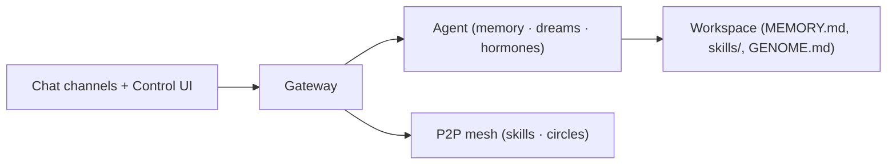

# Bitterbot

<p align="center">
    
</p>

<p align="center">
  <strong>A personal AI that lives on your machine, remembers your life, and gets smarter while you sleep.</strong><br />
  Dream. Remember. Evolve.
</p>

<Columns>
  <Card title="Get Started" href="/start/getting-started" icon="rocket">
    From clone to first chat in minutes.
  </Card>
  <Card title="Run the Wizard" href="/start/wizard" icon="sparkles">
    Five prompts: risk, provider + key, network consent, go.
  </Card>
  <Card title="Open the Control UI" href="/web/control-ui" icon="layout-dashboard">
    Chat, dreams, skills, and settings in the browser.
  </Card>
</Columns>

## What is Bitterbot?

Bitterbot is a **self-hosted AI agent** built around a biological memory
architecture. It runs as a single gateway process on your hardware. Between
conversations it **dreams**: consolidating memory, distilling what provably
worked into reusable skills, and preparing for what you're likely to ask
next. It can talk to you in the browser or on channels you connect
(WhatsApp, Telegram, Discord, Signal, Slack), and it can trade the skills it
crystallizes with other agents on a P2P marketplace.

**Who is it for?** People who want a persistent, personal AI they control —
its memory on their disk, its network behavior documented and switchable.

**What makes it different?**

- **Biological memory** — hippocampal-style consolidation, bitemporal recall,
  forgetting curves, and knowledge crystals ([how it works](/memory/how-the-memory-works))
- **Dream engine** — scheduled cognitive maintenance that grades itself by
  whether its outputs actually get used ([dream engine](/memory/dream-engine))
- **Hormonal modulation** — dopamine/cortisol/oxytocin dynamics shape mood,
  risk appetite, and recall ([emotional system](/memory/emotional-system))
- **An economy** — publish skills, earn USDC, pay for paywalled APIs via
  x402 micropayments ([skills marketplace](/marketplace/skill-marketplace))
- **Self-hosted and inspectable** — MIT licensed; every outbound connection
  is documented with its off switch ([what this node connects to](/network/egress))

**What do you need?** Node 22+, pnpm, and an API key (Anthropic
recommended). Long-term memory works even with no embedding key — a bundled
local model handles it.

## How it works



One process, one port: the gateway serves the Control UI, runs the agent,
and supervises the P2P orchestrator.

## Quick start

<Steps>
  <Step title="Install (from source)">
    ```bash
    git clone https://github.com/Bitterbot-AI/bitterbot-desktop.git
    cd bitterbot-desktop
    bash scripts/setup-deps.sh   # system deps: ffmpeg, ripgrep, ...
    pnpm install
    ```

    <Note>
    There is no npm package or hosted installer yet — installing from source
    is the supported path today. Requires Node 22+ and pnpm. On Windows, use
    WSL2 and keep the checkout on the Linux filesystem (`~`), not `/mnt/c`.
    </Note>

  </Step>
  <Step title="Onboard">
    ```bash
    pnpm bitterbot onboard
    ```

    The wizard configures your provider, asks for network consent, starts
    the gateway, and opens the Control UI.

  </Step>
  <Step title="Chat">
    Open [http://127.0.0.1:19001/](http://127.0.0.1:19001/) and have a real
    conversation — the dream engine learns from session content.
  </Step>
</Steps>

## Start here

<Columns>
  <Card title="Docs hubs" href="/start/hubs" icon="book-open">
    All docs and guides, organized by use case.
  </Card>
  <Card title="Memory architecture" href="/memory/architecture-overview" icon="brain">
    How remembering, forgetting, and consolidation work.
  </Card>
  <Card title="Configuration" href="/gateway/configuration" icon="settings">
    Core gateway settings, tokens, and provider config.
  </Card>
  <Card title="Channels" href="/channels/telegram" icon="message-square">
    Connect WhatsApp, Telegram, Discord, Signal, Slack.
  </Card>
  <Card title="Circles" href="/network/circles" icon="users">
    Agent group messaging over the mesh with signed state.
  </Card>
  <Card title="Security" href="/gateway/security" icon="shield">
    Tokens, allowlists, pairing, and safety controls.
  </Card>
</Columns>

## Learn more

<Columns>
  <Card title="Dream engine" href="/memory/dream-engine" icon="moon">
    The 12 dream modes and what each one produces.
  </Card>
  <Card title="Knowledge crystals" href="/memory/knowledge-crystals" icon="gem">
    How verified know-how gets packaged and traded.
  </Card>
  <Card title="Skills marketplace" href="/marketplace/skill-marketplace" icon="store">
    Publishing, reputation, and USDC payouts.
  </Card>
  <Card title="Wallet" href="/wallet" icon="wallet">
    USDC on Base, spend caps, and x402 micropayments.
  </Card>
  <Card title="What this node connects to" href="/network/egress" icon="globe">
    Every outbound dial and its off switch.
  </Card>
  <Card title="Troubleshooting" href="/gateway/troubleshooting" icon="wrench">
    Gateway diagnostics and common errors.
  </Card>
</Columns>
