# Memory System Architecture Overview

The Bitterbot memory system is a self-organizing knowledge store that indexes user interactions into **Knowledge Crystals**, consolidates them through Ebbinghaus-inspired decay, generates insights via offline **Dream Cycles**, and propagates skills across a P2P swarm network with a two-tiered topology of **Management** and **Edge** nodes. It runs entirely inside the Node.js application using SQLite for storage and sqlite-vec for vector search.

---

## Why SQLite?

The memory system stores everything — crystals, embeddings, dream insights, peer reputation, execution metrics — in a single SQLite database. This is deliberate:

1. **Zero infrastructure** — No external database server to install, configure, or keep running. The memory system works on a laptop with `node index.js`.
2. **Edge-native** — Each node carries its own brain. In a P2P swarm, every peer is fully self-contained. No shared Postgres cluster, no Pinecone account, no cloud dependency.
3. **Transactional consistency** — Consolidation engine applies decay, merges, and lifecycle transitions in a single ACID transaction. No eventual-consistency bugs.
4. **sqlite-vec** — The `sqlite-vec` extension provides real vector search (cosine similarity) inside SQLite, combined with FTS5 for BM25 keyword search. Hybrid retrieval with zero network hops.
5. **Portability** — The entire memory is one `.db` file. Back it up, move it between machines, or inspect it with any SQLite viewer.

For deployments that need distributed vector search at scale, the embedding and retrieval layers are abstracted behind provider interfaces — but for the primary use case (a single bot's memory), SQLite is the optimal choice.

---

## Quick Start (Day 1 Guide)

Get a working memory system in 3 steps:

### 1. Create and Index a Crystal

```typescript
import { MemoryIndexManager } from "./memory/manager.js";

const manager = await MemoryIndexManager.get({
  cfg: loadConfig(),
  agentId: "my-agent",
});

// Index a chunk of text — this creates a knowledge crystal
await manager.indexChunk({
  text: "TypeScript interfaces are erased at runtime. Use 'type' for simple aliases.",
  path: "notes/typescript.md",
  source: "memory",
  startLine: 1,
  endLine: 1,
});
```

### 2. Force Consolidation

```typescript
// Run one consolidation cycle immediately (normally timer-driven every 30 min)
const result = await manager.consolidate();
// result: { scored: 1, forgotten: 0, merged: 0 }
```

### 3. Search

```typescript
const results = await manager.search("typescript runtime types");
// results: [{ id, text, score, importanceScore, ... }]
```

### Inspect State

```bash
# Open the database directly
sqlite3 .bitterbot/memory/memory.db

# Count crystals
SELECT COUNT(*) FROM chunks;

# See lifecycle distribution
SELECT lifecycle, COUNT(*) FROM chunks GROUP BY lifecycle;

# Check hormonal state (read-only, decays in-memory)
# Use MemoryIndexManager.getHormonalState() from code

# View the audit log
SELECT * FROM memory_audit_log ORDER BY timestamp DESC LIMIT 10;

# Check dream history
SELECT cycle_id, started_at, insights_generated, modes_used FROM dream_cycles ORDER BY started_at DESC LIMIT 5;
```

---

## Data Flow

```mermaid
flowchart TB
    subgraph Input
        A[User Message / File Change] --> B[MemoryIndexManager.sync]
    end

    subgraph Indexing
        B --> C[Chunk Text]
        C --> D[Embed via Provider]
        D --> E[Store in chunks table]
        E --> F[FTS5 Index]
        E --> G[sqlite-vec Index]
    end

    subgraph Assessment
        E --> H[HormonalSystem.computeCrystalInfluence]
        E --> I[CuriosityEngine.assessChunk]
        E --> J[Governance.tagSensitivity]
    end

    subgraph Retrieval
        K[Search Query] --> L[Hybrid BM25 + Vector]
        L --> M[Retrieval Modulation - hormones bias ranking]
        M --> TMP[Temporal Scoring - query intent × epistemic half-lives]
        TMP --> N[Results]
        N --> LB[Limbic Bridge - results affect hormones]
    end

    subgraph "Proactive Recall (every turn, zero LLM cost)"
        UM[User Message] --> PR[Proactive Recall]
        PR --> ID[Identity prefs - always surface]
        PR --> VEC[Vector-match directive/world_fact crystals]
        ID --> SP[System Prompt injection]
        VEC --> SP
        COH[Session Coherence Tracker] --> SP
    end

    subgraph "Context Efficiency"
        TC[Tool Cache - LRU in-memory] --> PC[Progressive Compression]
        PC --> EM[Expand Message - truncated content retrieval]
    end

    subgraph "Deep Recall (on-demand)"
        DR[deep_recall tool] --> SS[Smart Shortcut - score ≥ 0.8]
        SS -->|miss| SUB[Sub-LLM REPL in VM Sandbox]
        SUB --> DB2[(Memory DB + Session JSONL)]
    end

    subgraph "Offline Processing (timer + emotional triggers)"
        O[ConsolidationEngine.run] --> P[Ebbinghaus Decay + Merge]
        O --> SNN[SNN Near-Merge Discovery]
        SNN --> NMH[(near_merge_hints table)]
        O --> ORF[Orphan Cluster Detection]
        ORF --> ORQ[(orphan_replay_queue)]
        O --> OAUTO[Auto-scratch from hormonal spikes]
        Q[DreamEngine.run] --> RDY{Readiness Check}
        RDY -->|ready| FSHO[FSHO Mode Selector]
        RDY -->|skip| SKIP[Save LLM tokens]
        MI[Marketplace Intelligence] --> FSHO
        FSHO --> R[7 Dream Modes - ripple-enhanced replay]
        R --> S[New Insights]
        S --> T[CuriosityEngine.assessDreamInsight]
        S --> U[SkillRefiner.evaluateMutations]
        U --> V[SkillVerifier.verify]
        V --> W[SkillNetworkBridge.publish]
        S --> RLM[RLM Working Memory Rewrite]
        RLM --> WMMD[MEMORY.md state update]
        Q --> SE[Session Extraction - per changed session]
        SE --> UPR[(user_preferences table)]
        SE --> HB[Handover Briefs]
        HB --> NEXT[Next session system prompt]
        EMT[Emotional Spike] -->|dopamine > 0.7 or cortisol > 0.8| MINI[Mini-Dream - immediate]
    end

    subgraph "P2P Network (Two-Tiered)"
        W --> X[Rust Orchestrator / libp2p]
        X --> Y[Peer Swarm]
        Y --> Z[SkillNetworkBridge.ingest]
        Z --> ZA{Cortisol gate}
        ZA -->|trusted or no spike| ZB[Verify management sig]
        ZA -->|untrusted + spike| ZC[Reject]
        ZB --> AA[PeerReputationManager]
        Y --> AB[Weather Broadcast]
        AB --> AC[HormonalStateManager.applyNetworkCortisolSpike]
        Y --> AD[Bounty Broadcast]
        AD --> AE[CuriosityEngine.ingestBounty]
    end

    subgraph "Management Nodes"
        MN[Management Node] -->|signed weather| AB
        MN -->|signed bounties| AD
        MN -->|skill endorsement| ZB
    end
```



---

## File Map

### Core

| File | Purpose |
|------|---------|
| `src/memory/manager.ts` | Central orchestrator. Creates all subsystems, runs search, exposes public API |
| `src/memory/manager-sync-ops.ts` | File-watching sync logic (mixin) |
| `src/memory/manager-embedding-ops.ts` | Embedding batch operations (mixin) |
| `src/memory/migrations.ts` | Schema versioning: 4 migration versions |
| `src/memory/memory-schema.ts` | Base table creation, `ensureColumn()` helper |
| `src/memory/crystal-types.ts` | All type definitions: `KnowledgeCrystal`, lifecycle, governance, etc. |
| `src/memory/crystal.ts` | `CrystalStore` — CRUD operations on knowledge crystals |
| `src/memory/importance.ts` | `calculateImportance()` — Ebbinghaus decay formula |
| `src/memory/internal.ts` | Shared math: `cosineSimilarity()`, `computeCentroid()`, `parseEmbedding()` |
| `src/memory/hybrid.ts` | `mergeHybridResults()`, `buildFtsQuery()`, `bm25RankToScore()` |

### Dream System

| File | Purpose |
|------|---------|
| `src/memory/dream-engine.ts` | `DreamEngine` — state machine, 7 mode runners, FSHO integration, emotional triggering |
| `src/memory/dream-oscillator.ts` | FSHO oscillator — Kuramoto coupling, order parameter for mode selection |
| `src/memory/dream-types.ts` | Dream types: modes, tiers, configs, `DreamInsight` |
| `src/memory/dream-schema.ts` | `dream_insights` + `dream_cycles` + `dream_telemetry` + `dream_outcomes` table creation |
| `src/memory/dream-evaluator.ts` | Dream outcome evaluation — DQS scoring, FSHO correlation, adaptive feedback |
| `src/memory/dream-synthesis-prompt.ts` | LLM prompt building, heuristic synthesis, response parsing |
| `src/memory/dream-search.ts` | Vector search over dream insights |
| `src/memory/dream-mutation-strategies.ts` | 5 mutation strategies + LLM prompt builders |

### Working Memory (RLM)

| File | Purpose |
|------|---------|
| `src/memory/working-memory-prompt.ts` | RLM synthesis prompt, user preferences input, Bond drift guard, schema validation |
| `src/memory/seed-crystal-migration.ts` | One-time migration of existing MEMORY.md into consolidated crystals |
| `src/agents/tools/working-memory-tool.ts` | `working_memory_note` tool — epistemic type parameter, scratch buffer WAL |

### Deep Recall

| File | Purpose |
|------|---------|
| `src/agents/rlm/executor.ts` | RLM executor — REPL loop, model routing, iteration control |
| `src/agents/rlm/sandbox.ts` | VM sandbox — isolated execution context with search/transcript APIs |
| `src/agents/rlm/prompts.ts` | REPL system prompts and diverse query generation |
| `src/agents/rlm/cost-tracker.ts` | Per-query token usage and cost monitoring |
| `src/agents/rlm/context-builder.ts` | Conversation history and session context assembly |
| `src/agents/tools/deep-recall-tool.ts` | Agent tool — smart shortcut, REPL dispatch |

### Session & User Knowledge

| File | Purpose |
|------|---------|
| `src/memory/session-extractor.ts` | Extract structured facts from session transcripts during dream cycles |
| `src/memory/session-handover.ts` | Generate/load compact session handover briefs for cross-session continuity, quality gate scoring |
| `src/memory/user-model.ts` | `UserModelManager` — preference storage, `upsertFromDirective()`, Bayesian confidence calibration |

### Cognitive Coherence (Plan 7)

| File | Purpose |
|------|---------|
| `src/memory/proactive-recall.ts` | Involuntary memory surfacing — identity/directive facts auto-inject every turn |
| `src/memory/session-coherence.ts` | Intra-session thread tracking, decision detection, intent classification |
| `src/memory/temporal-scoring.ts` | Query-intent-sensitive temporal decay with epistemic half-lives |
| `src/memory/dream-evaluator.ts` | Dream Quality Score (DQS), FSHO correlation analysis, outcome persistence |

### Agent Economy (Plan 8)

| File | Purpose |
|------|---------|
| `src/services/erc8004-identity.ts` | ERC-8004 onchain agent identity — register, reputation feedback, traction check |
| `src/memory/marketplace-intelligence.ts` | Demand-driven dream targeting — market signals as 4th dream mode signal |

### Context Efficiency

| File | Purpose |
|------|---------|
| `src/agents/tool-cache.ts` | In-memory LRU cache for tool results |
| `src/agents/pi-tools.cache.ts` | Cache integration layer for Pi coding tools |
| `src/agents/progressive-compression.ts` | Deterministic truncation before LLM summarization |
| `src/agents/tools/expand-message-tool.ts` | Retrieve full content of truncated messages |
| `src/agents/tools/emotional-anchor-tool.ts` | Create/recall persistent emotional bookmarks |

See [Working Memory](./working-memory.md) for full documentation.

### Curiosity & Emotional

| File | Purpose |
|------|---------|
| `src/memory/curiosity-engine.ts` | `CuriosityEngine` — novelty assessment, gap detection, region tracking |
| `src/memory/curiosity-types.ts` | Curiosity types: regions, targets, surprise assessment |
| `src/memory/curiosity-math.ts` | Novelty, surprise, information gain, contradiction scoring |
| `src/memory/hormonal.ts` | `HormonalStateManager` — dopamine/cortisol/oxytocin with exponential decay |
| `src/memory/consolidation.ts` | `ConsolidationEngine` — Ebbinghaus decay, merge, lifecycle transitions |
| `src/memory/user-model.ts` | `UserModelManager` — preference extraction, pattern detection |
| `src/memory/task-memory.ts` | `TaskMemoryManager` — goal tracking, progress, stall detection |

### Skills & P2P

| File | Purpose |
|------|---------|
| `src/memory/skill-refiner.ts` | `SkillRefiner` — mutation scoring, crystallization pipeline |
| `src/memory/skill-verifier.ts` | `SkillVerifier` — 3-check safety gate (dangerous patterns, structural, semantic drift) |
| `src/memory/skill-execution-tracker.ts` | `SkillExecutionTracker` — outcome recording, empirical metrics |
| `src/memory/skill-network-bridge.ts` | Skill publish/ingest, version conflict resolution, governance, P2P ingest safety gate |
| `src/memory/peer-reputation.ts` | `PeerReputationManager` — trust levels, EigenTrust, anomaly detection |
| `src/memory/discovery-agent.ts` | `DiscoveryAgent` — skill edge discovery, proactive suggestions |
| `src/memory/skill-marketplace.ts` | Marketplace listing, search, trending, recommendations (wired via gateway RPC) |
| `src/memory/skill-hierarchy.ts` | Parent-child skill tree relationships |

### Search & Embeddings

| File | Purpose |
|------|---------|
| `src/memory/manager-search.ts` | `searchVector()`, `searchKeyword()` implementations |
| `src/memory/mem-store.ts` | `MemStore` — publish/subscribe, version history |
| `src/memory/multi-perspective-search.ts` | Reciprocal Rank Fusion across 4 embedding perspectives |
| `src/memory/embedding-perspectives.ts` | Prefix-tuned multi-perspective embedding generation |
| `src/memory/embeddings.ts` | Provider abstraction: OpenAI, Gemini, Voyage, local |

### Infrastructure

| File | Purpose |
|------|---------|
| `src/memory/governance.ts` | `MemoryGovernance` — access control, sensitivity tagging, provenance DAG |
| `src/memory/scheduler.ts` | `MemoryScheduler` — per-hour LLM/embedding budgets |
| `src/memory/pipeline.ts` | `MemoryPipeline` — fluent retrieve-filter-augment-store API |

---

## Initialization Chain

`MemoryIndexManager` is the central orchestrator. It is obtained via the static async factory `MemoryIndexManager.get({ cfg, agentId })`, which caches instances by agent+workspace+settings key.

The private constructor runs this initialization sequence:

```
1.  openDatabase()              — open/create SQLite DB
2.  ensureSchema()              — base tables + runMigrations()
3.  ensureWatcher()             — file-system change watcher (chokidar)
4.  ensureSessionListener()     — session transcript change listener
5.  ensureSkillsListener()      — skills directory change listener
6.  ensureIntervalSync()        — periodic re-index timer
7.  ensureConsolidationInterval() — periodic consolidation + curiosity + hormonal decay
8.  ensureDreamEngine()         — DreamEngine + interval timer
9.  ensureCuriosityEngine()     — CuriosityEngine
10. ensureHormonalManager()     — HormonalStateManager
11. ensureUserModelManager()    — UserModelManager
12. ensureSkillRefiner()        — SkillRefiner + SkillVerifier
13. ensureGovernance()          — MemoryGovernance
14. ensureTaskMemory()          — TaskMemoryManager
15. ensureScheduler()           — MemoryScheduler
16. ensureMemStore()            — MemStore (publish/subscribe)
17. ensureSkillNetworkBridge()  — SkillNetworkBridge (null orchestrator, wired later)
```

The P2P orchestrator bridge is wired later at gateway startup via `wireOrchestratorBridge()`.

---

## Database

**Engine:** Node.js built-in `node:sqlite` (`DatabaseSync`) + `sqlite-vec` extension for vector search + FTS5 for full-text search.

**Schema versions:** 4 migrations in `migrations.ts`:

| Version | Description |
|---------|-------------|
| v1 | Knowledge Crystal columns on `chunks`: `semantic_type`, `lifecycle`, hormonal fields, `governance_json`, `provenance_chain`, `created_at` |
| v2 | Skills pipeline tables: `skill_executions`, `peer_reputation`, `peer_skill_ratings`, `mutation_queue`, `skill_edges` + versioning/marketplace/hierarchy columns on `chunks` |
| v3 | Trust hardening: `peer_trust_edges`, `peer_activity_log` tables + `is_banned`, `eigentrust_score`, `anomaly_flag` on `peer_reputation` |
| v4 | Management node verification: `is_verified`, `verified_by` columns on `chunks` + bounty tracking: `bounty_match_id`, `bounty_priority_boost` columns on `chunks` |

**Key tables:**

| Table | Purpose |
|-------|---------|
| `chunks` | Knowledge crystals (memory units) — ~50 columns |
| `chunks_vec` | sqlite-vec virtual table for vector search |
| `chunks_fts` | FTS5 virtual table for keyword search |
| `files` | Tracked source files with hashes |
| `meta` | Key-value store (schema version, provider key) |
| `dream_insights` | Dream-generated insights with embeddings |
| `dream_cycles` | Dream cycle execution metadata |
| `skill_executions` | Skill execution outcomes |
| `peer_reputation` | Per-peer trust scores |
| `peer_skill_ratings` | Individual skill ratings by peer |
| `peer_trust_edges` | EigenTrust web-of-trust edges |
| `peer_activity_log` | Peer activity timestamps for anomaly detection |
| `mutation_queue` | Pending dream mutation retries |
| `skill_edges` | Discovered skill relationships (prerequisite, enables, etc.) |
| `embedding_cache` | Cached embedding vectors |
| `memory_audit_log` | Governance audit trail |

---

## Config Hierarchy

All memory configuration flows from `BitterbotConfig.memory`:

```typescript
cfg.memory?.consolidation  → ConsolidationEngine config (decayRate, thresholds)
cfg.memory?.dream          → DreamEngineConfig (modes, tiers, intervals, LLM calls)
cfg.memory?.curiosity      → CuriosityConfig (weights, thresholds, max regions)
cfg.memory?.emotional      → EmotionalConfig
  .hormonal                → HormonalConfig (halflife values)
  .userModel               → UserModelConfig (preference/pattern extraction)
cfg.memory?.scheduler      → BudgetConfig (per-hour API limits)
```

Each subsystem has sensible defaults and is enabled by default. Disable any subsystem by setting `enabled: false` in its config block.

---

## Observability & Debugging

The memory system is non-deterministic — hormones decay, dreams fire on timers, peers send skills asynchronously. Here's how to inspect what's happening.

### Hormonal State

The hormonal system runs in-memory with exponential decay. To inspect current levels:

```typescript
// From MemoryIndexManager instance
const state = manager.getHormonalState();
// { dopamine: 0.12, cortisol: 0.45, oxytocin: 0.03, lastDecay: 1709... }

// Check if a network cortisol override is active
const modulation = manager.getConsolidationModulation();
// { decayResistance: 0.15, mergeThreshold: 0.93, haltUntrustedIngestion: true }
```

During a network cortisol spike (broadcast by a management node), `haltUntrustedIngestion` will be `true` — meaning untrusted/provisional peers cannot publish skills to this node. The spike auto-expires after its configured `duration_ms`.

### Audit Log

Every lifecycle transition (crystal promoted, merged, expired, ingested from peer) is recorded in `memory_audit_log`:

```sql
-- Recent audit events
SELECT action, crystal_id, details, timestamp
FROM memory_audit_log
ORDER BY timestamp DESC LIMIT 20;

-- All peer-ingested skills
SELECT * FROM memory_audit_log WHERE action = 'peer_skill_ingested';

-- Crystals that were cortisol-gated (rejected during spike)
SELECT * FROM memory_audit_log WHERE details LIKE '%cortisol%';
```

### Dream Cycles

```sql
-- Recent dream cycles with mode breakdown
SELECT cycle_id, started_at, duration_ms, insights_generated,
       modes_used, tiers_used, error
FROM dream_cycles
ORDER BY started_at DESC LIMIT 10;

-- Dream insights sorted by confidence
SELECT content, confidence, mode, importance_score
FROM dream_insights
ORDER BY confidence DESC LIMIT 10;
```

### P2P Network

```sql
-- Peer trust levels
SELECT pubkey, trust_level, reputation_score, skills_accepted, skills_rejected,
       is_banned, eigentrust_score, anomaly_flag
FROM peer_reputation
ORDER BY reputation_score DESC;

-- Verified skills (endorsed by management nodes)
SELECT id, text, verified_by, importance_score
FROM chunks
WHERE is_verified = 1;

-- Bounty-matched crystals
SELECT id, text, bounty_match_id, bounty_priority_boost
FROM chunks
WHERE bounty_match_id IS NOT NULL;
```

### Curiosity Engine

```sql
-- Active exploration targets (including bounties)
SELECT id, type, description, priority, metadata, expires_at
FROM curiosity_targets
WHERE resolved_at IS NULL AND expires_at > (strftime('%s','now') * 1000);

-- Knowledge regions
SELECT id, label, chunk_count, mean_importance, prediction_error
FROM curiosity_regions
ORDER BY chunk_count DESC;
```

### Consolidation

```sql
-- Crystal lifecycle distribution
SELECT lifecycle, COUNT(*) as count FROM chunks GROUP BY lifecycle;

-- Importance score distribution
SELECT
  CASE
    WHEN importance_score >= 0.8 THEN 'high (0.8+)'
    WHEN importance_score >= 0.4 THEN 'medium (0.4-0.8)'
    WHEN importance_score >= 0.1 THEN 'low (0.1-0.4)'
    ELSE 'expiring (<0.1)'
  END as tier,
  COUNT(*) as count
FROM chunks
WHERE lifecycle NOT IN ('expired', 'archived')
GROUP BY tier;
```

---

## Running Tests

```bash
# Full knowledge crystal test suite (117 tests)
npx vitest run src/memory/knowledge-crystal-system.test.ts

# P2P skill propagation tests (88 tests)
npx vitest run src/memory/p2p-skill-propagation.test.ts

# All memory tests
npx vitest run src/memory/
```

---

## Related Documentation

- [Knowledge Crystals](./knowledge-crystals.md) — core data model, lifecycle, epistemic layers
- [Dream Engine](./dream-engine.md) — 7 modes, FSHO selector, ripple replay, emotional triggering
- [Emotional System](./emotional-system.md) — hormones, anchors, limbic bridge
- [Deep Recall](./deep-recall.md) — RLM infinite memory via sub-LLM REPL
- [User Knowledge](./user-knowledge.md) — session extraction, Bond drift guard, handover briefs
- [Working Memory](./working-memory.md) — MEMORY.md as recursive state vector
- [Biological Identity](./biological-identity.md) — Genome/Phenotype model
- [Skills Pipeline](./skills-pipeline.md) — skill lifecycle, verification, and P2P network
- [Curiosity & Search](./curiosity-and-search.md) — curiosity engine and retrieval system
- [Core Network Systems](../network/core-systems.md) — A2A, wallet, marketplace, P2P
