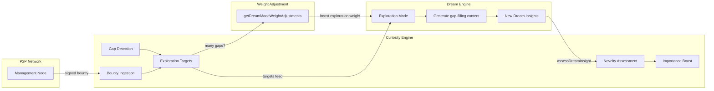
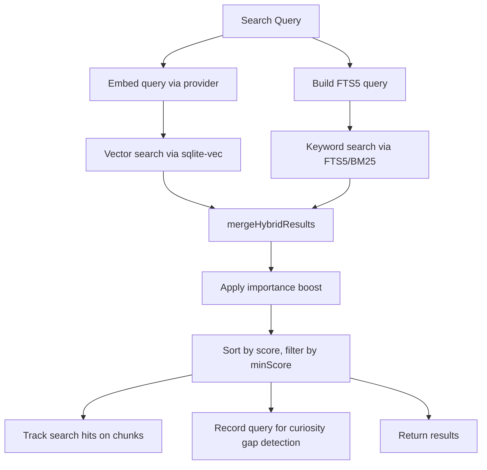

# Curiosity & Search — Curiosity Engine and Retrieval System

The curiosity engine identifies knowledge gaps by tracking what the system knows (knowledge regions), what surprises it (novelty assessment), and what the user searches for but can't find (gap detection). It feeds exploration targets into the dream engine's exploration mode and receives dream insights back, forming a continuous curiosity-dream feedback loop. The search system combines BM25 keyword matching with multi-perspective vector search for robust retrieval.

**Key source files:** `curiosity-engine.ts`, `curiosity-types.ts`, `gccrf-reward.ts`, `mem-store.ts`, `multi-perspective-search.ts`, `embedding-perspectives.ts`, `user-model.ts`, `task-memory.ts`

---

## Curiosity Engine

The `CuriosityEngine` (`curiosity-engine.ts`) maintains a map of what the system knows and detects gaps in that knowledge.

### Knowledge Regions

Regions are clusters of related knowledge, each with a centroid embedding:

```typescript
type KnowledgeRegion = {
  id: string;
  label: string;
  centroid: number[];
  chunkCount: number;
  totalAccesses: number;
  meanImportance: number;
  predictionError: number; // How often this region surprises us
  learningProgress: number; // Rate of prediction error reduction
  createdAt: number;
  lastUpdatedAt: number;
};
```

Regions are rebuilt periodically during `run()`. The maximum number of regions is configurable (default: 50).

### Unified GCCRF Scoring

When a new chunk is indexed, `assessChunk()` uses the internal GCCRF reward function to evaluate it across 5 components:

| Component                   | What it measures                                   | Weight |
| --------------------------- | -------------------------------------------------- | ------ |
| η (Prediction Error)        | Distance from nearest knowledge region centroid    | 0.25   |
| Δη (Learning Progress)      | Per-region improvement in prediction accuracy      | 0.20   |
| Iα (Info-Theoretic Novelty) | Density-based novelty with developmental annealing | 0.25   |
| E·μ (Empowerment)           | Knowledge agency gated by uncertainty              | 0.20   |
| S (Strategic Alignment)     | Alignment with active exploration targets          | 0.10   |

Additionally, **contradiction detection** runs separately — it identifies chunks with high cosine similarity but different content hashes (conflicting information). Contradictions are stored for target generation but do not influence the reward score.

```typescript
type SurpriseAssessment = {
  chunkId: string;
  noveltyScore: number; // Maps to η (prediction error)
  surpriseFactor: number; // Maps to Δη (learning progress)
  informationGain: number; // Maps to Iα (info-theoretic novelty)
  contradictionScore: number; // Standalone signal, not in GCCRF
  compositeReward: number; // Final GCCRF reward [0,1]
  regionId: string | null;
  assessedAt: number;
  gccrfComponents?: { eta; deltaEta; iAlpha; empowerment; strategic };
  gccrfReward?: number;
};
```

The GCCRF reward is written directly to `chunks.curiosity_reward`. The system also uses **alpha annealing** — young agents are rewarded for exploring common knowledge (α = -3), while mature agents are rewarded for frontier exploration (α → 0). See [Curiosity Reward Function](./curiosity-reward.md) for full details.

### Gap Detection

The engine detects knowledge gaps from two signals:

1. **Low-score searches** — When a search query returns results below `gapScoreThreshold` (default 0.4), a `knowledge_gap` exploration target is generated
2. **Search prediction error** — `recordSearchSurprise()` tracks the gap between expected and actual search scores. Large surprises (> 0.4) trigger new `knowledge_gap` targets

### Exploration Targets

```typescript
type ExplorationTargetType =
  | "knowledge_gap" // Missing knowledge detected from search
  | "contradiction" // Conflicting information found
  | "stale_region" // Region with declining learning progress
  | "frontier"; // Edge of knowledge — opportunity to expand

type ExplorationTarget = {
  id: string;
  type: ExplorationTargetType;
  description: string;
  priority: number;
  regionId: string | null;
  metadata: Record<string, unknown>;
  createdAt: number;
  resolvedAt: number | null;
  expiresAt: number; // Default TTL: 7 days
};
```

Maximum active targets: 10 (configurable). Expired targets are cleaned up during `run()`.

### Bounty System (Phase 3)

Management nodes can publish **global curriculum bounties** — network-wide exploration targets that tell every edge node "we need knowledge about X." Bounties arrive via Gossipsub and are ingested as ultra-high-priority exploration targets.

#### Bounty Ingestion

`CuriosityEngine.ingestBounty()` receives bounty events from `SkillNetworkBridge.handleBountyEvent()`:

```typescript
curiosityEngine.ingestBounty({
  bountyId: "bounty-001",
  targetType: "knowledge_gap", // maps to ExplorationTargetType
  description: "Production debugging patterns for memory leak detection",
  priority: 0.8,
  rewardMultiplier: 2.5,
  regionHint: "debugging",
  expiresAt: Date.now() + 86_400_000,
});
```

**Priority boost**: Bounty priority is doubled (capped at 1.5), making bounties consistently rank above locally-generated targets. The description is prefixed with `[BOUNTY {id}]` and metadata includes `{ isBounty: true, rewardMultiplier }`.

#### Bounty Matching

`CuriosityEngine.checkBountyMatch()` runs when a skill is crystallized. It keyword-matches the crystal's text against active bounty descriptions:

```typescript
const match = curiosityEngine.checkBountyMatch(crystalId, crystalText);
// match: { bountyId: "bounty-001", rewardMultiplier: 2.5 } | null
```

When a match is found:

1. The bounty target is resolved (`resolvedAt` set)
2. The `SkillNetworkBridge` applies a massive **dopamine boost**: `"achievement"` events are stimulated `ceil(rewardMultiplier)` times (capped at 5)
3. The crystal is updated with `bounty_match_id` and `bounty_priority_boost`
4. The crystal is auto-published to the network (priority upload for bounty matches)

This creates a network-wide incentive loop: management nodes post bounties, edge nodes prioritize those exploration targets in dream cycles, and matching crystals get rewarded with dopamine boosts that strengthen related memory pathways.

---

## Curiosity-Dream Feedback Loop

The curiosity engine and dream engine form a bidirectional feedback loop:



### Curiosity -> Dream

1. **Target feeding** — The dream engine's exploration mode loads unresolved `knowledge_gap` targets and generates content to fill them
2. **Weight adjustment** — `getDreamModeWeightAdjustments()` shifts dream mode selection based on curiosity state:
   - Many knowledge gaps -> boost `exploration` mode weight
   - Many contradictions -> boost `simulation` mode weight
   - Many frontiers -> boost `mutation` mode weight

### Dream -> Curiosity

`assessDreamInsight()` checks each new dream insight against existing curiosity state:

- **Gap filling** — If the insight's embedding is close to a knowledge gap target, the target is resolved
- **Contradiction detection** — If the insight contradicts existing knowledge regions
- **Frontier opening** — If the insight represents genuinely novel territory, a new `frontier` target is created

---

## Search System

### Hybrid BM25 + Vector Search

The primary search path in `MemoryIndexManager.search()` combines two retrieval methods:



**Hybrid merging** uses configurable weights (default: 0.7 vector + 0.3 text). BM25 ranks are converted to [0,1] scores via `bm25RankToScore()`.

**Importance boost** applies a multiplicative factor:

```
boostedScore = score * (1 - importanceWeight + importanceWeight * importanceScore)
```

### Multi-Perspective Search

The `multi-perspective-search.ts` module enables searching across all 4 embedding perspectives simultaneously using **Reciprocal Rank Fusion (RRF)**:

```typescript
type PerspectiveWeights = {
  semantic: number;
  procedural: number;
  causal: number;
  entity: number;
};
```

**Weight profiles** for different query intents:

| Profile           | Semantic | Procedural | Causal | Entity |
| ----------------- | -------- | ---------- | ------ | ------ |
| `general`         | 0.7      | 0.1        | 0.1    | 0.1    |
| `skill_discovery` | 0.3      | 0.3        | 0.1    | 0.3    |
| `debugging`       | 0.2      | 0.1        | 0.5    | 0.2    |
| `learning_path`   | 0.1      | 0.5        | 0.3    | 0.1    |

**RRF formula** (K=60): For each perspective, rank all chunks by cosine similarity. The fused score is:

```
score = sum(weight_p * 1/(K + rank_p)) for each perspective p
```

Steering reward and importance scores provide additional boosts to the fused score.

---

## Embedding Perspectives

The `embedding-perspectives.ts` module generates 4 different embedding views of the same text using **prefix-tuning**:

| Perspective  | Prefix                                          | What it captures                    |
| ------------ | ----------------------------------------------- | ----------------------------------- |
| `semantic`   | _(none)_                                        | General meaning and concepts        |
| `procedural` | `"Steps, prerequisites, and execution order: "` | How-to knowledge, workflows         |
| `causal`     | `"Causes, effects, and consequences: "`         | Why things happen, debugging chains |
| `entity`     | `"Tools, APIs, technologies, and entities: "`   | Named tools, frameworks, APIs       |

```typescript
// Generate all 4 perspectives for a text
const perspectives = await embedWithPerspectives(text, provider);
// perspectives.semantic, .procedural, .causal, .entity

// Batch embed multiple texts
const allPerspectives = await batchEmbedWithPerspectives(texts, provider);
```

Entity extraction (`extractEntities()`) uses regex patterns plus capitalized multi-word detection to identify tools, APIs, frameworks, and languages mentioned in text.

---

## User Model

The `UserModelManager` (`user-model.ts`) tracks user preferences and behavioral patterns.

### Preference Extraction

`extractPreferences()` scans text for user preferences using 7 regex-based extractors:

| Category        | Pattern examples                    |
| --------------- | ----------------------------------- |
| `language`      | "prefer TypeScript", "I use Python" |
| `tool`          | "using VSCode", "prefer vim"        |
| `style`         | "like functional", "prefer OOP"     |
| `workflow`      | "TDD approach", "CI/CD pipeline"    |
| `communication` | "be concise", "explain in detail"   |

Preferences are upserted with confidence boosting (+0.1 on repeated detection).

```typescript
type UserPreference = {
  id: string;
  category: "tool" | "language" | "style" | "workflow" | "communication";
  key: string;
  value: string;
  confidence: number;
  evidenceIds: string[];
  createdAt: number;
  updatedAt: number;
};
```

### Pattern Detection

`detectPatterns()` analyzes multiple texts to find recurring action patterns. Called during dream extrapolation mode. Requires >= 3 texts, returns patterns with frequency >= 2.

```typescript
type UserPattern = {
  pattern: string;
  frequency: number;
  lastOccurrence: number;
  predictiveValue: number;
};
```

---

## Task Memory

The `TaskMemoryManager` (`task-memory.ts`) tracks user goals and their progress.

### Goal Lifecycle

```typescript
type TaskGoal = {
  id: string;
  description: string;
  progress: number; // 0-1
  relatedCrystalIds: string[];
  sessionKey: string | null;
  status: "active" | "completed" | "stalled" | "abandoned";
  createdAt: number;
  updatedAt: number;
};
```

**Auto-detection**: `detectGoals()` scans conversational text for goal-like statements ("I want to...", "I need to...", "let's...", "plan to..."). Returns up to 5 descriptions (minimum 10 characters each).

**Stall detection**: `markStalledGoals()` runs periodically and marks goals as `stalled` if no progress update within 7 days (configurable).

**Crystal linking**: Goals can be linked to relevant knowledge crystals via `linkCrystal()`, connecting user intent to system knowledge.

### Integration with Skills Pipeline

Active and stalled goals feed into the `DiscoveryAgent`'s `goal_alignment` strategy for proactive skill suggestions. When a goal is stalled, the system looks for marketplace skills that could help unstall it.

---

## Configuration Reference

### Curiosity Config

```typescript
type CuriosityConfig = {
  enabled?: boolean; // Default: true
  weights?: Partial<CuriosityWeights>;
  boostThreshold?: number; // Default: 0.4
  boostMultiplier?: number; // Default: 1.3
  maxRegions?: number; // Default: 50
  maxTargets?: number; // Default: 10
  targetTtlHours?: number; // Default: 168 (7 days)
  maxQueryHistory?: number; // Default: 200
  gapScoreThreshold?: number; // Default: 0.4
};

// Default weights
const DEFAULT_CURIOSITY_WEIGHTS = {
  novelty: 0.3,
  surprise: 0.25,
  informationGain: 0.25,
  contradiction: 0.2,
};
```

### Emotional Config

```typescript
type EmotionalConfig = {
  enabled?: boolean; // Default: true
  decayResistance?: number; // Default: 0.5
  sentimentAnalysis?: "keyword" | "hybrid" | "llm" | "none";
  hormonal?: {
    enabled?: boolean;
    dopamineHalflife?: number; // Default: 30 min (ms)
    cortisolHalflife?: number; // Default: 60 min (ms)
    oxytocinHalflife?: number; // Default: 45 min (ms)
  };
  userModel?: {
    enabled?: boolean;
    extractPreferences?: boolean;
    detectPatterns?: boolean;
  };
};
```

---

## Related Documentation

- [Architecture Overview](./architecture-overview.md) — system entry point and file map
- [Knowledge Crystals](./knowledge-crystals.md) — core data model and lifecycle
- [Dream Engine](./dream-engine.md) — how curiosity targets feed dream exploration
- [Skills Pipeline](./skills-pipeline.md) — skill suggestions from curiosity gaps
