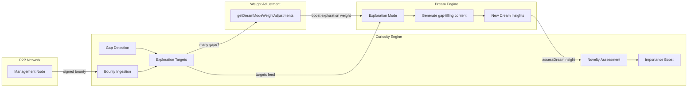
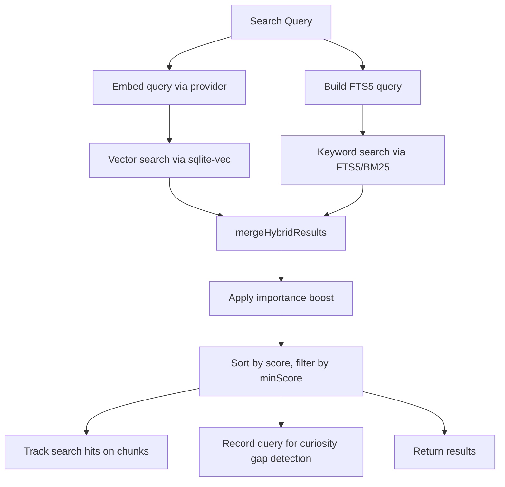

# Curiosity & Search — Curiosity Engine and Retrieval System

The curiosity engine identifies knowledge gaps by tracking what the system knows (knowledge regions), what surprises it (novelty assessment), and what the user searches for but can't find (gap detection). Since PLAN-54 (2026-10-07) the loop is closed: open questions are researched on the web on a schedule, verified against at least two sources, stored with provenance, surfaced in conversation marked "learned on my own", and counted when a conversation uses them, so the agent learns where learning pays off. The search system combines BM25 keyword matching with multi-perspective vector search for robust retrieval.

**Key source files:** `curiosity-engine.ts`, `curiosity-types.ts`, `gccrf-reward.ts`, `mem-store.ts`, `user-model.ts`, `task-memory.ts`

---

## Curiosity Engine

The `CuriosityEngine` (`curiosity-engine.ts`) maintains a map of what the system knows and detects gaps in that knowledge.

### Knowledge Regions

Regions are clusters of related knowledge, each with a centroid embedding:

```typescript
type KnowledgeRegion = {
  id: string;
  label: string;
  centroid: number[];
  chunkCount: number;
  totalAccesses: number;
  meanImportance: number;
  predictionError: number; // How often this region surprises us
  learningProgress: number; // Rate of prediction error reduction
  createdAt: number;
  lastUpdatedAt: number;
};
```

Regions are rebuilt periodically during `run()`. The maximum number of regions is configurable (default: 50).

### Unified GCCRF Scoring

When a new chunk is indexed, `assessChunk()` uses the internal GCCRF reward function to evaluate it across 5 components:

| Component                   | What it measures                                   | Weight |
| --------------------------- | -------------------------------------------------- | ------ |
| η (Prediction Error)        | Distance from nearest knowledge region centroid    | 0.25   |
| Δη (Learning Progress)      | Per-region improvement in prediction accuracy      | 0.20   |
| Iα (Info-Theoretic Novelty) | Density-based novelty with developmental annealing | 0.25   |
| E·μ (Empowerment)           | Knowledge agency gated by uncertainty              | 0.20   |
| S (Strategic Alignment)     | Alignment with active exploration targets          | 0.10   |

Additionally, **contradiction detection** runs separately — it identifies chunks with high cosine similarity but different content hashes (conflicting information). Contradictions are stored for target generation but do not influence the reward score.

```typescript
type SurpriseAssessment = {
  chunkId: string;
  noveltyScore: number; // Maps to η (prediction error)
  surpriseFactor: number; // Maps to Δη (learning progress)
  informationGain: number; // Maps to Iα (info-theoretic novelty)
  contradictionScore: number; // Standalone signal, not in GCCRF
  compositeReward: number; // Final GCCRF reward [0,1]
  regionId: string | null;
  assessedAt: number;
  gccrfComponents?: { eta; deltaEta; iAlpha; empowerment; strategic };
  gccrfReward?: number;
};
```

The GCCRF reward is written directly to `chunks.curiosity_reward`. The system also uses **alpha annealing** — young agents are rewarded for exploring common knowledge (α = -3), while mature agents are rewarded for frontier exploration (α → 0). See [Curiosity Reward Function](./curiosity-reward.md) for full details.

### Gap Detection

The engine detects knowledge gaps from two signals:

1. **Low-score searches** — A query that returns results below `gapScoreThreshold` (default 0.5) becomes its own `knowledge_gap` target (one per query, embedding-deduped against everything open or answered in the last 30 days).
2. **Working-memory questions** — The `## Curiosity Gaps` bullets the dream rewrite writes into `MEMORY.md` become `question` targets after every rewrite. These are the best questions the agent has: grounded in the owner's actual life and work.
3. **Owner questions** — `curiosity.ask` (the Curiosity page) queues a question at top priority.

The former "emerging skill" frontier generator was deleted: it mistook handover briefs and READMEs for skills.

### Exploration Targets

```typescript
type ExplorationTargetType =
  | "question" // A question the agent wants answered (working memory, owner)
  | "knowledge_gap" // Missing knowledge detected from search
  | "contradiction" // Conflicting information found
  | "stale_region" // Region with declining learning progress
  | "frontier"; // Edge of knowledge — opportunity to expand

type ExplorationTarget = {
  id: string;
  type: ExplorationTargetType;
  description: string;
  priority: number;
  regionId: string | null;
  metadata: Record<string, unknown>;
  createdAt: number;
  resolvedAt: number | null;
  expiresAt: number; // 48h for engine targets, 14 days for questions
  attempts: number; // research attempts (closed as unanswered after 2)
  embeddingJson: string | null; // for dedupe
};
```

Maximum active targets: 10 (configurable). Expired targets are cleaned up during `run()`.

### The research loop (PLAN-54)

`src/memory/curiosity-researcher.ts`, on the maintenance tick, every `intervalMinutes` (240):

1. Pick up to 3 researchable targets (`question`, or `metadata.researchable = 1`), ranked by priority plus 0.25 × the region's curiosity ROI, minus 0.1 per prior attempt.
2. Skip sensitive topics on the node (`isSensitiveTopic`). Rewrite the question as a search phrase with the agent's own model (a genuinely local model when configured), which also declares the public subject terms it kept (at most 4, each copied from the question). Reject the phrase if it contains an email, a URL, the owner's name or any knowledge-graph person/organization/project (checked on the raw phrase, so a "public term" can never launder a private name), a 3-token fragment or three copied bigrams of the question outside the declared public terms, or a copied non-ASCII token. `research.strictEgress: true` ignores declared public terms (then named technologies cannot be searched). A rejected phrase is never sent; the page shows the question as held back.
3. Search (`runConfiguredWebSearch`, one retry with "explained"), fetch up to `maxPagesPerTarget` (3) pages from distinct hosts through the SSRF guard, log every egress to `research_egress_log`.
4. Distill a ≤120-word answer with `confidence` and `supporting_sources`. Verified when confidence ≥ `minConfidence` (0.55) and two sources support it, or one does at confidence ≥ floor + 0.2.
5. Store: a `world_fact` chunk (`origin = curiosity`, `path = curiosity/<target>`, evidence URLs, `valid_time_start`), a `curiosity_findings` row (question, phrase, answer, confidence, sources, hormonal state, cost, chunk), and a `research_findings` line the system prompt voices once. An earlier answer to the same target gets `valid_time_end` and is archived, never deleted. The target resolves with `researchOutcome = learned`; a dopamine `curiosity_progress` event fires.
6. Otherwise the outcome is `inconclusive` (retry later) or, on the last attempt, `unanswered`. The answer it did find is kept as an unverified finding (`curiosity_findings.verified = 0`, no chunk, never voiced, excluded from utility and the brief) and shown dimmed on the Curiosity page as "found, but not confident enough to remember", so a miss is never silent.

Budget: `maxPerDay` (6) questions per UTC day, +2 when dopamine > 0.65, −2 when cortisol > 0.65 (cortisol also raises the confidence floor by 0.1). Pause state lives in `memory_meta`.

Use ledger (`src/memory/curiosity-use.ts`): memory search and proactive recall call `recordCuriosityUse` for any self-learned chunk they return; `curiosityRoiByRegion` feeds step 1. RPCs: `curiosity.status`, `curiosity.list`, `curiosity.pause`, `curiosity.resume`, `curiosity.dismiss`, `curiosity.ask`, `curiosity.runNow`.

### Bounty System (Phase 3)

Management nodes can publish **global curriculum bounties** — network-wide exploration targets that tell every edge node "we need knowledge about X." Bounties arrive via Gossipsub and are ingested as ultra-high-priority exploration targets.

#### Bounty Ingestion

`CuriosityEngine.ingestBounty()` receives bounty events from `SkillNetworkBridge.handleBountyEvent()`:

```typescript
curiosityEngine.ingestBounty({
  bountyId: "bounty-001",
  targetType: "knowledge_gap", // maps to ExplorationTargetType
  description: "Production debugging patterns for memory leak detection",
  priority: 0.8,
  rewardMultiplier: 2.5,
  regionHint: "debugging",
  expiresAt: Date.now() + 86_400_000,
});
```

**Priority boost**: Bounty priority is doubled (capped at 1.5), making bounties consistently rank above locally-generated targets. The description is prefixed with `[BOUNTY {id}]` and metadata includes `{ isBounty: true, rewardMultiplier }`.

#### Bounty Matching

`CuriosityEngine.checkBountyMatch()` runs when a skill is crystallized. It keyword-matches the crystal's text against active bounty descriptions:

```typescript
const match = curiosityEngine.checkBountyMatch(crystalId, crystalText);
// match: { bountyId: "bounty-001", rewardMultiplier: 2.5 } | null
```

When a match is found:

1. The bounty target is resolved (`resolvedAt` set)
2. The `SkillNetworkBridge` applies a massive **dopamine boost**: `"achievement"` events are stimulated `ceil(rewardMultiplier)` times (capped at 5)
3. The crystal is updated with `bounty_match_id` and `bounty_priority_boost`
4. The crystal is auto-published to the network (priority upload for bounty matches)

This creates a network-wide incentive loop: management nodes post bounties, edge nodes prioritize those exploration targets in dream cycles, and matching crystals get rewarded with dopamine boosts that strengthen related memory pathways.

---

## Curiosity-Dream Feedback Loop

The curiosity engine and dream engine form a bidirectional feedback loop:


```mermaid
flowchart LR
    subgraph Curiosity Engine
        A[Gap Detection] --> B[Exploration Targets]
        F[Novelty Assessment] --> G[Importance Boost]
        BN[Bounty Ingestion] --> B
    end

    subgraph Dream Engine
        C[Exploration Mode] --> D[Generate gap-filling content]
        D --> E[New Dream Insights]
    end

    subgraph P2P Network
        MN[Management Node] -->|signed bounty| BN
    end

    B -->|targets feed| C
    E -->|assessDreamInsight| F

    subgraph Weight Adjustment
        H[getDreamModeWeightAdjustments]
    end

    B -->|many gaps?| H
    H -->|boost exploration weight| C
```

### Curiosity -> Dream

1. **Target feeding** — The dream engine's exploration mode (off by default, no web) reflects on unresolved targets; the research loop above is what actually answers them
2. **Weight adjustment** — `getDreamModeWeightAdjustments()` shifts dream mode selection based on curiosity state:
   - Many knowledge gaps -> boost `exploration` mode weight
   - Many contradictions -> boost `simulation` mode weight
   - Many frontiers -> boost `distillation` mode weight

### Dream -> Curiosity

`assessDreamInsight()` checks each new dream insight against existing curiosity state:

- **Gap filling** — If the insight's embedding is close to a knowledge gap target, the target is resolved
- **Contradiction detection** — If the insight contradicts existing knowledge regions
- **Frontier opening** — If the insight represents genuinely novel territory, a new `frontier` target is created

---

## Search System

### Hybrid BM25 + Vector Search

The primary search path in `MemoryIndexManager.search()` combines two retrieval methods:


```mermaid
flowchart TB
    A[Search Query] --> B[Embed query via provider]
    A --> C[Build FTS5 query]

    B --> D[Vector search via sqlite-vec]
    C --> E[Keyword search via FTS5/BM25]

    D --> F[mergeHybridResults]
    E --> F

    F --> G[Apply importance boost]
    G --> H[Sort by score, filter by minScore]
    H --> I[Track search hits on chunks]
    H --> J[Record query for curiosity gap detection]
    H --> K[Return results]
```

**Hybrid merging** uses reciprocal rank fusion by default (`mergeStrategy: "rrf"`); the configurable weights (0.7 vector + 0.3 text) apply only with `mergeStrategy: "weighted"`. BM25 ranks are converted to [0,1] scores via `bm25RankToScore()`.

**Importance boost** applies a multiplicative factor:

```
boostedScore = score * (1 - importanceWeight + importanceWeight * importanceScore)
```

---

## User Model

The `UserModelManager` (`user-model.ts`) tracks user preferences and behavioral patterns.

### Preference Extraction

`extractPreferences()` scans text for user preferences using 7 regex-based extractors:

| Category        | Pattern examples                    |
| --------------- | ----------------------------------- |
| `language`      | "prefer TypeScript", "I use Python" |
| `tool`          | "using VSCode", "prefer vim"        |
| `style`         | "like functional", "prefer OOP"     |
| `workflow`      | "TDD approach", "CI/CD pipeline"    |
| `communication` | "be concise", "explain in detail"   |

Preferences are upserted with confidence boosting (+0.1 on repeated detection).

```typescript
type UserPreference = {
  id: string;
  category: "tool" | "language" | "style" | "workflow" | "communication";
  key: string;
  value: string;
  confidence: number;
  evidenceIds: string[];
  createdAt: number;
  updatedAt: number;
};
```

### Pattern Detection

`detectPatterns()` analyzes multiple texts to find recurring action patterns. Called during dream extrapolation mode. Requires >= 3 texts, returns patterns with frequency >= 2.

```typescript
type UserPattern = {
  pattern: string;
  frequency: number;
  lastOccurrence: number;
  predictiveValue: number;
};
```

---

## Task Memory

The `TaskMemoryManager` (`task-memory.ts`) tracks user goals and their progress.

### Goal Lifecycle

```typescript
type TaskGoal = {
  id: string;
  description: string;
  progress: number; // 0-1
  relatedCrystalIds: string[];
  sessionKey: string | null;
  status: "active" | "completed" | "stalled" | "abandoned";
  createdAt: number;
  updatedAt: number;
};
```

**Auto-detection**: `detectGoals()` scans conversational text for goal-like statements ("I want to...", "I need to...", "let's...", "plan to..."). Returns up to 5 descriptions (minimum 10 characters each).

**Stall detection**: `markStalledGoals()` runs periodically and marks goals as `stalled` if no progress update within 7 days (configurable).

**Crystal linking**: Goals can be linked to relevant knowledge crystals via `linkCrystal()`, connecting user intent to system knowledge.

### Integration with Skills Pipeline

Active and stalled goals feed into the `DiscoveryAgent`'s `goal_alignment` strategy for proactive skill suggestions. When a goal is stalled, the system looks for marketplace skills that could help unstall it.

---

## Configuration Reference

### Curiosity Config

```typescript
type CuriosityConfig = {
  enabled?: boolean; // Default: true
  weights?: Partial<CuriosityWeights>;
  boostThreshold?: number; // Default: 0.4
  boostMultiplier?: number; // Default: 1.3
  maxRegions?: number; // Default: 50
  maxTargets?: number; // Default: 10
  targetTtlHours?: number; // Default: 48
  maxQueryHistory?: number; // Default: 200
  gapScoreThreshold?: number; // Default: 0.5
  research?: {
    enabled?: boolean; // Default: true (legacy autoResearch.enabled=false also disables)
    intervalMinutes?: number; // Default: 240
    maxPerDay?: number; // Default: 6
    maxSearchesPerTarget?: number; // Default: 2
    maxPagesPerTarget?: number; // Default: 3
    minConfidence?: number; // Default: 0.55
    blockedDomains?: string[]; // Default: []
    maxAttempts?: number; // Default: 2
  };
};

// Default weights
const DEFAULT_CURIOSITY_WEIGHTS = {
  novelty: 0.3,
  surprise: 0.25,
  informationGain: 0.25,
  contradiction: 0.2,
};
```

### Emotional Config

```typescript
type EmotionalConfig = {
  enabled?: boolean; // Default: true
  decayResistance?: number; // Default: 0.5
  sentimentAnalysis?: "keyword" | "hybrid" | "llm" | "none";
  hormonal?: {
    enabled?: boolean;
    dopamineHalflife?: number; // Default: 30 min (ms)
    cortisolHalflife?: number; // Default: 60 min (ms)
    oxytocinHalflife?: number; // Default: 45 min (ms)
  };
  userModel?: {
    enabled?: boolean;
    extractPreferences?: boolean;
    detectPatterns?: boolean;
  };
};
```

---

## Related Documentation

- [Architecture Overview](./architecture-overview.md) — system entry point and file map
- [Knowledge Crystals](./knowledge-crystals.md) — core data model and lifecycle
- [Dream Engine](./dream-engine.md) — how curiosity targets feed dream exploration
- [Skills Pipeline](./skills-pipeline.md) — skill suggestions from curiosity gaps
