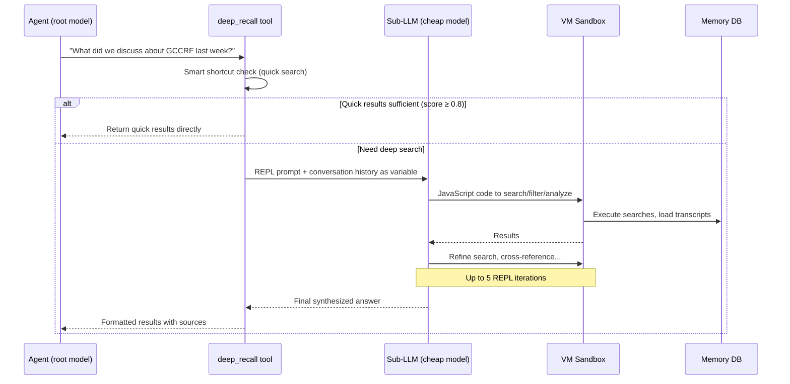

# Deep Recall — RLM Infinite Memory

Deep Recall extends the agent's memory beyond the context window using the **Recursive Language Model (RLM)** pattern. When the agent needs to answer a question that requires reasoning over many messages or old memories, it spawns a sandboxed sub-LLM that writes and executes its own search code against the full conversation history and crystal database.

**Key source files:** `rlm/executor.ts`, `rlm/sandbox.ts`, `rlm/prompts.ts`, `rlm/cost-tracker.ts`, `rlm/context-builder.ts`, `rlm/types.ts`, `tools/deep-recall-tool.ts`

---

## How It Works



### The Key Insight (from RLM Paper, arxiv 2512.24601)

The sub-LLM writes its own search code rather than having pre-baked search functions. This means it can:
- Combine semantic search with keyword filtering
- Cross-reference results across sessions
- Apply temporal reasoning ("messages from last Tuesday")
- Chain multiple searches based on intermediate results

### Example REPL Loop

```javascript
// Iteration 1: Sub-LLM writes this code
const results = await search("GCCRF implementation details", { limit: 20 });
const gccrf = results.filter(r => r.score > 0.6);

// Iteration 2: Refine based on results
const dates = gccrf.map(r => new Date(r.created_at).toISOString().slice(0, 10));
const recentResults = await search("GCCRF changes March 2026", { limit: 10 });

// Iteration 3: Synthesize
return {
  summary: "GCCRF was discussed on March 12 and March 26...",
  sources: gccrf.slice(0, 5).map(r => ({ id: r.id, text: r.text.slice(0, 200) }))
};
```

---

## Smart Shortcut

Before spawning the expensive sub-LLM, the tool runs a quick hybrid search (BM25 + vector). If results score ≥ 0.8, they're returned directly — skipping the REPL.

**Important:** The 0.8 threshold is applied **client-side** after retrieval, because the RRF (Reciprocal Rank Fusion) merge strategy ignores the `minScore` parameter. This was a critical bug that caused the shortcut to ALWAYS fire.

```typescript
// Fixed: filter scores client-side
const quickResults = rawResults.filter(r => r.score >= 0.8);
if (quickResults.length >= 3) {
  return formatQuickResults(quickResults); // Skip REPL
}
```

---

## Model Routing

| Role | Model | Why |
|------|-------|-----|
| Root agent | User's configured model (e.g., Claude Opus) | Understands the question, uses the answer |
| Sub-LLM (REPL) | Cheap model (e.g., GPT-4o-mini, Haiku) | Writes search code — doesn't need creativity |

Resolved via `resolveAgentModelPrimary()` for root, hardcoded cheap model for sub-calls.

---

## Sandbox Security

The sub-LLM's code runs in a **Node.js VM sandbox** (`vm.createContext`):

- **Isolated context** — no access to `process`, `require`, `fs`, or network
- **Available APIs:** `search()`, `loadTranscript()`, `listSessions()`, `console.log()`
- **Timeout:** Configurable per execution (on `runInContext`, not `Script` constructor)
- **Cleanup:** `vmContext` is nulled after disposal to prevent memory leaks
- **Iteration limit:** Maximum 5 REPL iterations per query

---

## Cost Tracking

The `CostTracker` monitors sub-LLM token usage:

```typescript
interface CostSnapshot {
  inputTokens: number;
  outputTokens: number;
  estimatedCostUsd: number;
  iterations: number;
}
```

Typical cost: $0.005-0.02 per deep recall query (1-5 cheap model calls).

---

## Context Building

The `ContextBuilder` prepares the REPL prompt with:

1. **Conversation history** — Recent messages as a variable the sub-LLM can reference
2. **Available sessions** — List of session keys for cross-session queries
3. **Search API docs** — Function signatures and usage examples
4. **Original query** — The user's question
5. **Diverse seed queries** — Multiple search angles generated from the question (replaced a wildcard `"*"` that returned random results)

---

## Related Documentation

- [Architecture Overview](./architecture-overview.md) — where deep recall fits in the system
- [Working Memory](./working-memory.md) — MEMORY.md provides immediate context
- [Curiosity & Search](./curiosity-and-search.md) — search infrastructure deep recall builds on
- [User Knowledge](./user-knowledge.md) — session extraction for long-term facts
