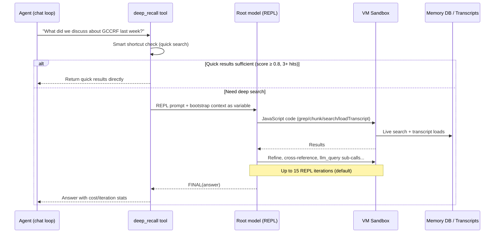

# Deep Recall — RLM Infinite Memory

Deep Recall extends the agent's memory beyond the context window using the **Recursive Language Model (RLM)** pattern. When the agent needs to answer a question that requires reasoning over many messages or old memories, it runs a sandboxed REPL where the model writes and executes search code against conversation history and the crystal database.

**Key source files:** `rlm/executor.ts`, `rlm/sandbox.ts`, `rlm/prompts.ts`, `rlm/cost-tracker.ts`, `rlm/context-builder.ts`, `rlm/types.ts`, `tools/deep-recall-tool.ts`

---

## How It Works


```mermaid
sequenceDiagram
    participant Agent as Agent (chat loop)
    participant Tool as deep_recall tool
    participant Root as Root model (REPL)
    participant Sandbox as VM Sandbox
    participant DB as Memory DB / Transcripts

    Agent->>Tool: "What did we discuss about GCCRF last week?"
    Tool->>Tool: Smart shortcut check (quick search)
    alt Quick results sufficient (score ≥ 0.8, 3+ hits)
        Tool-->>Agent: Return quick results directly
    else Need deep search
        Tool->>Root: REPL prompt + bootstrap context as variable
        Root->>Sandbox: JavaScript code (grep/chunk/search/loadTranscript)
        Sandbox->>DB: Live search + transcript loads
        Sandbox-->>Root: Results
        Root->>Sandbox: Refine, cross-reference, llm_query sub-calls...
        Note over Root,Sandbox: Up to 15 REPL iterations (default)
        Root-->>Tool: FINAL(answer)
        Tool-->>Agent: Answer with cost/iteration stats
    end
```

### The Key Insight (from RLM Paper, arXiv:2512.24601)

The model writes its own search code rather than calling pre-baked search functions. This means it can:

- Combine semantic search with keyword filtering
- Cross-reference results across sessions
- Apply temporal reasoning ("messages from last Tuesday")
- Chain multiple searches based on intermediate results

### Live environment, not just a snapshot

The `context` variable is a **bootstrap snapshot** (capped by `maxContextTokens`, default 500k tokens). Beyond it, the sandbox exposes **live async APIs** that reach the full history:

| API                                  | What it does                                                      |
| ------------------------------------ | ----------------------------------------------------------------- |
| `await search(query, {maxResults?})` | Hybrid semantic+keyword search over crystals and indexed sessions |
| `await listSessions()`               | List all session transcripts, newest first                        |
| `await loadTranscript(sessionId)`    | Load a full transcript as `[timestamp] ROLE: text` lines          |

Live API payloads are size-capped, errors come back as data (never crash the REPL), and all access is read-only.

### Example REPL Loop

```javascript
// Iteration 1: search live memory beyond the snapshot
const hits = await search("GCCRF implementation details", { maxResults: 20 });
store(
  "hits",
  hits.filter((r) => r.score > 0.6),
);

// Iteration 2: read the surrounding conversation
const sessions = await listSessions();
const transcript = await loadTranscript(sessions[2].sessionId);
const relevant = grep(transcript, "GCCRF");

// Iteration 3: synthesize and finish
FINAL("GCCRF was discussed on March 12 and March 26: ...");
```

---

## Session-Persistent Sandbox

The sandbox is cached per `agent:session:scope` and **reused across `deep_recall` calls**: values saved with `store()` in one query are readable via `get()` in the next, so repeated recalls build on earlier exploration instead of starting cold.

- The bootstrap snapshot is rebuilt after a 15-minute TTL (the store survives the rebuild; live APIs cover the gap in between).
- JSON-serializable store entries are persisted to disk (`<agent dir>/rlm-store/`) and re-imported after a gateway restart.
- Completion signals (`FINAL`) are cleared between runs; the store is not.

---

## Recursion Depth

`memory.rlm.maxDepth` controls what a sub-call is (capped at 3):

- **1 (default):** `llm_query()` sub-calls are plain one-shot completions on the cheap model — the paper's depth-1 regime.
- **2:** each sub-call becomes a **nested mini-RLM**: the cheap model gets its own REPL over the sub-context (5 iterations max), and its own sub-calls are plain completions. Nested cost and sub-calls are charged to the parent budget.

---

## Smart Shortcut

Before spawning the REPL, the tool runs a quick hybrid search (BM25 + vector). If 3+ results score ≥ 0.8, they're returned directly — skipping the REPL.

**Important:** The 0.8 threshold is applied **client-side** after retrieval, because the RRF (Reciprocal Rank Fusion) merge strategy ignores the `minScore` parameter. This was a critical bug that caused the shortcut to ALWAYS fire.

```typescript
// Fixed: filter scores client-side
const highConfidence = quickResults.filter((r) => r.score >= 0.8);
if (highConfidence.length >= 3) {
  return formatQuickResults(highConfidence); // Skip REPL
}
```

---

## Model Routing

| Role                    | Model                                       | Why                                                   |
| ----------------------- | ------------------------------------------- | ----------------------------------------------------- |
| Root (writes REPL code) | User's configured model (e.g., Claude Opus) | Exploration strategy needs the strong model           |
| Sub-LLM (`llm_query`)   | Cheap model (e.g., GPT-4o-mini, Haiku)      | Summarizing/extracting from chunks doesn't need power |

Root resolved via `resolveAgentModelPrimary()`; sub-model auto-picked from available API keys (`memory.rlm.subModel` overrides).

---

## Sandbox Security

The REPL code runs in a **Node.js VM sandbox** (`vm.createContext`):

- **Isolated context** — no access to `process`, `require`, `fs`, or network
- **Available APIs:** text utilities (`grep`, `chunk`, `getLines`, ...), `store()`/`get()`, `llm_query()`/`llm_query_parallel()`, and the read-only live APIs (`search`, `loadTranscript`, `listSessions`)
- **Timeout:** per code block (`memory.rlm.sandboxTimeout`, default 30s), plus a hard outer timeout covering async calls
- **Cleanup:** cached sandboxes are disposed on LRU eviction (8 max)

---

## Budgets and Cost Tracking

The `CostTracker` enforces per-invocation limits (defaults): 15 REPL iterations, 20 sub-calls, $0.50. The model gets an explicit budget warning as limits approach, and results report iterations, sub-calls, and dollar cost.

Typical cost: $0.005-0.02 per deep recall query.

---

## Context Building

The `ContextBuilder` prepares the bootstrap snapshot with:

1. **Conversation history** — recent session transcripts (scope-dependent)
2. **Knowledge crystals** — diverse seed queries against memory (replaced a wildcard `"*"` that returned random results)
3. **Metadata** — session list, date ranges, message counts

---

## Self-Improvement

The RLM executor includes two self-improvement mechanisms:

### Query Result Cache

Identical (or near-identical) queries within a 1-hour window return cached results immediately, avoiding redundant REPL sessions. The cache is keyed on `SHA-256(scope + lowercase query)` and holds up to 50 entries. Cache is invalidated whenever new session extraction runs (facts have changed).

### Blind Spot Registration

When `deep_recall` returns no useful answer, the failed query is registered as a high-priority exploration target (`knowledge_gap` type, priority 0.85, 7-day TTL) in the curiosity engine. This ensures the dream engine's exploration mode specifically targets the gap during the next cycle. Over time, the system actively fills the holes that users care about most.

---

## Configuration

```json5
{
  memory: {
    rlm: {
      enabled: true, // kill switch
      subModel: "auto", // or "provider/model"
      maxIterations: 15,
      maxDepth: 1, // 2 = nested mini-RLM sub-calls (cap 3)
      maxBudget: 0.5, // USD per invocation
      maxSubCalls: 20,
      sandboxTimeout: 30000,
      maxContextTokens: 500000, // bootstrap snapshot size
      defaultScope: "recent_sessions",
    },
  },
}
```

---

## Related Documentation

- [Architecture Overview](./architecture-overview.md) — where deep recall fits in the system
- [Working Memory](./working-memory.md) — MEMORY.md provides immediate context
- [Curiosity & Search](./curiosity-and-search.md) — search infrastructure deep recall builds on
- [User Knowledge](./user-knowledge.md) — session extraction for long-term facts
