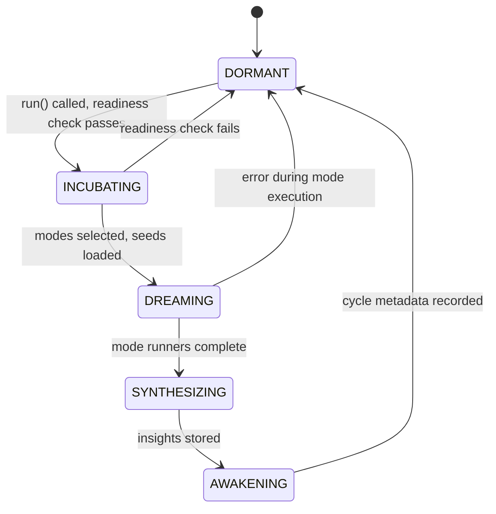
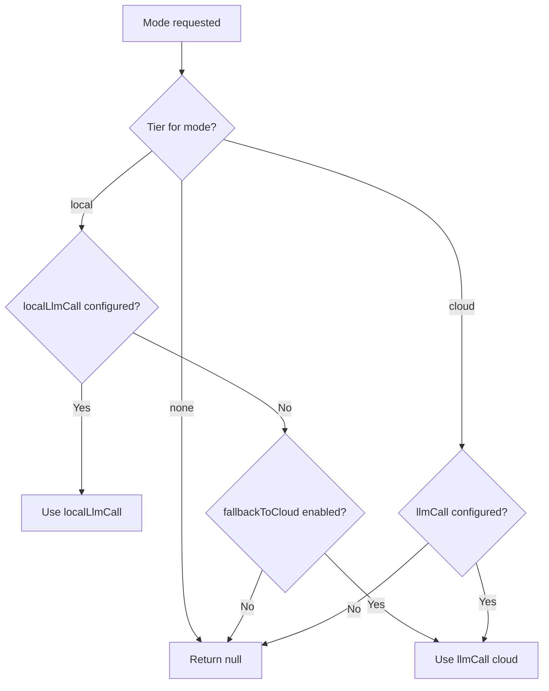

# Dream Engine — Offline Processing & Insight Generation

The Dream Engine processes memories during idle periods, generating new insights through 7 specialized modes: replaying important memories, compressing redundant knowledge, mutating skills, extrapolating future patterns, simulating cross-domain recombinations, exploring curiosity-driven knowledge gaps, and researching empirical prompt optimizations. Each mode is assigned a compute tier (none, local LLM, or cloud LLM) to balance cost against insight quality.

The engine uses three complementary signals for intelligent mode selection: **curiosity heuristics**, **GCCRF information theory**, and **FSHO oscillator dynamics** (a Kuramoto synchronization model). Dream cycles are triggered on a timer, but can also fire immediately in response to emotional spikes.

**Key source files:** `dream-engine.ts`, `dream-types.ts`, `dream-schema.ts`, `dream-synthesis-prompt.ts`, `dream-mutation-strategies.ts`, `dream-oscillator.ts`, `scheduler.ts`

---

## State Machine

The dream engine progresses through 5 states in each cycle:



```typescript
type DreamState = "DORMANT" | "INCUBATING" | "DREAMING" | "SYNTHESIZING" | "AWAKENING";
```

A cycle is triggered by a timer (default: every 120 minutes), manually via `MemoryIndexManager.dream()`, or by an **emotional mini-dream** (see below).

The minimum chunks required to trigger a dream cycle is **5**, so the dream engine activates within a single conversation session rather than requiring days of accumulated data.

After each dream cycle completes, the engine also performs an **RLM Working Memory rewrite** — updating MEMORY.md as a recursive state vector. See [Working Memory](./working-memory.md) for details.

---

## Dream Readiness Check

Before spending LLM tokens, the engine computes an **information-theoretic readiness score** [0, 1]:

```
readiness = newChunks / totalChunks   (information ratio)
```

The cycle is skipped if:
- No chunks have been added/updated since the last dream
- Fewer than 3 new chunks AND no pending near-merge hints AND no curiosity targets

Secondary triggers that guarantee readiness:
- **Near-merge hints** from SNN discovery (score ≥ 0.3)
- **Active curiosity targets** (score ≥ 0.2)

Mini-dreams (emotionally triggered) bypass the readiness check entirely.

This saves ~$0.50/day in LLM tokens during quiet periods and prevents "stale dream hallucination" — where the LLM generates fake insights about unchanged material.

---

## 7 Dream Modes

Each mode serves a different purpose and has a default weight controlling how often it's selected:

| Mode | Weight | Compute Tier | Purpose |
|------|--------|-------------|---------|
| `replay` | 0.20 | `none` | Strengthen important memory pathways via ripple-enhanced multi-pass |
| `compression` | 0.20 | `none` | Generalize into higher abstractions; consume near-merge hints |
| `mutation` | 0.15 | `cloud` | Generate skill/knowledge variations via strategy-based prompts |
| `simulation` | 0.15 | `cloud` | Cross-domain creative recombination via farthest-point sampling |
| `extrapolation` | 0.10 | `cloud` | Predict future patterns from user behavior |
| `exploration` | 0.10 | `local` | Gap-filling from curiosity targets |
| `research` | 0.10 | `cloud` | Empirical prompt optimization using skill execution data |

### Mode Selection — Three-Signal Architecture

`selectModes()` picks 1-3 modes using three complementary signals, combined via weighted normalization:

```
adjustment = 0.3 × curiosityAdj + 0.3 × gccrfAdj + 0.4 × fshoAdj
```

#### 1. Curiosity Heuristics (weight: 0.3)
The `CuriosityEngine` shifts weights based on detected knowledge structure:
- Many knowledge gaps → boost `exploration`
- Contradictions detected → boost `simulation`
- Frontier targets → boost `mutation`

#### 2. GCCRF Component Analysis (weight: 0.3)
Maps individual GCCRF components to modes — what the agent *needs to learn*:
- High η (prediction error) → `exploration` (investigate the surprising)
- High Δη (learning progress) → `compression` (consolidate what's being learned)
- High Iα (novelty) → `simulation` (cross-domain connections in novel space)
- High E (empowerment) → `mutation` (optimize high-agency skills)
- High S (strategic alignment) → `research` (goal-directed investigation)

#### 3. FSHO Oscillator Dynamics (weight: 0.4)
Maps what the *memory landscape* looks like. Runs a Kuramoto-coupled oscillator simulation on recent chunk salience values and outputs an order parameter R ∈ [0, 1]:

| R Range | Memory State | Favored Modes |
|---------|-------------|---------------|
| R > 0.7 | Coherent (memories clustered) | compression, replay, research |
| 0.3-0.7 | Critical (edge of sync) | mutation, simulation |
| R < 0.3 | Scattered (memories dispersed) | exploration, extrapolation |

The FSHO uses fractional Gaussian noise (Hurst parameter H=0.7 for long-range memory) and completes in <3ms.

**Key insight:** GCCRF and FSHO can disagree. High curiosity targets (GCCRF wants exploration) but coherent memory set (FSHO wants compression) → the weighted combination produces a balanced selection rather than one signal dominating.

#### Hormonal Temperature
After adjustment, mode selection uses temperature-scaled softmax:
- **High dopamine** → higher temperature → more creative/exploratory
- **High cortisol** → lower temperature → more focused/replay-oriented
- **High oxytocin** → slight temperature increase → relational exploration

#### Auto-Triggers
- `exploration` forced if unresolved curiosity targets exist
- `mutation` forced if skill crystals exist

---

### Replay Mode — Ripple-Enhanced (no LLM)

Implements biologically-inspired sharp-wave ripple consolidation. Instead of a single importance boost per chunk, applies **Poisson-distributed ripple events** (λ=3, range [1,7]) with exponentially decaying boosts:

```
Ripple 1: +0.100
Ripple 2: +0.060
Ripple 3: +0.036
Ripple 4: +0.022
...
Total (3 ripples): +0.196
Total (7 ripples): +0.243
```

Each ripple represents a simulated sharp-wave replay at 60% amplitude of the previous, modeling STDP habituation. The total boost is applied in a single DB write for efficiency.

**Orphan priority:** Replay mode first processes chunks from the `orphan_replay_queue` (important-but-neglected memory clusters detected by the anti-catastrophic-forgetting system), then fills remaining slots via normal hormonal-weighted selection.

**Spaced repetition tracking:** Each chunk stores `last_ripple_count`, enabling future prioritization of chunks that received fewer ripples in previous cycles.

**Hormonal influence on seed selection:**
- High dopamine → preferentially replay positive memories (reinforcement)
- High cortisol → preferentially replay successful memories (stress coping)

### Compression Mode (heuristic, no LLM)

Clusters semantically similar chunks (cosine ≥ 0.85, min 3 members, min 6 seeds) and generates merged summaries via heuristic synthesis. Source chunks are archived.

**Near-merge hint consumption:** Before selecting seeds, compression mode checks for **SNN-discovered near-merge hints** — chunk pairs identified by Shared Nearest Neighbor analysis as semantically related despite being below the merge threshold (cosine 0.82-0.91). These pairs are fed into the compression pipeline for LLM-free evaluation.

### Mutation Mode (cloud LLM)

Generates skill variations using strategy-based prompts. Processes up to 5 skill crystals per cycle:

1. Selects a skill crystal
2. `selectStrategy()` picks one of 5 mutation strategies based on metrics
3. `buildStrategyPrompt()` generates a strategy-specific LLM prompt
4. LLM produces a variation
5. Result is evaluated by `SkillRefiner` and optionally verified by `SkillVerifier`

Mid-confidence results are queued in `mutation_queue` for retry (up to 3 attempts). Successful promotions trigger a **dopamine spike** via the hormonal manager.

### Extrapolation Mode (cloud LLM)

Predicts future user needs by analyzing preferences, patterns, and episodic memories. Requires at least 3 seed chunks.

### Simulation Mode (cloud LLM)

Cross-domain creative recombination. Uses **farthest-point sampling** to select 3 maximally diverse chunks, then asks the LLM to find unexpected connections.

### Exploration Mode (local LLM)

Gap-filling driven by the curiosity engine. Loads unresolved `curiosity_targets` of type `knowledge_gap` and generates content to fill those gaps using a local LLM (to minimize cost).

### Research Mode (cloud LLM)

Empirical prompt optimization. Analyzes skill execution data to identify underperforming prompts, generates variations, and uses the `ExperimentSandbox` to evaluate them against real metrics. The most effective variants are promoted.

---

## Emotional Dream Triggering

The dream engine can be triggered immediately by significant hormonal spikes, bypassing the normal timer:

| Spike | Threshold | Mini-Dream Mode | Rationale |
|-------|-----------|----------------|-----------|
| Dopamine | > 0.7 | `replay` | Reinforce the positive experience |
| Cortisol | > 0.8 | `compression` | Process the stressful event |

Mini-dreams run through the same `run()` pipeline but with a single non-LLM mode (free). A **10-minute cooldown** prevents runaway cycles.

The trigger is wired through `MemoryIndexManager` (the orchestration layer), not directly on the hormonal manager — maintaining the existing architectural pattern where the manager coordinates all subsystems.

---

## Dream Telemetry

All dream phases write structured metrics to the `dream_telemetry` table:

```sql
CREATE TABLE dream_telemetry (
  cycle_id TEXT NOT NULL,
  phase TEXT NOT NULL,       -- 'fsho', 'ripple', 'snn_merge', 'orphan_rescue', 'readiness'
  metric_name TEXT NOT NULL,
  metric_value REAL NOT NULL,
  created_at INTEGER NOT NULL
);
```

Examples:
- `(cycle_123, "fsho", "order_parameter", 0.62)` — FSHO computed R=0.62 (creative zone)
- `(cycle_123, "ripple", "ripple_count", 4)` — 4 Poisson-sampled ripples this replay
- `(cycle_123, "readiness", "score", 0.45)` — 45% of knowledge base is new

This enables closed-loop validation: empirically measuring whether FSHO's R-parameter actually correlates with better dream outcomes.

### Dream Outcome Evaluation

After each dream cycle, a **Dream Quality Score (DQS)** is computed and persisted to the `dream_outcomes` table. DQS is a weighted composite of five metrics:

| Component | Weight | Measures |
|-----------|--------|----------|
| **Crystal Yield** | 0.25 | New insights per LLM call |
| **Merge Efficiency** | 0.15 | Successful merges / merge attempts |
| **Orphan Rescue** | 0.15 | Orphans replayed / orphans queued |
| **Bond Stability** | 0.30 | Whether the Bond passed drift validation |
| **Token Efficiency** | 0.15 | Budget utilization |

Bond stability has the highest weight because losing the user's identity information is the worst failure mode.

The `analyzeSignalCorrelation()` function computes Pearson correlation between FSHO R values and DQS across the last 20 cycles. If |r| > 0.3, the FSHO signal is predictive and its weight should be maintained. This data will eventually drive adaptive weight tuning of the 0.3/0.3/0.4 (curiosity/GCCRF/FSHO) combination.

### GCCRF ↔ FSHO Alpha Coupling

The GCCRF's alpha parameter shifts from density-seeking (learn fundamentals, α = -3) to frontier-seeking (explore novelty, α = 0) as the agent matures. The FSHO order parameter R provides a complementary signal: high R means memories are well-consolidated, so the agent can afford to explore earlier.

The coupling modulates alpha based on a running EMA of R:

```
effective_alpha = base_alpha + 0.5 × (R_avg - 0.5)
```

If R_avg > 0.5 (coherent memories), alpha shifts toward frontier-seeking. If R_avg < 0.5 (scattered), it shifts toward consolidation. This creates a self-regulating curiosity drive that responds to the actual state of the agent's knowledge.

---

## Anti-Catastrophic Forgetting

The consolidation engine detects **orphan clusters** — groups of important memories (importance > 0.4) that haven't been accessed in 7+ days. Instead of simply boosting their importance (which creates a sawtooth decay pattern), orphans are queued for **replay via the dream engine**:

1. `ConsolidationEngine.rescueOrphanClusters()` detects neglected clusters (cosine > 0.75, min 2 members)
2. Orphan chunk IDs are inserted into `orphan_replay_queue` with cluster metadata
3. Next dream cycle → replay mode picks orphan seeds first
4. Ripple-enhanced replay updates `last_dreamed_at`, `dream_count`, `importance_score`
5. Chunk re-enters normal selection pipeline with refreshed metadata

This creates a genuine consolidation pathway rather than an importance band-aid.

---

## Shared Nearest Neighbor Merge Discovery

Before the standard cosine ≥ 0.92 merge step, the consolidation engine runs **SNN analysis** to find "hidden clusters" — chunks that are semantically related but sit at cosine 0.82-0.91:

1. Compute k-NN (k=10) for each chunk
2. For pairs in the near-miss cosine range, count shared neighbors
3. Pairs with ≥ 4 shared neighbors → stored as `near_merge_hints`
4. Compression mode consumes hints in the next dream cycle

SNN is more robust than raw cosine for high-dimensional embedding spaces because it detects *structural* similarity (shared neighborhood) rather than just pairwise distance.

---

## Tiered Compute Routing

Each dream mode maps to a compute tier:

```typescript
type ComputeTier = "none" | "local" | "cloud";

const DEFAULT_MODE_TIERS: Record<DreamMode, ComputeTier> = {
  replay: "none",
  compression: "none",
  exploration: "local",
  mutation: "cloud",
  extrapolation: "cloud",
  simulation: "cloud",
  research: "cloud",
};
```

### LLM Call Resolution (`getLlmCallForMode()`)



---

## Clustering

The `clusterChunks()` method uses **greedy single-linkage clustering**:

1. Parse all seed chunk embeddings
2. Compute cosine similarity to every existing cluster centroid
3. If similarity >= threshold (default 0.65), assign to best cluster
4. Otherwise, create a new cluster
5. Recompute centroid after each assignment

---

## Synthesis Pipeline

Dream insights are generated through two paths:

### Heuristic Synthesis (`"heuristic"`)
No LLM call. Extracts keywords, builds summary from highest-importance chunks, assigns confidence based on cluster cohesion.

### LLM Synthesis (`"llm"`)
1. `buildDreamSynthesisPrompt()` generates prompt with cluster context
2. LLM returns JSON array of `{ content, confidence, keywords }`
3. `parseDreamSynthesisResponse()` validates results

### Both (`"both"`, default)
Runs heuristic first, then LLM. Takes the higher-confidence result.

### Insight Storage
Each insight is stored in `dream_insights` with its own embedding. Insights exceeding `maxInsights` (200) are pruned by lowest importance.

---

## Budget System

The `MemoryScheduler` enforces per-hour API budgets:

| Budget | Default | Operations |
|--------|---------|------------|
| `llmCallsPerHour` | 20 | dream, curiosity, discovery |
| `embeddingCallsPerHour` | 100 | embed, preload, backfill |
| `localLlmCallsPerHour` | ∞ | local LLM operations |

Search and consolidation are always allowed (no API calls).

---

## Configuration Reference

```typescript
type DreamEngineConfig = {
  enabled?: boolean;                        // Default: true
  intervalMinutes?: number;                 // Default: 120
  maxChunksPerCycle?: number;               // Default: 50
  maxLlmCallsPerCycle?: number;             // Default: 5
  clusterSimilarityThreshold?: number;      // Default: 0.65
  minImportanceForDream?: number;           // Default: 0.3
  synthesisMode?: "heuristic" | "llm" | "both";  // Default: "both"
  model?: string;                           // Default: "openai/gpt-4o-mini"
  maxInsights?: number;                     // Default: 200
  minChunksForDream?: number;               // Default: 5
  llmCall?: (prompt: string) => Promise<string>;
  localLlmCall?: (prompt: string) => Promise<string>;
  modes?: Partial<Record<DreamMode, Partial<DreamModeConfig>>>;
  modelTiers?: ModelTierConfig;
};
```

---

## Related Documentation

- [Architecture Overview](./architecture-overview.md) — system entry point and data flow
- [Emotional System](./emotional-system.md) — hormonal dynamics, anchors, limbic bridge
- [Knowledge Crystals](./knowledge-crystals.md) — core data model and lifecycle
- [Deep Recall](./deep-recall.md) — RLM infinite recall system
- [User Knowledge](./user-knowledge.md) — session extraction and Bond evolution
- [Skills Pipeline](./skills-pipeline.md) — how dream mutations feed into skill refinement
- [Curiosity & Search](./curiosity-and-search.md) — curiosity-dream feedback loop

---

## Dream-Driven Skill Crystallization

The dream engine plays a central role in the skill marketplace:

1. **Mutation mode** creates variations of existing skill patterns during dream cycles
2. **SkillCrystallizer** detects repeated successful execution patterns and promotes them to skill crystals
3. **MarketplaceEconomics** automatically prices and lists qualifying skills
4. **Hormonal feedback:** Successful skill sales trigger `marketplace_sale` dopamine events, reinforcing the crystallization → sale → dopamine loop

This creates a virtuous cycle: the agent's daily work generates episodes → dream engine distills patterns → skills crystallize → marketplace sells them → dopamine reinforces the behavior.
