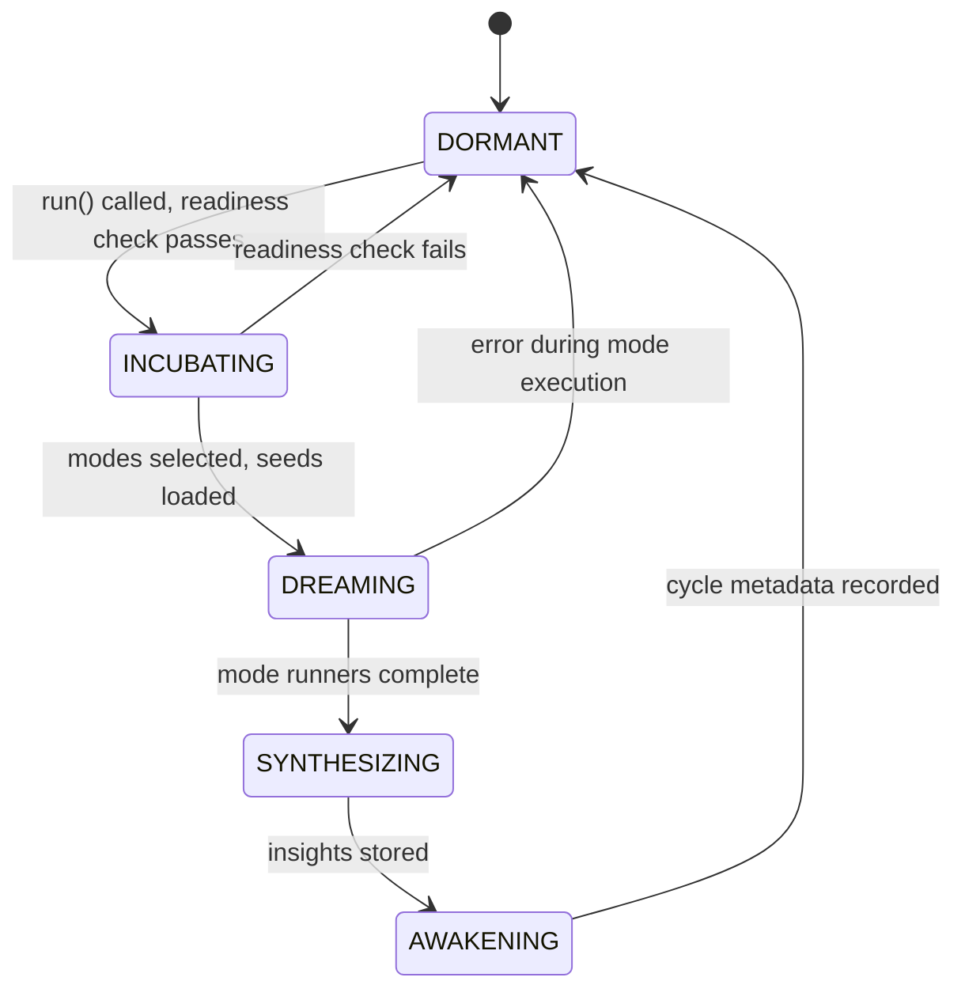
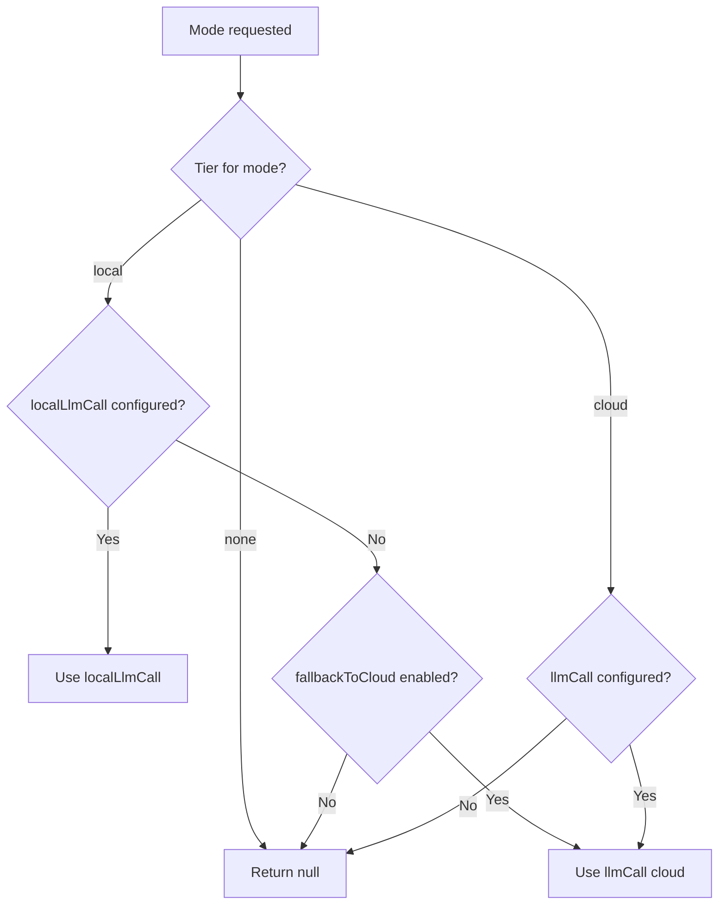

# Dream Engine — Offline Processing & Insight Generation

> **PLAN-45 Phase 1 (2026-09-05).** The legacy skill producers are gone:
> the `mutation` and `research` dream modes, the PLAN-21 slow update, the
> Pareto ranker, prompt optimization, and `SkillRefiner` were deleted, not
> merely disabled. The `skill_text_history` table is left in place (no
> migration) but is now orphaned: nothing reads or writes it. Skill
> improvement runs through the PLAN-40 `distillation` lane and the PLAN-42/44
> wiki-skill pipeline (`docs/memory/skills-pipeline.md`).
>
> **PLAN-40 retarget in progress (2026-08-10).** The utility evaluation
> (docs/reviews/dream-engine-utility-2026-08-10.md) found the engine's
> lifetime cognitive output had never been consumed by anything downstream.
> Phase 0 landed: `mutation` is **disabled by default** (its lifetime output
> was 206 paraphrases of one skill, zero reads/executions; the
> verified-success distillation lane replaces it), the three fuel-starved
> modes (`interceptor_harvest`, `harness_evolve`,
> `relationship_reconsolidation`) are **held disabled** with doctor-visible
> wake thresholds (10 outcome-tagged records / 25 completed executions /
> 100 relationships), `mutation_queue` was dropped (it never had a reader),
> exploration only fires on **unexplored** curiosity targets, the per-cycle
> LLM budget is now hard (verifier calls included), and every artifact the
> engine produces gets a **`dream_utility` funnel row** whose set-once
> consumption stamp is written only where content provably enters a model
> prompt. Consumed-artifact rate — not DQS — is the engine's score.

The Dream Engine processes memories during idle periods, generating new insights through specialized modes: replaying important memories, compressing redundant knowledge, extrapolating future patterns, simulating cross-domain recombinations, and exploring curiosity-driven knowledge gaps, plus the plan-specific lanes listed below. Each mode is assigned a compute tier (none, local LLM, or cloud LLM) to balance cost against insight quality.

The engine uses three complementary signals for intelligent mode selection: **curiosity-driven GCCRF analysis** (prediction error, learning progress, novelty, empowerment, strategic alignment), **FSHO oscillator dynamics** (a Kuramoto synchronization model with empirical self-validation), and **marketplace demand** (Plan 8). Dream cycles are triggered on a timer, but can also fire immediately in response to emotional spikes.

**Key source files:** `dream-engine.ts`, `dream-types.ts`, `dream-schema.ts`, `dream-synthesis-prompt.ts`, `dream-oscillator.ts`, `scheduler.ts`

---

## State Machine

The dream engine progresses through 5 states in each cycle:


```mermaid
stateDiagram-v2
    [*] --> DORMANT
    DORMANT --> INCUBATING: run() called, readiness check passes
    INCUBATING --> DREAMING: modes selected, seeds loaded
    DREAMING --> SYNTHESIZING: mode runners complete
    SYNTHESIZING --> AWAKENING: insights stored
    AWAKENING --> DORMANT: cycle metadata recorded
    INCUBATING --> DORMANT: readiness check fails
    DREAMING --> DORMANT: error during mode execution
```

```typescript
type DreamState = "DORMANT" | "INCUBATING" | "DREAMING" | "SYNTHESIZING" | "AWAKENING";
```

A cycle is triggered by a timer (default: every 120 minutes), manually via `MemoryIndexManager.dream()`, or by an **emotional mini-dream** (see below).

The minimum chunks required to trigger a dream cycle is **5**, so the dream engine activates within a single conversation session rather than requiring days of accumulated data.

After each dream cycle completes, the engine also performs an **RLM Working Memory rewrite** — updating MEMORY.md as a recursive state vector. See [Working Memory](./working-memory.md) for details.

---

## Dream Readiness Check

Before spending LLM tokens, the engine computes an **information-theoretic readiness score** [0, 1]:

```
readiness = newChunks / totalChunks   (information ratio)
```

The cycle is skipped if:

- No chunks have been added/updated since the last dream
- Fewer than 3 new chunks AND no pending near-merge hints AND no curiosity targets

Secondary triggers that guarantee readiness:

- **Near-merge hints** from SNN discovery (score ≥ 0.3)
- **Active curiosity targets** (score ≥ 0.2)

Mini-dreams (emotionally triggered) bypass the readiness check entirely.

This saves ~$0.50/day in LLM tokens during quiet periods and prevents "stale dream hallucination" — where the LLM generates fake insights about unchanged material.

---

## Dream Modes

Each mode serves a different purpose and has a default weight controlling how often it's selected:

| Mode            | Weight | Compute Tier | Purpose                                                             |
| --------------- | ------ | ------------ | ------------------------------------------------------------------- |
| `replay`        | 0.18   | `none`       | Strengthen important memory pathways via ripple-enhanced multi-pass |
| `compression`   | 0.18   | `none`       | Generalize into higher abstractions; consume near-merge hints       |
| `simulation`    | 0.14   | `cloud`      | Cross-domain creative recombination via farthest-point sampling     |
| `extrapolation` | 0.09   | `cloud`      | Predict future patterns from user behavior                          |
| `exploration`   | 0.09   | `local`      | Gap-filling from curiosity targets                                  |

**Retired in PLAN-45 Phase 1 (2026-09-05):** `mutation` and `research`. Both were disabled by default since PLAN-40 / PLAN-34 and are now deleted from `DreamMode`. A `bitterbot.json` that still lists either key under `memory.dream.modes` or `modelTiers.modeTiers` keeps working: the engine logs `dream mode X was retired in PLAN-45 Phase 1; ignoring` once per key at construction and drops it.

**`hygiene` (PLAN-40 Lane 2, enabled, reserved slot):** each cycle it
(a) drains the never-embedded crystal backlog (200/cycle, no LLM,
cursorless) and (b) enqueues up to 2 "still true?" questions for canonical
facts unconfirmed for 90+ days (3 asks max, then the fact transitions to
`unconfirmed`; a tier ≥ 1 re-confirmation resets the budget for the next
staleness episode). One selection slot per cycle is reserved for utility
lanes round-robin so softmax competition can never starve them.

The lane's third operation — a near-duplicate merge that consolidated
cosine ≥ 0.92 clusters into LLM summaries and demoted the members out of
the search indexes — was **deleted 2026-08-14** after failing its
pre-registered D2 gate: across 23 real replayed queries on state copies
differing only by the merge, 0 top-5 changes and −0.1% injected tokens
(`docs/reviews/plan40-phase-adversarial-2026-08-11.md`). Its ~19 summaries
and their demoted members remain valid live data; the machinery that keeps
demotions holding across re-indexing (re-index carry-over, the FTS drift
fence's lifecycle filter, compression's `hygiene_done` skip) is still
active. Measured top-5 redundancy (~0.65) lives in handover/session
summaries the merge never targeted — future redundancy work should start
there.

**`distillation` (PLAN-40 Lane 1, enabled, reserved slot):** verified-success
distillation — the AWM/Voyager shape. Skills with ≥3 completed executions
recorded by the attributed hook path (`recorded_by='after_tool_call'`),
success rate ≥ 0.7, and no negative user feedback get ONE "what works"
workflow note (`semantic_type='task_pattern'`, evidence refs = execution
ids), searchable immediately. `reward_score` is never consulted (it is a
length heuristic); dream-origin crystals never qualify (no paraphrase
self-distillation); the cursor rides `started_at`, never rowid.

**`anticipation` (PLAN-40 Lane 3, enabled, reserved slot):** grounded briefs
for predictable next questions, from the user's demonstrably-active context
(recently-confirmed canonical facts + recent first-party episodes). At most
1 brief/cycle, 5 open; each must cite ≥2 real sources. Briefs are NOT
memory chunks — they live in `dream_briefs`, invisible to every retrieval
surface, and drain (one per session start) only into sessions that resolve
to the OWNER, marked explicitly as machine hunches.

**Disabled by default since PLAN-40 Phase 0 (2026-08-10):** the three
structurally-unfueled holds `interceptor_harvest`,
`harness_evolve`, and `relationship_reconsolidation`. Holds re-enable when
their wake counters (shown in `bitterbot doctor`'s dream-utility section)
cross threshold: ≥10 outcome-tagged intervention records, ≥25 completed
skill executions, ≥100 active relationships respectively. All remain
individually re-enablable via `memory.dream.modes.<mode>.enabled`.

### Mode Selection — Three-Signal Architecture

`selectModes()` picks 1-3 modes using three complementary signals from the unified `CuriosityEngine`, combined via weighted normalization. The marketplace signal activates only when there is recent marketplace activity; otherwise the original two-signal weights are preserved:

**When marketplace is active** (purchases, bounties, or searches in the last 24h):

```
adjustment = 0.25 × curiosityAdj + 0.25 × gccrfAdj + (0.30 × fshoFactor) × fshoAdj + 0.20 × marketAdj
```

**When no marketplace activity** (fallback to original weights):

```
adjustment = 0.30 × curiosityAdj + 0.30 × gccrfAdj + (0.40 × fshoFactor) × fshoAdj
```

The `fshoFactor` is an empirical self-validation coefficient (0.5–1.5x) computed from the Pearson correlation between FSHO R and Dream Quality Score over recent cycles. If FSHO doesn't predict dream quality after 20+ cycles, its influence is automatically reduced.

#### 1. Curiosity Heuristics

The `CuriosityEngine` shifts weights based on detected knowledge structure:

- Many knowledge gaps → boost `exploration`
- Contradictions detected → boost `simulation`
- Frontier targets → boost `distillation` (was `mutation` before PLAN-45 Phase 1)

#### 2. GCCRF Component Analysis

The unified `CuriosityEngine` maps its internal GCCRF component values to modes — what the agent _needs to learn_:

- High η (prediction error) → `exploration` (investigate the surprising)
- High Δη (learning progress) → `compression` (consolidate what's being learned)
- High Iα (novelty) → `simulation` (cross-domain connections in novel space)
- (The E → `mutation` and S → `research` couplings were retired with those modes in PLAN-45 Phase 1.)

#### 3. FSHO Oscillator Dynamics (self-validating)

Maps what the _memory landscape_ looks like. Runs a Kuramoto-coupled oscillator simulation on recent chunk salience values and outputs an order parameter R ∈ [0, 1]:

| R Range | Memory State                   | Favored Modes                     |
| ------- | ------------------------------ | --------------------------------- |
| R > 0.7 | Coherent (memories clustered)  | compression, replay, distillation |
| 0.3-0.7 | Critical (edge of sync)        | simulation, extrapolation         |
| R < 0.3 | Scattered (memories dispersed) | exploration, extrapolation        |

The FSHO uses fractional Gaussian noise (Hurst parameter H=0.7 for long-range memory) and completes in <3ms. After 10+ dream cycles, `computeFshoWeightAdjustment()` checks whether FSHO R actually predicts dream quality (Pearson |r| > 0.3 = validated, |r| < 0.2 after 20 cycles = demoted).

**Key insight:** Curiosity and FSHO can disagree. High curiosity targets (GCCRF wants exploration) but coherent memory set (FSHO wants compression) → the weighted combination produces a balanced selection rather than one signal dominating.

#### Hormonal Temperature

After adjustment, mode selection uses temperature-scaled softmax:

- **High dopamine** → higher temperature → more creative/exploratory
- **High cortisol** → lower temperature → more focused/replay-oriented
- **High oxytocin** → slight temperature increase → relational exploration

#### Auto-Triggers

- `exploration` forced if unresolved curiosity targets exist
- (the `mutation` auto-trigger was retired in PLAN-45 Phase 1)

---

### Replay Mode — Ripple-Enhanced (no LLM)

Implements biologically-inspired sharp-wave ripple consolidation. Instead of a single importance boost per chunk, applies **Poisson-distributed ripple events** (λ=3, range [1,7]) with exponentially decaying boosts:

```
Ripple 1: +0.100
Ripple 2: +0.060
Ripple 3: +0.036
Ripple 4: +0.022
...
Total (3 ripples): +0.196
Total (7 ripples): +0.243
```

Each ripple represents a simulated sharp-wave replay at 60% amplitude of the previous, modeling STDP habituation. The total boost is applied in a single DB write for efficiency.

**Orphan priority:** Replay mode first processes chunks from the `orphan_replay_queue` (important-but-neglected memory clusters detected by the anti-catastrophic-forgetting system), then fills remaining slots via normal hormonal-weighted selection.

**Spaced repetition tracking:** Each chunk stores `last_ripple_count`, enabling future prioritization of chunks that received fewer ripples in previous cycles.

**Hormonal influence on seed selection:**

- High dopamine → preferentially replay positive memories (reinforcement)
- High cortisol → preferentially replay successful memories (stress coping)

### Compression Mode (heuristic, no LLM)

Clusters semantically similar chunks (cosine ≥ 0.85, min 3 members, min 6 seeds) and generates merged summaries via heuristic synthesis. Source chunks are archived.

**Near-merge hint consumption:** Before selecting seeds, compression mode checks for **SNN-discovered near-merge hints** — chunk pairs identified by Shared Nearest Neighbor analysis as semantically related despite being below the merge threshold (cosine 0.82-0.91). These pairs are fed into the compression pipeline for LLM-free evaluation.

### Mutation Mode

**Retired in PLAN-45 Phase 1 (2026-09-05).** The strategy-prompt skill-variation mode, `dream-mutation-strategies.ts`, and the `SkillRefiner` that consumed its output were deleted. Its lifetime output was 206 paraphrases of one skill with zero reads or executions (PLAN-40 evaluation E2). The `distillation` lane is the replacement.

### Extrapolation Mode (cloud LLM)

Predicts future user needs by analyzing preferences, patterns, and episodic memories. Requires at least 3 seed chunks. **Prediction tracking:** unvalidated extrapolation insights that go unretrieved for 5+ dream cycles have their importance halved, preventing speculative noise from accumulating in the insight corpus.

### Simulation Mode (cloud LLM)

Cross-domain creative recombination. Uses **farthest-point sampling** to select 3 maximally diverse chunks, then asks the LLM to find unexpected connections. Rotates through three **creativity modes** per cycle: `associative` (metaphors/analogies), `convergent` (unified principles), and `cross_domain` (technique transfer). A **relevance gate** filters insights before storage — simulation insights with max cosine similarity < 0.4 to their source chunks are rejected as hallucinated connections. Gate pass rate is tracked in telemetry.

### Exploration Mode (local LLM)

Gap-filling driven by the curiosity engine. Loads unresolved `curiosity_targets` of type `knowledge_gap` and generates content to fill those gaps using a local LLM (to minimize cost).

### Research Mode

**Retired in PLAN-45 Phase 1 (2026-09-05).** The empirical prompt-optimization mode (`prompt-optimization.ts`), its PLAN-21 two-gate validation sandbox (faithfulness gate + paired-bootstrap performance gate over held-out `skill_executions`), and the Pareto / cosine-decay edit budget (`skill-mutation-pareto.ts`) were deleted. It was unfueled (skill-execution bootstrap deadlock) and its promotion path wrote directly to live chunk text. What survives of `experiment-sandbox.ts` is only the paired LLM judge that harness-evolve (PLAN-25) uses to compare two harness policies; it never gates a skill.

### Slow Update (PLAN-21 Phase D)

**Retired in PLAN-45 Phase 1 (2026-09-05).** The epoch-wise longitudinal regression (`dream-slow-update.ts`) and its per-cycle hook were deleted. The `skill_text_history` table it read is intentionally left in place with no migration and is now orphaned (no reader, no writer); `dream_telemetry` rows under phase `plan21_slow_update` and `memory_audit_log` `plan21_slow_update_fired` events are historical only.

---

## Emotional Dream Triggering

The dream engine can be triggered immediately by significant hormonal spikes, bypassing the normal timer:

| Spike    | Threshold | Mini-Dream Mode | Rationale                         |
| -------- | --------- | --------------- | --------------------------------- |
| Dopamine | > 0.7     | `replay`        | Reinforce the positive experience |
| Cortisol | > 0.8     | `compression`   | Process the stressful event       |

Mini-dreams run through the same `run()` pipeline but with a single non-LLM mode (free). A **10-minute cooldown** prevents runaway cycles.

The trigger is wired through `MemoryIndexManager` (the orchestration layer), not directly on the hormonal manager — maintaining the existing architectural pattern where the manager coordinates all subsystems.

---

## Dream Telemetry

All dream phases write structured metrics to the `dream_telemetry` table:

```sql
CREATE TABLE dream_telemetry (
  cycle_id TEXT NOT NULL,
  phase TEXT NOT NULL,       -- 'fsho', 'ripple', 'snn_merge', 'orphan_rescue', 'readiness'
  metric_name TEXT NOT NULL,
  metric_value REAL NOT NULL,
  created_at INTEGER NOT NULL
);
```

Examples:

- `(cycle_123, "fsho", "order_parameter", 0.62)` — FSHO computed R=0.62 (creative zone)
- `(cycle_123, "ripple", "ripple_count", 4)` — 4 Poisson-sampled ripples this replay
- `(cycle_123, "readiness", "score", 0.45)` — 45% of knowledge base is new

This enables closed-loop validation: empirically measuring whether FSHO's R-parameter actually correlates with better dream outcomes.

### Dream Outcome Evaluation

After each dream cycle, a **Dream Quality Score (DQS)** is computed and persisted to the `dream_outcomes` table. DQS is a weighted composite of five metrics:

| Component            | Weight | Measures                                 |
| -------------------- | ------ | ---------------------------------------- |
| **Crystal Yield**    | 0.25   | New insights per LLM call                |
| **Merge Efficiency** | 0.15   | Successful merges / merge attempts       |
| **Orphan Rescue**    | 0.15   | Orphans replayed / orphans queued        |
| **Bond Stability**   | 0.30   | Whether the Bond passed drift validation |
| **Token Efficiency** | 0.15   | Budget utilization                       |

Bond stability has the highest weight because losing the user's identity information is the worst failure mode.

The `analyzeSignalCorrelation()` function computes Pearson correlation between FSHO R values and DQS across the last 30 cycles. `computeFshoWeightAdjustment()` then uses this correlation to scale FSHO's influence on mode selection: validated signals (|r| > 0.3) get boosted up to 1.5x, while noise (|r| < 0.2 after 20+ cycles) gets reduced to 0.5x. This makes the FSHO oscillator self-validating — it must empirically prove its value to maintain influence.

### GCCRF ↔ FSHO Alpha Coupling

The GCCRF's alpha parameter shifts from density-seeking (learn fundamentals, α = -3) to frontier-seeking (explore novelty, α = 0) as the agent matures. The FSHO order parameter R provides a complementary signal: high R means memories are well-consolidated, so the agent can afford to explore earlier.

The coupling modulates alpha based on a running EMA of R:

```
effective_alpha = base_alpha + 0.5 × (R_avg - 0.5)
```

If R_avg > 0.5 (coherent memories), alpha shifts toward frontier-seeking. If R_avg < 0.5 (scattered), it shifts toward consolidation. This creates a self-regulating curiosity drive that responds to the actual state of the agent's knowledge.

### Marketplace Intelligence (Plan 8)

Market demand signals feed into dream mode selection as the fourth signal, enabling the agent to dream about what will sell and then build it.

**Key source file:** `marketplace-intelligence.ts`

**Demand signals ingested:**

- **Purchases by category** — which skill categories are buyers spending on
- **Active bounties** — explicit requests from marketplace users that no skill yet fulfills
- **Unfulfilled searches** — search queries that returned zero or low-quality results

**Effect on dream modes:**

- High-demand categories boost `exploration` and `distillation` modes (the `mutation`/`research` boosts were retired in PLAN-45 Phase 1), directing creative energy toward market opportunities
- Demand targets are injected into the curiosity engine as exploration targets with a **24-hour TTL**, ensuring stale market signals expire naturally
- When marketplace activity is detected (any signal within the last 24h), the four-signal weighting activates (0.25/0.25/0.30/0.20); when no marketplace activity exists, the system falls back to the original three-signal weights (0.30/0.30/0.40)

**Virtuous cycle:** marketplace purchases surface demand → dream engine explores and mutates toward that demand → new skills crystallize → marketplace lists them → sales generate dopamine → reinforcement loop closes.

---

## Anti-Catastrophic Forgetting

The consolidation engine detects **orphan clusters** — groups of important memories (importance > 0.4) that haven't been accessed in 7+ days. Instead of simply boosting their importance (which creates a sawtooth decay pattern), orphans are queued for **replay via the dream engine**:

1. `ConsolidationEngine.rescueOrphanClusters()` detects neglected clusters (cosine > 0.75, min 2 members)
2. Orphan chunk IDs are inserted into `orphan_replay_queue` with cluster metadata
3. Next dream cycle → replay mode picks orphan seeds first
4. Ripple-enhanced replay updates `last_dreamed_at`, `dream_count`, `importance_score`
5. Chunk re-enters normal selection pipeline with refreshed metadata

This creates a genuine consolidation pathway rather than an importance band-aid.

---

## Shared Nearest Neighbor Merge Discovery

Before the standard cosine ≥ 0.92 merge step, the consolidation engine runs **SNN analysis** to find "hidden clusters" — chunks that are semantically related but sit at cosine 0.82-0.91:

1. Compute k-NN (k=10) for each chunk
2. For pairs in the near-miss cosine range, count shared neighbors
3. Pairs with ≥ 4 shared neighbors → stored as `near_merge_hints`
4. Compression mode consumes hints in the next dream cycle

SNN is more robust than raw cosine for high-dimensional embedding spaces because it detects _structural_ similarity (shared neighborhood) rather than just pairwise distance.

---

## Tiered Compute Routing

Each dream mode maps to a compute tier:

```typescript
type ComputeTier = "none" | "local" | "cloud";

const DEFAULT_MODE_TIERS: Record<DreamMode, ComputeTier> = {
  replay: "none",
  compression: "none",
  exploration: "local",
  extrapolation: "cloud",
  simulation: "cloud",
  // ... plus the plan-specific lanes (all "cloud")
};
```

### LLM Call Resolution (`getLlmCallForMode()`)


```mermaid
flowchart TD
    A[Mode requested] --> B{Tier for mode?}
    B -->|none| C[Return null]
    B -->|local| D{localLlmCall configured?}
    D -->|Yes| E[Use localLlmCall]
    D -->|No| F{fallbackToCloud enabled?}
    F -->|Yes| G[Use llmCall cloud]
    F -->|No| C
    B -->|cloud| H{llmCall configured?}
    H -->|Yes| G
    H -->|No| C
```

---

## Clustering

The `clusterChunks()` method uses **greedy single-linkage clustering**:

1. Parse all seed chunk embeddings
2. Compute cosine similarity to every existing cluster centroid
3. If similarity >= threshold (default 0.65), assign to best cluster
4. Otherwise, create a new cluster
5. Recompute centroid after each assignment

---

## Synthesis Pipeline

Dream insights are generated through two paths:

### Heuristic Synthesis (`"heuristic"`)

No LLM call. Extracts keywords, builds summary from highest-importance chunks, assigns confidence based on cluster cohesion.

### LLM Synthesis (`"llm"`)

1. `buildDreamSynthesisPrompt()` generates prompt with cluster context
2. LLM returns JSON array of `{ content, confidence, keywords }`
3. `parseDreamSynthesisResponse()` validates results

### Both (`"both"`, default)

Runs heuristic first, then LLM. Takes the higher-confidence result.

### Insight Storage

Most modes store their insights in `dream_insights` with their own embedding; insights exceeding `maxInsights` (200) are pruned by lowest importance.

### Insight Promotion (PLAN-34 Phase 4)

The two LLM-backed creative modes — `extrapolation` and `simulation` — no longer write to the write-only `dream_insights` table. Instead they route through a promotion gate so that dreams become **rememberable**: qualifiers become searchable `chunks` (`origin='dream'`, `semantic_type='insight'`, `epistemic_layer='mental_model'`), the rest are ephemeral (this-cycle MEMORY.md input only).

The gate leads with legs no model can game, then a verifier:

1. **Mode eligibility** — extrapolation and simulation only. Compression is heuristic template synthesis with no LLM to attest anything; exploration outputs questions.
2. **Mechanical grounding** — each accepted source chunk must clear an embedding-similarity floor (0.4) to the insight AND rank among the most-similar of the offered inputs (citing everything cannot pass); `>= 2` distinct grounded sources, `>= 2` of them non-dream ancestors (dream-on-dream compounding is blocked — promoted insight chunks are excluded from both mode seed queries and grounding), and `>= 1` first-party source read from the persisted `chunks.session_trust` column.
3. **Claim-decomposition verification** — a verifier seam that runs on a _distinct model from the generating call_ (the synthesis model, then the local model, then cloud as a last resort — never the same closure that generated the insight). It labels each hypothesis sentence {restated | inferred | unsupported} and reports misattribution. The parse fails **closed**: fewer labels than sentences, any non-enum/uppercase label, an empty/unparseable reply, or an absent/non-boolean misattribution flag all count against promotion. The untrusted source text is fenced and the output contract is re-asserted after it, so an instruction planted in a source cannot steer the verdict. Promotion requires zero unsupported sentences and no misattribution.
4. **Hard cap** of 3 promotions per cycle; `maxLlmCallsPerCycle` is 8 (5 mode + 3 verification) and the verification calls are counted into the cycle's LLM total; candidates are relevance-ranked so only the most-grounded are verified within budget.

Promoted chunks copy the in-cycle embedding and write `chunks_vec`/`chunks_fts` in the same pass, so they are immediately retrievable; entry importance = `confidence * 0.5` and normal consolidation decay applies. Only a successful searchable-chunk write counts as a promotion (a failed insert never inflates the counter). `dream_search` reads the promoted corpus (with the legacy `dream_insights` rows as read-only history). Promoted insight chunks are excluded from the simulation, replay, and compression seed queries and from grounding, so dream-on-dream compounding is blocked on every path. Proactive recall renders a dream-origin fact with an explicit `- (dream hypothesis) …` marker (keyed on origin, not importance), capped at one per turn _at selection time_ (in both the vector and keyword paths, so a hypothesis never consumes a slot or cooldown stamp it will not be shown in), sentence-boundary truncated, under a header noting hypotheses may be shared as hunches, not facts. Kill switch: `memory.dream.insightPromotion.enabled` (default true) — when off (or when no searchable-write path is wired) the promotable modes fall back to the original `dream_insights` write so insights are never silently lost; rollback is the flag plus a one-query purge of `origin='dream' AND semantic_type='insight'` chunks (the refiner's mutation crystals are untouched by construction).

**Dream predictions (§6.3).** A _promoted_ extrapolation whose content carries a temporal/predictive cue ("will", "likely", "next week", "by Q3", …) is additionally routed into prospective memory as a `[dream prediction]` row. Conservative by construction: the trigger is distilled from the clause _after_ the cue (the predicted condition, not the topic) to distinctive content words — cue/filler/ubiquitous-domain words and bare numerics stripped, deduped, max 8, minimum 3 with at least one ≥ 6-char anchor word; otherwise no prediction is created, since a vague trigger false-firing on unrelated turns is worse than a missed prediction. Dream rows match **semantically only** (cosine ≥ 0.75 against the embedded trigger): the substring keyword fallback that user reminders keep is a false-fire vector for word-bag triggers, so `checkTriggers` skips it for dream rows, and a trigger that cannot be embedded creates no prediction at all. Action and trigger text are sanitized to a single prompt line at write time (control chars stripped, whitespace collapsed — LLM-generated content cannot smuggle forged `- [reminder]` lines), with a render-time sanitize as defense in depth; the action is sentence-boundary truncated at 300 chars. Dream-origin rows are capped at 5 active (independent of the global 50-row cap); at cap a strictly-lower-confidence row is evicted, otherwise the new prediction is refused and counted. Rows expire after 7 days instead of the 30-day reminder default and carry a `dream:<insightId>` source marker. When one triggers, the endocrine renderer voices it as `- [dream prediction] …` — never `[reminder]` — so an agent-made hypothesis cannot masquerade as a user-set intention. Requires the curiosity subsystem (which owns the prospective engine); when it is disabled the writer warns once and drops predictions. Telemetry under the `promotion` phase: `prediction_created`, `prediction_capped`.

**Historical backfill (§6.2).** Pre-Phase-4 `dream_insights` (top 200 extrapolation/simulation rows by importance) drain through the SAME promotion gate, incrementally. Two-step design (the first attempt was dead-on-arrival: historical chunks had NULL `session_trust`, so the first-party leg rejected 100% and a one-shot flag locked that in): first, session extraction backfills `chunks.session_trust` for pre-migration session chunks via the sessions.json resolver — NULL rows only, whole run skipped when the store loads zero mappings (a transient failure never permanently stamps `unknown`), genuinely unmapped paths stamped `unknown` since pruned history cannot improve. Then, dream cycles that spent no live promotion budget assess up to 3 backlog candidates each (same per-cycle LLM envelope), deduped against already-promoted insight ids from `evidence_refs` so a re-run can never double-write. Only actually-assessed candidates are marked attempted; the done flag is set solely on candidate exhaustion — never because a run promoted zero. Because step A runs on the consolidation cadence and step B on the dream cadence (independent, either can fire first), step B refuses to assess while ANY session chunk still carries NULL trust: that way it always waits for step A to finish stamping history before grounding candidates against it, rather than assessing the top-importance insights against still-unstamped sources and losing them.

---

## Budget System

The `MemoryScheduler` enforces per-hour API budgets:

| Budget                  | Default | Operations                  |
| ----------------------- | ------- | --------------------------- |
| `llmCallsPerHour`       | 20      | dream, curiosity, discovery |
| `embeddingCallsPerHour` | 100     | embed, preload, backfill    |
| `localLlmCallsPerHour`  | ∞       | local LLM operations        |

Search and consolidation are always allowed (no API calls).

---

## Configuration Reference

```typescript
type DreamEngineConfig = {
  enabled?: boolean; // Default: true
  intervalMinutes?: number; // Default: 120
  maxChunksPerCycle?: number; // Default: 50
  maxLlmCallsPerCycle?: number; // Default: 5
  clusterSimilarityThreshold?: number; // Default: 0.65
  minImportanceForDream?: number; // Default: 0.3
  synthesisMode?: "heuristic" | "llm" | "both"; // Default: "both"
  model?: string; // Default: "openai/gpt-4o-mini"
  maxInsights?: number; // Default: 200
  minChunksForDream?: number; // Default: 5
  llmCall?: (prompt: string) => Promise<string>;
  localLlmCall?: (prompt: string) => Promise<string>;
  modes?: Partial<Record<DreamMode, Partial<DreamModeConfig>>>;
  modelTiers?: ModelTierConfig;
};
```

---

## Related Documentation

- [Architecture Overview](./architecture-overview.md) — system entry point and data flow
- [Emotional System](./emotional-system.md) — hormonal dynamics, anchors, limbic bridge
- [Knowledge Crystals](./knowledge-crystals.md) — core data model and lifecycle
- [Deep Recall](./deep-recall.md) — RLM infinite recall system
- [User Knowledge](./user-knowledge.md) — session extraction and Bond evolution
- [Skills Pipeline](./skills-pipeline.md) — how skills are produced now that dream mutation is retired
- [Curiosity & Search](./curiosity-and-search.md) — curiosity-dream feedback loop

---

## Dream-Driven Skill Crystallization

The dream engine plays a central role in the skill marketplace:

1. **Distillation lane** writes verified-success workflow notes from attributed executions (the `mutation` mode that used to sit here was retired in PLAN-45 Phase 1)
2. **SkillCrystallizer** detects repeated successful execution patterns and promotes them to skill crystals
3. **MarketplaceEconomics** automatically prices and lists qualifying skills
4. **Hormonal feedback:** Successful skill sales trigger `marketplace_sale` dopamine events, reinforcing the crystallization → sale → dopamine loop

This creates a virtuous cycle: the agent's daily work generates episodes → dream engine distills patterns → skills crystallize → marketplace sells them → dopamine reinforces the behavior.

## Relationship reconsolidation (PLAN-23 SABM)

A 9th dream mode, `relationship_reconsolidation`, runs each cycle and is the only place the memory system performs a destructive belief revision. The write path merely _flags_ conflicting relationship edges (both stay active); this mode drains those flags and closes the losing edge only after (1) the supporting evidence has exited its labile window and (2) a hormonally-gated confidence floor is cleared (high cortisol makes it more conservative). Closed beliefs are retained and remain queryable. See `docs/memory/sabm-belief-adjudication.md`.

## Relationship mining (PLAN-28 A2)

The `relationship_mining` mode is the offline, high-recall counterpart to the deterministic hot-path extractor (`extractTypedRelationshipFromFact`). During calm cycles it batches unprocessed fact-like crystals through a cheap LLM (Haiku, strict JSON), extracts typed triples, validates them against the graph's relation/entity vocabulary, and ingests them via `KnowledgeGraphManager.ingestExtraction` — populating the substrate the SAGE reader traverses and SABM adjudicates. It is hormonally gated (`cortisol > 0.7` skips — don't restructure memory under stress) and drains the backlog incrementally via an idempotent `meta` rowid cursor, so re-runs never double-scan. Behind the `BITTERBOT_KG_RELATIONSHIPS` population flag (default on); see `docs/plans/PLAN-28-GRAPH-POPULATION-AND-RETRIEVAL-OBSERVABILITY.md`.
