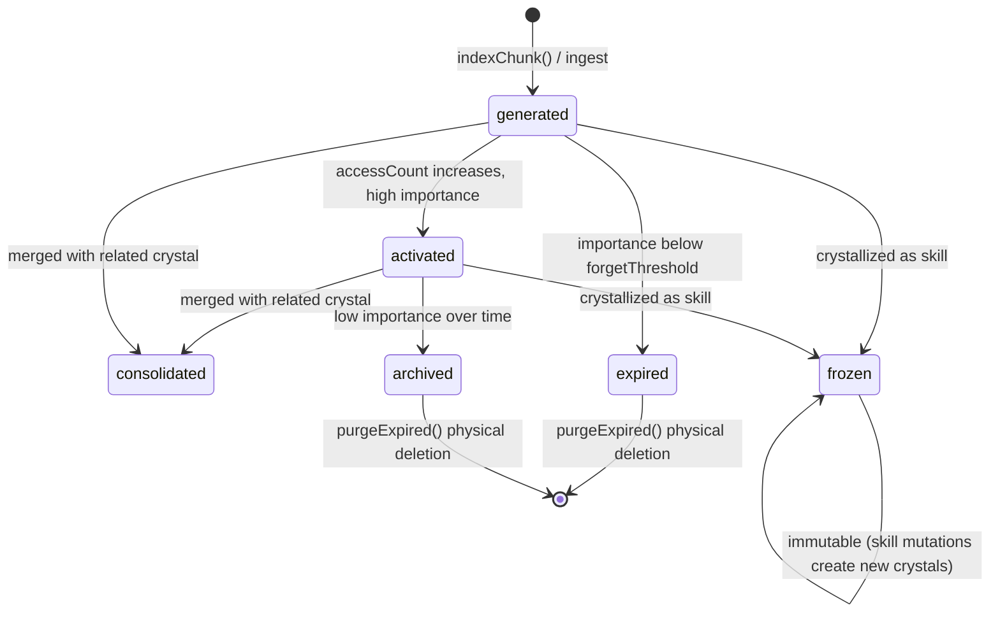
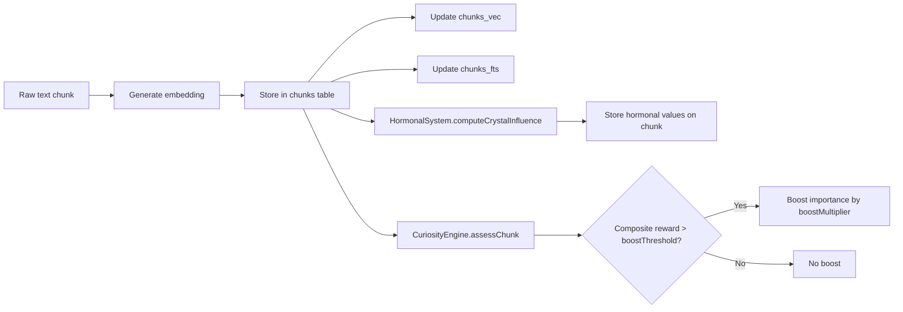

# Knowledge Crystals — Core Memory Unit

A **Knowledge Crystal** is the fundamental memory unit in the Bitterbot memory system. Every piece of indexed content — file snippets, conversation excerpts, dream insights, skills — is stored as a crystal in the `chunks` table. Crystals carry rich metadata: lifecycle state, governance scope, hormonal influence, provenance lineage, and importance scores that decay over time following an Ebbinghaus-inspired formula.

**Key source files:** `crystal-types.ts`, `crystal.ts`, `importance.ts`, `consolidation.ts`, `hormonal.ts`, `governance.ts`, `pipeline.ts`

---

## Memory Crystals vs Knowledge Crystals

Bitterbot formally distinguishes two crystal types:
- **Memory Crystals** (episode, preference, relationship, fact, goal) — private, autobiographical, never leave the node
- **Knowledge Crystals** (skill, task_pattern) — executable, procedural, eligible for P2P marketplace

This document covers Knowledge Crystals. For Memory Crystals, see the main memory architecture documentation.

### Marketplace Pricing

Knowledge Crystals are automatically priced by the marketplace economics engine:
- **Base price:** Configurable (default $0.01 USDC)
- **Quality multiplier:** successRate × avgRewardScore
- **Demand multiplier:** 1 + log(uniqueBuyers + bountyMatches + 1) × 0.1
- **Reputation multiplier:** Publishing agent's peer reputation score
- **Scarcity bonus:** 1.5x for rare skill types, 1.2x for uncommon, 1.0x for common

Skills must pass quality gates before listing: minimum 3 executions and 60% success rate.

---

## Crystal Anatomy

The `KnowledgeCrystal` type (`crystal-types.ts`) defines ~50 fields across several categories:

### Payload

| Field | Type | Description |
|-------|------|-------------|
| `id` | `string` | UUID primary key |
| `text` | `string` | The actual memory content |
| `embedding` | `number[]` | Primary semantic embedding vector |

### Descriptive Metadata

| Field | Type | Description |
|-------|------|-------------|
| `path` | `string` | Source file path (relative to workspace) |
| `source` | `MemorySource` | `"memory"` \| `"sessions"` \| `"skills"` |
| `startLine` / `endLine` | `number` | Line range in source file |
| `hash` | `string` | Content hash for deduplication |
| `semanticType` | `CrystalSemanticType` | Classification (see below) |
| `origin` | `CrystalOrigin` | How it was created (see below) |

### Semantic Types

```typescript
type CrystalSemanticType =
  | "fact"           // Factual knowledge
  | "preference"     // User preference
  | "task_pattern"   // Recurring task pattern
  | "skill"          // Executable skill
  | "episode"        // Episodic memory (event)
  | "insight"        // Dream-synthesized insight
  | "relationship"   // User relationship/social
  | "goal"           // User goal/objective
  | "general";       // Default
```

### Origins

```typescript
type CrystalOrigin =
  | "indexed"      // File-based memory
  | "session"      // Conversation transcript
  | "skill"        // Crystallized skill
  | "dream"        // Dream synthesis output
  | "user_input"   // Direct user statement
  | "inferred"     // Extracted by LLM
  | "peer";        // Received from P2P peer
```

### Behavioral Fields

| Field | Type | Description |
|-------|------|-------------|
| `importanceScore` | `number` | 0-1, recalculated by consolidation engine |
| `accessCount` | `number` | Times retrieved in search results |
| `lastAccessedAt` | `number \| null` | Timestamp of last search hit |
| `emotionalValence` | `number \| null` | Derived: `(dopamine + oxytocin - cortisol) / 2` at ingestion time. Influences dream seed selection, Ebbinghaus decay resistance, and limbic bridge feedback. |
| `hormonalInfluence` | `HormonalInfluence \| null` | Dopamine/cortisol/oxytocin snapshot at ingestion time |
| `curiosityBoost` | `number` | Legacy boost field (backward compat). New scoring uses `curiosityReward` from unified CuriosityEngine |
| `dreamCount` | `number` | Times processed in dream cycles |
| `lastDreamedAt` | `number \| null` | Last dream processing timestamp |
| `lastRippleCount` | `number \| null` | Poisson-sampled ripple count from last replay (enables spaced repetition prioritization) |
| `steeringReward` | `number` | -1 to 1, accumulated from skill execution outcomes |
| `epistemicLayer` | `EpistemicType \| null` | Knowledge type: `"experience"` \| `"directive"` \| `"world_fact"` \| `"mental_model"`. Populated by session extraction pipeline during dream cycles. Directives (explicit user preferences) take priority over inferred knowledge. |

### Verification & Bounties (Phase 3)

| Field | Type | Description |
|-------|------|-------------|
| `isVerified` | `boolean` | Whether endorsed by a management node's Ed25519 signature |
| `verifiedBy` | `string \| null` | Base64 pubkey of the management node that endorsed this skill |
| `bountyMatchId` | `string \| null` | ID of the bounty this crystal fulfilled (if any) |
| `bountyPriorityBoost` | `number` | Reward multiplier from the matched bounty |

### Versioning (Skills)

| Field | Type | Description |
|-------|------|-------------|
| `stableSkillId` | `string \| null` | Persistent ID across skill versions |
| `skillVersion` | `number` | Increments on each mutation promotion |
| `previousVersionId` | `string \| null` | Crystal ID of the prior version |
| `deprecated` | `boolean` | Whether superseded by a newer version |
| `deprecatedBy` | `string \| null` | `stableSkillId` of the replacement |
| `skillTags` | `string[]` | Categorization tags |
| `skillCategory` | `string \| null` | e.g. `"code-generation"`, `"debugging"` |

### Multi-Perspective Embeddings

| Field | Type | Description |
|-------|------|-------------|
| `embeddingProcedural` | `number[]` | Steps/execution-focused embedding |
| `embeddingCausal` | `number[]` | Cause/effect-focused embedding |
| `embeddingEntity` | `number[]` | Tools/APIs/technology-focused embedding |

---

## Lifecycle

Crystals progress through a defined lifecycle managed by the consolidation engine:



```typescript
type CrystalLifecycle =
  | "generated"    // Just created/indexed
  | "activated"    // Frequently accessed, high importance
  | "consolidated" // Merged with related crystals
  | "archived"     // Low importance, retained for lineage
  | "expired"      // Marked for purge
  | "frozen";      // Immutable (skills, critical memories)
```

**Transition rules (in `ConsolidationEngine.run()`):**
- Skills (`memory_type='skill'`) are immune to decay — they never reach `expired`
- Crystals below `forgetThreshold` (default 0.02) transition to `expired`
- Merged crystals: the winner becomes `consolidated`, the loser becomes `archived` with a `parent_id` pointing to the winner
- All transitions are logged to `memory_audit_log`

---

## Governance Model

Each crystal carries a `CrystalGovernance` object stored as JSON in the `governance_json` column:

```typescript
type CrystalGovernance = {
  accessScope: "private" | "shared" | "public";
  lifespanPolicy: "permanent" | "ttl" | "decay";
  ttlMs?: number;
  priority: number;
  sensitivity: "normal" | "personal" | "confidential";
  provenanceChain: string[];
  peerOrigin?: string;
};
```

### Access Control (`MemoryGovernance.canAccess()`)

| Scope | Who can access |
|-------|---------------|
| `confidential` | Only `local_agent` |
| `private` | Only `local_agent` |
| `shared` | `local_agent` + authenticated sessions |
| `public` | Anyone |

Expired crystals always return `false` regardless of scope.

### Sensitivity Detection (`MemoryGovernance.tagSensitivity()`)

Content is automatically classified via regex patterns:
- **confidential**: passwords, API keys, tokens, secrets
- **personal**: names, emails, opinions, personal feelings
- **normal**: everything else

### Lifespan Policies

| Policy | Behavior |
|--------|----------|
| `permanent` | Never automatically expired |
| `ttl` | Expired after `ttlMs` milliseconds (enforced by `enforceLifespan()`) |
| `decay` | Subject to Ebbinghaus decay in consolidation cycles |

### Provenance DAG

Each crystal can have a `provenanceDag` (array of `ProvenanceNode`) tracking its full derivation history:

```typescript
type ProvenanceNode = {
  crystalId: string;
  operation: "created" | "mutated" | "merged" | "imported" | "forked";
  actor: string;         // "local_agent" | "dream_engine" | "peer:<pubkey>"
  timestamp: number;
  parentIds: string[];   // multiple parents for merges
  metadata?: Record<string, unknown>;
};
```

`MemoryGovernance.getDerivationTree()` recursively builds the tree up to depth 5. `getAttributionChain()` returns all unique actors in the lineage via BFS.

---

## Hormonal System

The `HormonalStateManager` (`hormonal.ts`) maintains three hormone levels that modulate memory behavior. Each hormone decays exponentially with a configurable half-life.

### Hormone Channels

| Hormone | Signal | Half-life (default) | Trigger patterns |
|---------|--------|---------------------|------------------|
| Dopamine | Reward/achievement | 30 min | "success", "fixed", "shipped", "deployed", "milestone" |
| Cortisol | Stress/urgency | 60 min | "fail", "error", "bug", "crash", "urgent", "deadline" |
| Oxytocin | Social/relational | 45 min | "thank", "help", "appreciate", "team", "collaborate" |

### Event Types and Spike Magnitudes

```typescript
type HormonalEvent = "reward" | "error" | "social" | "achievement" | "urgency";

// Spike values (added to current level, clamped to [0, 1]):
reward:      { dopamine: 0.3, cortisol: 0,   oxytocin: 0   }
error:       { dopamine: 0,   cortisol: 0.3, oxytocin: 0   }
social:      { dopamine: 0,   cortisol: 0,   oxytocin: 0.3 }
achievement: { dopamine: 0.4, cortisol: 0,   oxytocin: 0.2 }
urgency:     { dopamine: 0,   cortisol: 0.4, oxytocin: 0   }
```

### Decay Formula

Hormones decay toward homeostasis (a personality-defining resting state), not toward zero:

```
hormone(t) = homeostasis + (hormone(t₀) - homeostasis) * 0.5^((t - t₀) / halflife)
```

Default homeostasis: dopamine=0.15, cortisol=0.02, oxytocin=0.10. Values below 0.001 are clamped to 0.

### How Hormones Influence Memory

1. **Consolidation modulation** (`getConsolidationModulation()`):
   - `decayResistance` = effectiveCortisol\*0.3 + dopamine\*0.2 + oxytocin\*0.2 (max 0.5) — high stress slows memory decay
   - `mergeThreshold` = 0.92 + effectiveCortisol\*0.03 — stress makes merging more conservative
   - `haltUntrustedIngestion` — `true` when a network cortisol override is active (see below)

2. **Retrieval modulation** (`getRetrievalModulation()`):
   - `importanceBoost` = 1 + dopamine\*0.2 — reward state boosts important memories
   - `recencyBias` = 1 + cortisol\*0.3 — stress favors recent memories

3. **Per-crystal influence** (`computeCrystalInfluence()`):
   - Detects hormonal events in text via keyword patterns
   - Session-origin content gets +0.1 oxytocin baseline
   - Stored as `HormonalInfluence { dopamine, cortisol, oxytocin }` on each crystal

### Network Cortisol Override (Phase 3)

Management nodes can broadcast a **hormonal weather event** — a signed cortisol spike that propagates across the entire P2P swarm via Gossipsub. When received:

1. `HormonalStateManager.applyNetworkCortisolSpike(level, durationMs, reason)` sets an override
2. `getState()` returns `cortisol = max(localCortisol, networkOverrideLevel)`
3. `getConsolidationModulation()` uses `effectiveCortisol` (the max of local and network) for all calculations
4. `haltUntrustedIngestion` becomes `true`, which causes `SkillNetworkBridge.ingestNetworkSkill()` to reject skills from peers whose trust level is below `"trusted"`

The override auto-expires after `durationMs` milliseconds. This is the network's **immune response** — if a management node detects a Sybil attack or poisoned skill wave, it broadcasts a cortisol spike to lock down untrusted ingestion across all edge nodes simultaneously.

```typescript
// Management node broadcasts via OrchestratorBridge:
await orchestratorBridge.publishWeather(0.9, 300_000, "suspicious skill burst from peer cluster");

// All edge nodes automatically:
// 1. Raise cortisol to 0.9 for 5 minutes
// 2. Halt untrusted/provisional peer skill ingestion
// 3. Increase decay resistance (stressed memories harder to forget)
// 4. Tighten merge threshold (more conservative merging)
```

---

## Consolidation Engine

The `ConsolidationEngine` (`consolidation.ts`) runs periodically (default: every 30 minutes) and performs 4 phases:

### Phase 1: Score All Chunks (Ebbinghaus Decay)

Every crystal's importance is recalculated from scratch using `calculateImportance()`:

```
I(t) = S(t) * f(accessCount) * e^(-λ_eff * Δt)
```

Where:
- **S(t)** = `1.0` (fixed base — avoids compounding decay)
- **f(n)** = `1 - e^(-0.1 * (n + 1))` — saturating frequency factor
- **Δt** = milliseconds since last access
- **λ\_eff** = `decayRate * (1 - |emotionalValence| * emotionDecayResistance)`

The key insight: `semanticRelevance` is always `1.0` so importance is determined solely by access patterns and time. Emotional valence slows decay but doesn't inflate scores.

### Phase 2: Identify Forgotten Chunks

Crystals scoring below `forgetThreshold` (default 0.02) are marked `expired` — except skill-type chunks which are immune to decay.

### Phase 3: Merge Overlapping Promoted Chunks

Crystals scoring above `promoteThreshold` (default 0.7) are candidates for merging. Two promoted crystals from the **same file path** with cosine similarity >= `mergeOverlapThreshold` (default 0.92) are merged: the higher-importance one becomes `consolidated`, the lower one becomes `archived` with `parent_id` set.

### Phase 4: Apply Changes (Transaction)

All score updates, lifecycle transitions, and merges are applied in a single SQLite transaction. Every transition is logged to `memory_audit_log`.

### Configuration

```typescript
type ConsolidationConfig = {
  decayRate: number;              // Default: 5e-10 (~16-day half-life)
  promoteThreshold: number;       // Default: 0.7
  forgetThreshold: number;        // Default: 0.02
  mergeOverlapThreshold: number;  // Default: 0.92
  emotionDecayResistance: number; // Default: 0.5
};
```

---

## Indexing Pipeline

When new content is synced (file change, session update, skill addition), the indexing flow in `manager-embedding-ops.ts` processes each chunk:



The `MemoryPipeline` class (`pipeline.ts`) provides a fluent API for custom retrieve-filter-augment-store workflows:

```typescript
const result = await MemoryPipeline.create()
  .retrieve("query", { semanticType: "skill", limit: 20 })
  .filter(c => c.importanceScore > 0.5)
  .augment(c => ({ ...c, importanceScore: c.importanceScore * 1.1 }))
  .store()
  .execute(db);
```

---

## Related Documentation

- [Architecture Overview](./architecture-overview.md) — system entry point and file map
- [Dream Engine](./dream-engine.md) — offline processing and insight generation
- [Skills Pipeline](./skills-pipeline.md) — skill lifecycle and P2P network
- [Curiosity & Search](./curiosity-and-search.md) — curiosity engine and retrieval
