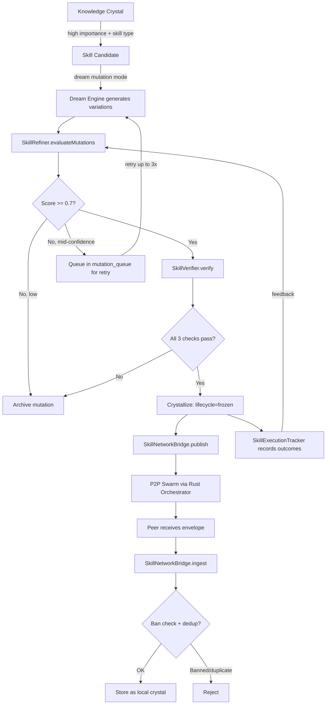
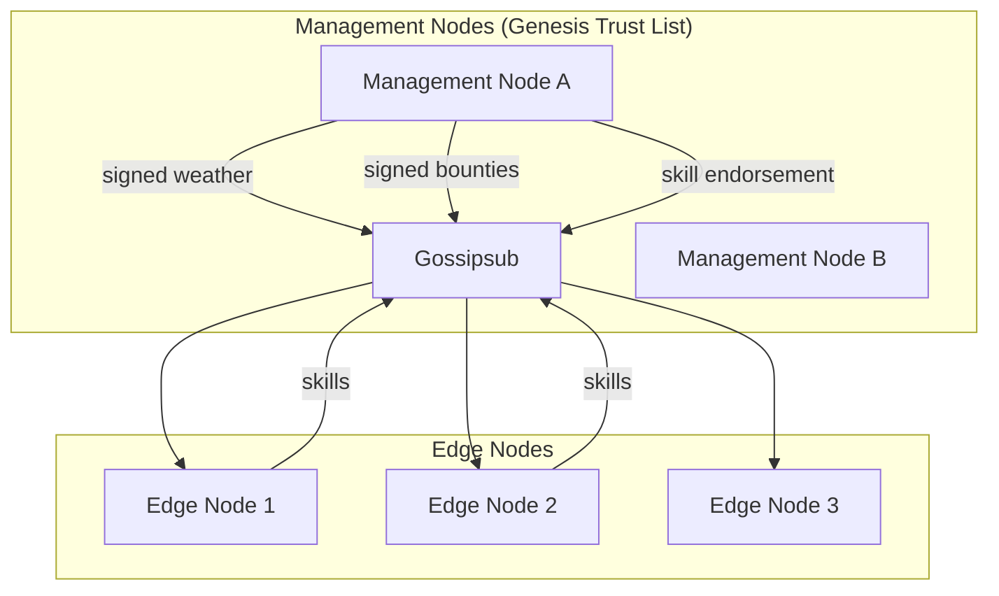
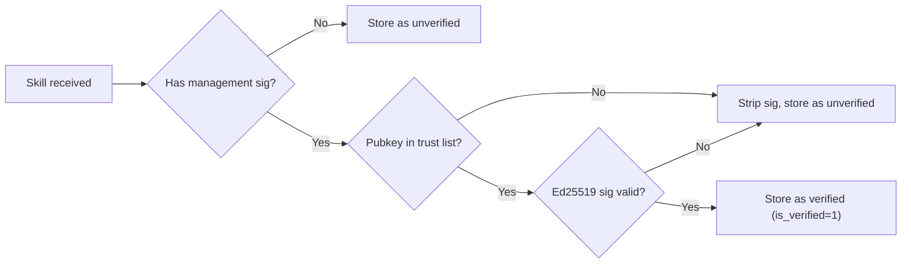
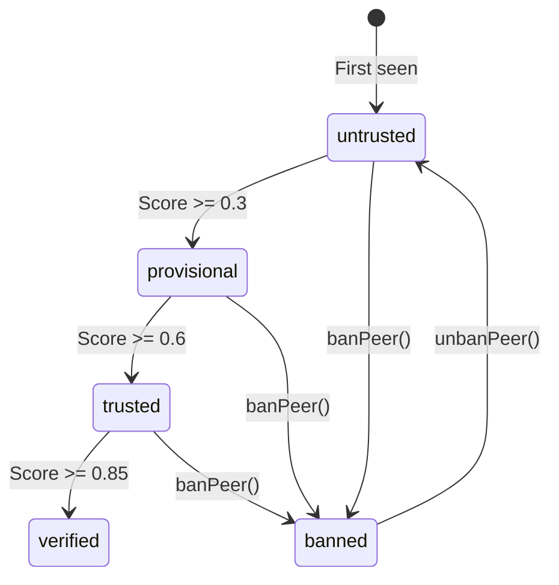

# Skills Pipeline — Skill Lifecycle, Verification & P2P Network

The skills pipeline handles the full lifecycle of autonomous skill generation: from identifying skill candidates in memory, through dream-based mutation and verification, to P2P propagation across a swarm network with graduated peer trust. Skills are knowledge crystals with `lifecycle='frozen'` and `semantic_type='skill'` that represent reusable, executable knowledge.

**Key source files:** `skill-refiner.ts`, `skill-verifier.ts`, `skill-execution-tracker.ts`, `skill-crystallizer.ts`, `skill-network-bridge.ts`, `peer-reputation.ts`, `discovery-agent.ts`, `dream-mutation-strategies.ts`, `skill-marketplace.ts`, `skill-hierarchy.ts`, `skill-pricing.ts`, `marketplace-economics.ts`

---

## Full Knowledge Crystal Pipeline

The pipeline transforms raw task experience into verified, tradeable skill crystals through six stages:

```
Task Execution → Execution Tracking → Dream Mutation → Crystallization → Verification → Marketplace
```

1. **Task Execution** — The agent performs tasks. Each execution is instrumented by `SkillExecutionTracker`, which records success/failure, reward scores, timing, and error types.
2. **Execution Tracking** — As executions accumulate, `SkillCrystallizer` monitors for patterns that meet the promotion threshold (>= 3 successes, >= 70% success rate).
3. **Dream Mutation** — The Dream Engine generates variations of promising patterns using strategy-specific prompts (error-driven, adversarial, compositional, parametric, or generic).
4. **Crystallization** — `SkillRefiner` scores mutations via `heuristicScore()` + empirical data, then promotes those scoring >= 0.7 to frozen skill crystals with versioning and provenance DAGs.
5. **Verification** — `SkillVerifier` runs a 3-check safety gate (dangerous pattern blocklist, structural invariants, semantic drift) before any mutation is crystallized.
6. **Marketplace** — `MarketplaceEconomics` dynamically prices verified skills and lists them for P2P trade, with earnings feeding into The Niche economic summary.

### How Skills Are Learned

```
Episode (task execution)
  → SkillExecutionTracker records outcome (success/fail, reward, timing)
    → SkillCrystallizer detects pattern (≥3 successes, ≥70% rate)
      → Dream Engine generates mutation variations
        → SkillRefiner scores & promotes (heuristicScore + empirical >= 0.7)
          → SkillVerifier safety gate (3 checks must pass)
            → Frozen skill crystal (lifecycle='frozen', semantic_type='skill')
              → SkillNetworkBridge publishes to P2P swarm
                → MarketplaceEconomics prices & lists for trade
```

---

## Skill Lifecycle



---

## Pattern Crystallization (SkillCrystallizer)

The `SkillCrystallizer` (`skill-crystallizer.ts`) is the entry point for automatic skill creation. It scans execution history for patterns that meet strict quality thresholds, then promotes them to skill crystals.

### Promotion Criteria

| Constant | Value | Purpose |
|----------|-------|---------|
| `MIN_SUCCESSES` | 3 | Minimum successful executions before a pattern qualifies |
| `MIN_SUCCESS_RATE` | 0.7 (70%) | Minimum success/total ratio |

The crystallizer queries the `skill_executions` table, grouping by `skill_crystal_id`, and selects patterns where `successes >= 3 AND successes/total >= 0.7`. Deduplication prevents re-crystallizing patterns that already have a frozen skill crystal or a crystallized child.

### Crystal Creation

When a pattern qualifies:
1. The original chunk text is loaded and used as the basis
2. Importance score is computed as `successRate * 0.6 + frequencyFactor * 0.4` (where `frequencyFactor = min(1, totalExecutions / 20)`)
3. A new chunk is inserted with `lifecycle='generated'`, `memory_type='skill'`, `semantic_type='skill'`, `origin='inferred'`
4. An audit log entry is created with event `skill_crystallized`
5. The `parent_id` links back to the source pattern

---

## Skill Refinement (SkillRefiner)

The `SkillRefiner` (`skill-refiner.ts`) orchestrates the dream mutation evaluation pipeline. It takes mutations generated by the Dream Engine and decides which ones are good enough to become frozen skill crystals.

### Scoring

Each mutation is scored by combining heuristic and empirical signals:

**Heuristic score** (`heuristicScore()`):
- **Length ratio** (+0.2) — mutations should be similar length to originals (penalty for >2x or <0.5x)
- **Keyword coverage** (+0.3 max) — what fraction of original keywords (words >3 chars) appear in the mutation
- **Novelty** (+0.3 max) — new words not in the original (rewarded via `min(0.3, novelty * 0.5)`)
- **Structural indicators** (+0.1 each) — presence of edge case handling, generality/robustness language

**Empirical score** (from `SkillExecutionTracker`):
- If the original skill has >= 3 executions, the tracker's `successRate` boosts the score by `successRate * 0.15`
- If the original already has >90% success rate, an additional `-0.1` penalty raises the bar for mutations (the original is already strong)
- Combined score is capped at 1.0

### Promotion Threshold and Verification Gate

Mutations must clear two gates to be promoted:

1. **Score gate**: `score >= promotionThreshold` (default **0.7**) AND `mutation.confidence >= 0.5`
2. **Verification gate**: `SkillVerifier.verify()` must pass all 3 safety checks (dangerous patterns, structural invariants, semantic drift)

Mutations failing the score gate are archived with a learning note via the audit log. Mutations passing the score gate but failing verification are also archived with the verification failure reason.

### Crystallization

When a mutation is promoted:
1. A new chunk is created with `lifecycle='frozen'`, `memory_type='skill'`, `semantic_type='skill'`
2. If the original had a `stable_skill_id`, the new crystal inherits it with `skill_version + 1` and a `previous_version_id` link
3. If no `stable_skill_id` exists, a new one is generated (UUID)
4. A provenance DAG node is recorded: `operation='mutated'`, `actor='dream_engine'`
5. An audit log entry records `skill_mutation_promoted` with the original ID, mutation ID, confidence, stable skill ID, and version
6. The `onSkillCrystallized` callback fires (if registered)
7. If a `SkillNetworkBridge` is wired, `onSkillCrystallized()` auto-publishes to the P2P network

---

## Verification Safety Gate

The `SkillVerifier` (`skill-verifier.ts`) runs 3 checks before any mutation is promoted. All 3 must pass.

### Check 1: Dangerous Pattern Blocklist

Tests the mutation text against 17 regex patterns covering:
- SQL injection (`DROP TABLE`, `DROP DATABASE`, `TRUNCATE`, `DELETE FROM`)
- Shell injection (`rm -rf`, `curl|sh`, `wget|sh`, `sudo`, `chmod 777`)
- Code injection (`eval(`, `new Function(`, `child_process`, `exec(`, `execSync(`)
- Prototype pollution (`__proto__`, `constructor["prototype"]`)
- Process control (`process.exit`)

### Check 2: Structural Invariants

- Content must be non-empty
- Minimum 20 characters
- Maximum 50KB

### Check 3: Semantic Drift

If a parent crystal ID is provided and has an embedding:
- Computes cosine distance between the mutation embedding and the parent embedding
- Rejects if distance > `maxDriftThreshold` (default 0.3)
- Ensures mutations stay semantically related to their origin

```typescript
type VerificationResult = {
  passed: boolean;
  checks: VerificationCheck[];    // Array of { name, passed, reason }
  overallReason: string;
};
```

---

## Dream Mutation Strategies

The `dream-mutation-strategies.ts` module provides 5 specialized mutation strategies:

| Strategy | Trigger condition | What it does |
|----------|-------------------|--------------|
| `generic` | Default fallback | General-purpose skill improvement prompt |
| `error_driven` | >= 3 executions, high error count | Analyzes failure logs, suggests fixes |
| `adversarial` | Success rate > 0.9 | Finds edge cases, hardens the skill |
| `compositional` | >= 2 related skills | Combines best aspects of multiple skills |
| `parametric` | Numeric parameters detected in text | Varies thresholds, timeouts, strategies |

### Strategy Selection (`selectStrategy()`)

```typescript
function selectStrategy(
  skill: { text: string; skillCategory?: string | null },
  metrics: SkillMetrics | null,
  relatedSkillCount?: number,
): MutationStrategy
```

Priority order: error\_driven > adversarial > compositional > parametric > generic

### Numeric Parameter Detection

`hasNumericParameters()` uses regex to detect patterns like `timeout=30`, `max_retries: 3`, `threshold 0.8` — triggering the `parametric` strategy.

---

## Skill Execution Tracking

The `SkillExecutionTracker` (`skill-execution-tracker.ts`) records the outcomes of skill usage for empirical quality feedback.

### Execution Flow

```typescript
// 1. Start tracking
const execId = tracker.startExecution(skillCrystalId, sessionId);

// 2. Record outcome
tracker.completeExecution(execId, {
  success: true,
  rewardScore: 0.8,
  executionTimeMs: 1200,
  toolCallsCount: 3,
});

// 3. Optional user feedback
tracker.recordFeedback(execId, 1);  // -1, 0, or 1
```

### Steering Reward

On completion, the skill crystal's `steering_reward` is adjusted:
- **Success:** +0.1 (clamped to [-1.0, 1.0])
- **Failure:** -0.05

Steering rewards decay multiplicatively each consolidation cycle (default factor: 0.95).

### Aggregated Metrics

```typescript
type SkillMetrics = {
  totalExecutions: number;
  successRate: number;         // 0-1
  avgRewardScore: number;
  avgExecutionTimeMs: number;
  userFeedbackScore: number;   // -1 to 1 (weighted average)
  lastExecutedAt: number;
  errorBreakdown: Record<string, number>;
};
```

---

## SKILL.md Generation

When a skill crystal is published (either to the P2P network or for marketplace listing), a `SKILL.md` document is generated in the Anthropic skill spec format.

### Format

```markdown
---
name: deploy-node-production
description: Dream-generated skill crystal
crystal_id: <uuid>
---

<skill text content>
```

### Anthropic Spec Compliance

The generated SKILL.md must satisfy:
- Starts with YAML frontmatter delimiters (`---`)
- Contains `name:` field (sanitized from path, max 64 chars, alphanumeric + hyphens)
- Contains `description:` field
- Total document under 500 lines
- Total size under ~5000 tokens (~20K characters)

The `SkillNetworkBridge.publishCrystalSkill()` generates this format automatically when publishing to the P2P network. The frontmatter is base64-encoded into the `SkillEnvelope.skill_md` field for transport.

---

## P2P Skill Network

### SkillNetworkBridge

The `SkillNetworkBridge` (`skill-network-bridge.ts`) mediates between the local crystal store and the P2P network.

**Publishing** (`publishCrystalSkill()`):
1. Loads the crystal from the database
2. Enforces governance: only `shared` or `public` scope, never `confidential` sensitivity
3. Checks provenance chain for confidential ancestors (blocks publish if found)
4. Generates a SKILL.md format with frontmatter
5. Sends to the Rust orchestrator via `orchestratorBridge.publishSkill()`

**Ingesting** (`ingestNetworkSkill()`):
1. Checks if the sender peer is banned via `PeerReputationManager`
2. **Cortisol gate** — if a network cortisol spike is active (`haltUntrustedIngestion`), rejects skills from peers with trust level below `"trusted"` (i.e., `untrusted` and `provisional` peers are blocked)
3. Deduplicates by content hash
4. Version conflict resolution via `SkillVersionResolver` (natural selection: fitter variants win)
5. Decodes base64 content from the envelope
6. **SkillVerifier safety gate** (Plan 8) — inbound skills pass through the same 3-check verification as locally crystallized mutations: dangerous pattern blocklist, structural integrity, and semantic drift. Rejected skills result in a negative trust signal (0.2 weight) against the sender, degrading their EigenTrust score over time.
7. Verifies management signature if present (Ed25519 via Node.js `crypto`)
8. Stores as a new crystal with `lifecycle='generated'`, `semantic_type='skill'`, `origin='peer'`, plus `is_verified` and `verified_by` if management-endorsed
9. Stores peer wallet address (if included in envelope) for revenue sharing
10. Checks for bounty matches — if a match is found and the skill passes the **bounty quality gate** (SkillVerifier + 3 executions + >70% success rate), a bounty claim is published to the network for USDC payout

### Rust Orchestrator

The P2P layer uses a Rust binary (`swarm/mod.rs`) implementing a real libp2p swarm with:
- **Gossipsub** for skill envelope broadcast (4 topics — see below)
- **Kademlia** for peer discovery
- **AutoNAT** for NAT traversal
- **Identify** for peer identification and node tier advertisement

Communication between Node.js and Rust happens via IPC. The bridge is wired at gateway startup via `MemoryIndexManager.wireOrchestratorBridge()`.

### Gossipsub Topics

| Topic | Purpose | Who publishes |
|-------|---------|--------------|
| `bitterbot/skills/v1` | Skill envelope broadcast | All nodes |
| `bitterbot/telemetry/v1` | Telemetry events | All nodes |
| `bitterbot/weather/v1` | Hormonal weather broadcasts | Management nodes only |
| `bitterbot/bounties/v1` | Global curriculum bounties | Management nodes only |

---

## Two-Tiered Network: Management & Edge Nodes

The P2P network has two tiers. **Edge nodes** (default) run the standard pipeline: index, dream, publish, ingest. **Management nodes** are trusted oracles that provide three additional capabilities: skill endorsement, hormonal weather broadcasting, and global curriculum bounties.



### Genesis Trust List

Management node authorization is based on a **Genesis Trust List** — a file of base64-encoded Ed25519 public keys, one per line. The list is configured via:

- **Rust CLI**: `--genesis-trust-list /path/to/genesis_trust_list.txt` (defaults to `{key_dir}/genesis_trust_list.txt`)
- **TypeScript config**: `p2p.genesisTrustListPath` or `p2p.genesisTrustList` (inline array)

```
# genesis_trust_list.txt — authorized management node pubkeys
MCowBQYDK2VwAyEA7x...base64...==
MCowBQYDK2VwAyEAkR...base64...==
```

A node declaring `--node-tier management` must have its own pubkey in the trust list, or the orchestrator refuses to start.

### Node Tier Identification

Tiers are advertised via the **Identify protocol**. The `agent_version` string encodes the tier:

```
bitterbot-orchestrator/0.1.0/edge
bitterbot-orchestrator/0.1.0/management
```

When a peer identifies as `management`, the receiving node:
1. Extracts the peer's Ed25519 pubkey from the Identify response
2. Checks the pubkey against the local genesis trust list
3. Sets `PeerDetail.tier = "management"` and `PeerDetail.tier_verified = true/false`
4. Emits a `peer_identified` IPC event to Node.js

Management claims from peers not in the trust list are silently downgraded to `edge`.

### Verified Safe Marketplace Tier

Management nodes can cryptographically endorse skills by signing the skill content with their Ed25519 key. The `SkillEnvelope` carries two optional fields:

```typescript
type SkillEnvelope = {
  // ... existing fields ...
  management_signature?: string;  // base64 Ed25519 sig by management node
  management_pubkey?: string;     // base64 pubkey of management signer
};
```

**Verification flow:**



- **Rust side**: `SecurityValidator.validate_management_signature()` verifies the signature and strips forged claims. Invalid management sigs are stripped but the skill is still accepted (never reject a skill just for a bad endorsement).
- **TypeScript side**: `SkillNetworkBridge.verifyManagementSignature()` performs Ed25519 verification using Node.js `crypto` with SPKI DER wrapping.
- **Marketplace sort**: Verified skills sort above unverified by default (`ORDER BY is_verified DESC, importance_score DESC`).

### Hormonal Weather Broadcasting

Management nodes can broadcast **weather events** — network-wide cortisol spikes that trigger the immune response across all edge nodes:

```typescript
// Management node publishes:
await orchestratorBridge.publishWeather(
  0.9,       // cortisol level (0-1)
  300_000,   // duration: 5 minutes
  "Sybil attack detected in peer cluster X"
);
```

**Security:**
- Weather envelopes are signed with the management node's Ed25519 key
- Rust validates: pubkey in genesis trust list + valid signature
- **5-minute TTL**: Envelopes with timestamps older than 5 minutes or more than 1 minute in the future are silently dropped (replay attack prevention)
- Edge nodes call `HormonalStateManager.applyNetworkCortisolSpike()` to raise local cortisol

**Effects on edge nodes during a spike:**
- `haltUntrustedIngestion = true` — skills from `untrusted`/`provisional` peers are rejected
- `decayResistance` increases — stressed memories are harder to forget
- `mergeThreshold` tightens — more conservative merging

See [Knowledge Crystals: Network Cortisol Override](./knowledge-crystals.md#network-cortisol-override-phase-3) for the full hormonal mechanics.

### Global Curriculum Bounties

Management nodes can publish **bounties** — exploration targets that prioritize specific knowledge gaps across the entire network:

```typescript
await orchestratorBridge.publishBounty({
  bounty_id: "bounty-001",
  target_type: "knowledge_gap",     // or "contradiction", "stale_region", "frontier"
  description: "Production debugging patterns for memory leak detection",
  priority: 0.8,
  reward_multiplier: 2.5,
  expires_at: Date.now() + 86_400_000,  // 24 hours
  region_hint: "debugging",
});
```

**Bounty lifecycle:**

```mermaid
flowchart LR
    A[Management publishes bounty] --> B[Gossipsub broadcast]
    B --> C[Edge nodes ingest via CuriosityEngine]
    C --> D["Ultra-high priority target (priority*2, cap 1.5)"]
    D --> E[Dream exploration mode picks up target]
    E --> F[Crystal generated matching bounty]
    F --> G[checkBountyMatch detects match]
    G --> H["Dopamine boost (achievement * rewardMultiplier)"]
    H --> I[Crystal published with bounty_match_id]
```



- Bounties are signed by management nodes (same verification as weather)
- **5-minute TTL** for replay attack prevention
- `CuriosityEngine.ingestBounty()` inserts the bounty as an exploration target with doubled priority (capped at 1.5)
- `CuriosityEngine.checkBountyMatch()` keyword-matches crystallized content against active bounties
- On match: massive dopamine stimulation scaled by `rewardMultiplier`, and the crystal is recorded with `bounty_match_id` and `bounty_priority_boost`

See [Curiosity & Search: Bounty System](./curiosity-and-search.md#bounty-system-phase-3) for curiosity engine integration details.

---

## Peer Reputation System

The `PeerReputationManager` (`peer-reputation.ts`) implements graduated trust with anti-Sybil protections.

### Trust Levels



```typescript
type TrustLevel = "banned" | "untrusted" | "provisional" | "trusted" | "verified";
```

### Local Reputation Score

```
localScore = 0.4 * acceptanceRate + 0.4 * avgSkillQuality + 0.2 * longevityFactor
```

Where `longevityFactor` grows with time since first seen.

### EigenTrust Web-of-Trust

Trust edges between peers form a graph. The EigenTrust algorithm computes global trust scores via power iteration:

```
t_new = 0.9 * C^T * t + 0.1 * p
```

Where:
- `C` = row-normalized trust matrix
- `t` = current trust vector
- `p` = pre-trusted peer vector (from config)
- Convergence threshold: 0.001

Trust edges are updated via EMA blending: `new = 0.3 * observation + 0.7 * previous`.

### Blended Score

```
reputationScore = 0.7 * localScore + 0.3 * eigenTrustScore
```

### Anomaly Detection

`detectAnomalies()` runs periodically and flags peers publishing > 3x their historical average rate within a sliding window (default: 1 hour). Anomalous peers:
- Get `anomaly_flag = 1` in the database
- Are capped at `provisional` trust level maximum

### Management Node Check

`isManagementNode(pubkey)` checks whether a peer's pubkey is in the Genesis Trust List. Used by `SkillNetworkBridge` to verify management signatures on skill envelopes.

### Ban/Blocklist

`banPeer(pubkey)` immediately blocks all future skill ingestion from that peer. `isBanned()` is checked on every `ingestNetworkSkill()` call.

---

## Proactive Skill Suggestions

The `DiscoveryAgent` (`discovery-agent.ts`) suggests skills to the user using 4 strategies:

| Strategy | Signal | Data source |
|----------|--------|-------------|
| `friction` | Repeated low-score search queries | `curiosity_search_queries` (>= 3 occurrences, avg score < 0.4) |
| `goal_alignment` | Active or stalled user goals | `task_goals` table matched to marketplace by keyword |
| `curiosity_gap` | Unresolved knowledge gaps | `curiosity_targets` of type `knowledge_gap` |
| `trending` | Popular peer-origin skills | High-download marketplace-listed chunks |

```typescript
type SkillSuggestion = {
  skillId: string;
  skillName: string;
  confidence: number;
  rationale: string;
  source: "friction" | "goal_alignment" | "curiosity_gap" | "trending";
  relevantGoalIds: string[];
  relevantQueryPatterns: string[];
};
```

### Skill Edge Discovery

The `DiscoveryAgent` also maintains the `skill_edges` table, discovering relationships between skills:

| Edge type | Meaning | Discovery method |
|-----------|---------|------------------|
| `prerequisite` | Skill A is required before B | LLM analysis of skill pairs |
| `enables` | Completing A unlocks B | LLM analysis |
| `contradicts` | A and B are mutually exclusive | LLM analysis |
| `composes` | A and B can be combined | LLM analysis of same-category skills |
| `similar` | A and B are semantically close | Cosine similarity >= 0.8 |

Edge steering rewards decay by 0.95x each cycle.

---

## Skill Marketplace

The `skill-marketplace.ts` module provides listing and search over published skills:

```typescript
type MarketplaceEntry = {
  stableSkillId: string;
  name: string;
  description: string;
  version: number;
  authorPeerId: string;
  authorReputation: number;
  successRate: number;
  downloadCount: number;
  tags: string[];
  category: string;
  createdAt: number;
  isVerified?: boolean;          // Endorsed by a management node (Phase 3)
  verifiedBy?: string | null;    // Base64 pubkey of endorsing management node
};

type MarketplaceFilters = {
  category?: string;
  minSuccessRate?: number;
  minAuthorReputation?: number;
  tags?: string[];
  sortBy?: "relevance" | "trending" | "newest" | "top_rated";
};
```

Skills are listed when `marketplace_listed = 1` on the chunk. Download counts are tracked in the `download_count` column.

**Default sort order**: Verified skills sort above unverified (`ORDER BY is_verified DESC, importance_score DESC`). Skills endorsed by a management node appear first in search results.

### Marketplace Economics Integration

The `MarketplaceEconomics` (`marketplace-economics.ts`) handles the economic layer on top of the search/discovery marketplace. It works with the `SkillPricingEngine` (`skill-pricing.ts`) to dynamically price skills.

#### Dynamic Pricing

Each skill's price is computed by `computeSkillPrice()`:

```
rawPrice = basePriceUsdc * (1 + qualityMultiplier) * demandMultiplier * reputationMultiplier * scarcityBonus
```

| Component | Formula | Range |
|-----------|---------|-------|
| `qualityMultiplier` | `successRate * max(0.1, avgRewardScore)` | 0-1 |
| `demandMultiplier` | `1 + log(uniqueBuyers + bountyMatches + 1) * 0.1` | 1+ |
| `reputationMultiplier` | `max(0.1, reputationScore)` | 0.1-1 |
| `scarcityBonus` | `1.5` if <= 2 similar skills, `1.2` if <= 5, else `1.0` | 1.0-1.5 |

Price defaults: base `$0.01`, floor `$0.001`, cap `$1.00`. Prices are rounded to 6 decimal places (USDC precision).

#### Listing Requirements

A skill must meet minimum quality gates before it can be listed:
- `minExecutionsForListing`: 3 (default)
- `minSuccessRateForListing`: 0.6 (60%)

Skills failing these gates get `listable = false` with a `listingBlockReason`.

#### Purchase Tracking and Anti-Sybil

Purchases are recorded in the `marketplace_purchases` table with buyer peer ID, amount, tx hash (unique index for replay protection), and direction (`sale` or `purchase`). The demand signal for pricing uses unique buyer counts (`COUNT(DISTINCT buyer_peer_id)`) rather than raw download counts to prevent sybil wash trading.

#### Earnings Feed into The Niche

`getEconomicSummary()` produces a summary consumed by The Niche (working memory economic section):

```typescript
type EconomicSummary = {
  totalEarningsUsdc: number;
  totalSpentUsdc: number;
  netEarningsUsdc: number;
  listedSkillCount: number;
  uniqueBuyers: number;
  skillsPurchased: number;
  topEarners: Array<{ name: string; earningsUsdc: number; purchases: number }>;
  earningsTrend: Array<{ date: string; amountUsdc: number }>;
  walletBalanceUsdc?: number;
};
```

Listings are refreshed during consolidation (every ~30 minutes) via `MarketplaceEconomics.refreshListings()`, which scans all `publish_visibility='shared'` skill/task_pattern crystals, recomputes prices, and upserts into `marketplace_listings` within a single SQLite transaction.

---

## Skill Hierarchy

The `skill-hierarchy.ts` module manages parent-child skill relationships and multi-level capability scoring:

```typescript
type SkillHierarchy = {
  level3: number;           // Overall capability score (0-1)
  level2: DomainProfile;    // 3 domains: What/How/Why
  level1: {                 // 6 groups
    factual: number;
    temporal: number;
    causal: number;
    relational: number;
    qualitative: number;
    implementation: number;
  };
  level0: number[];         // Raw 4-perspective embedding similarities
};

type DomainProfile = {
  factual: number;     // What: facts, entities, knowledge
  procedural: number;  // How: steps, tools, execution
  affective: number;   // Why: goals, motivations, context
};
```

---

## Related Documentation

- [Architecture Overview](./architecture-overview.md) — system entry point and file map
- [Knowledge Crystals](./knowledge-crystals.md) — core data model and lifecycle
- [Dream Engine](./dream-engine.md) — how dream mutations are generated
- [Curiosity & Search](./curiosity-and-search.md) — curiosity-driven skill gap detection
