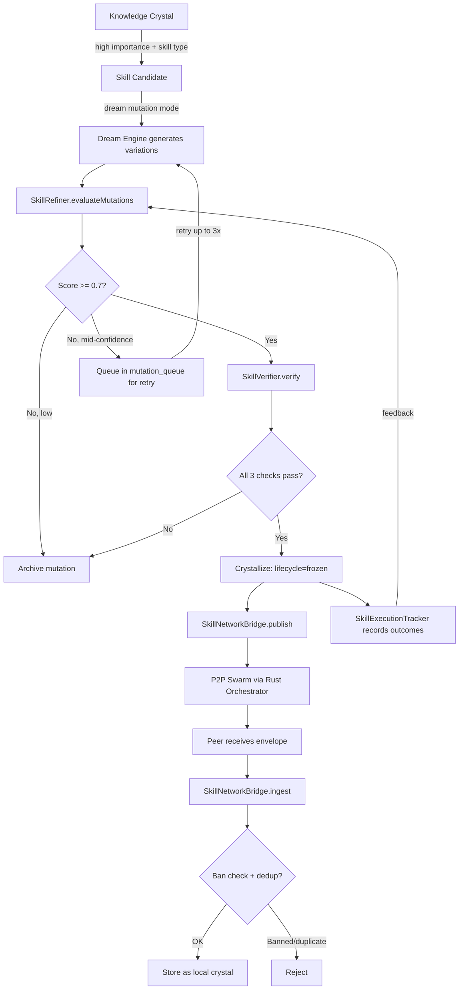
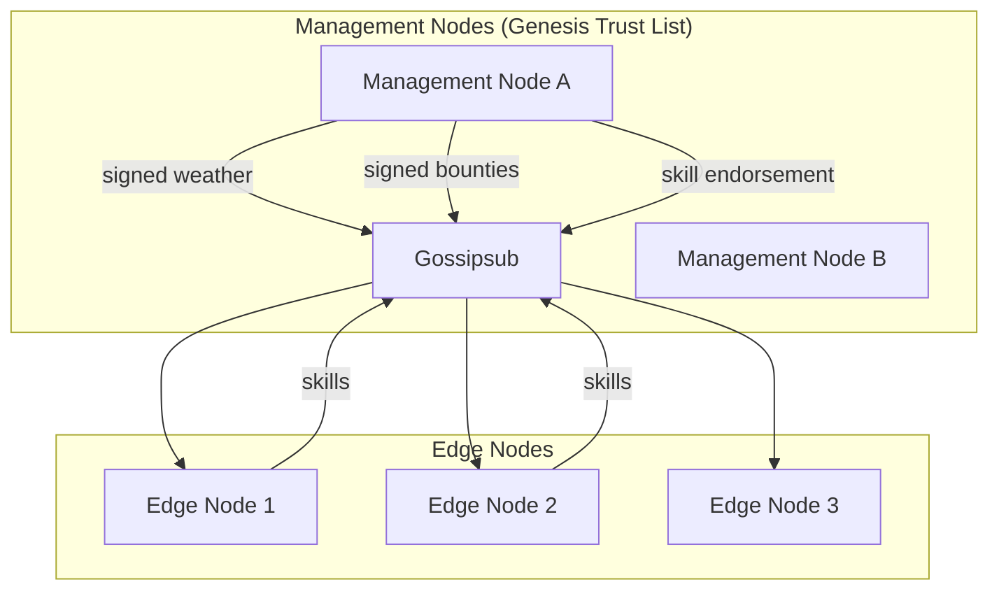
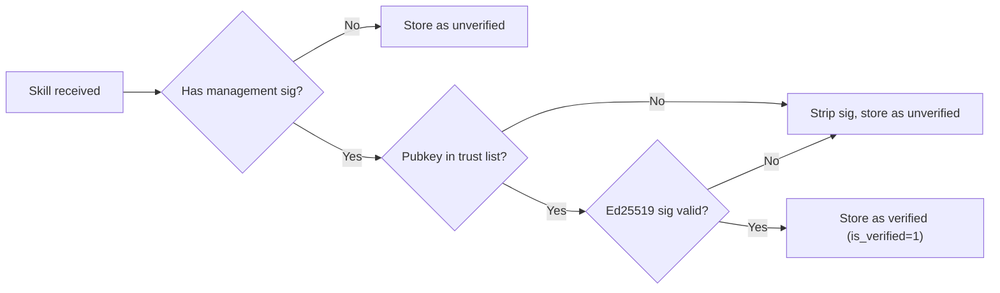
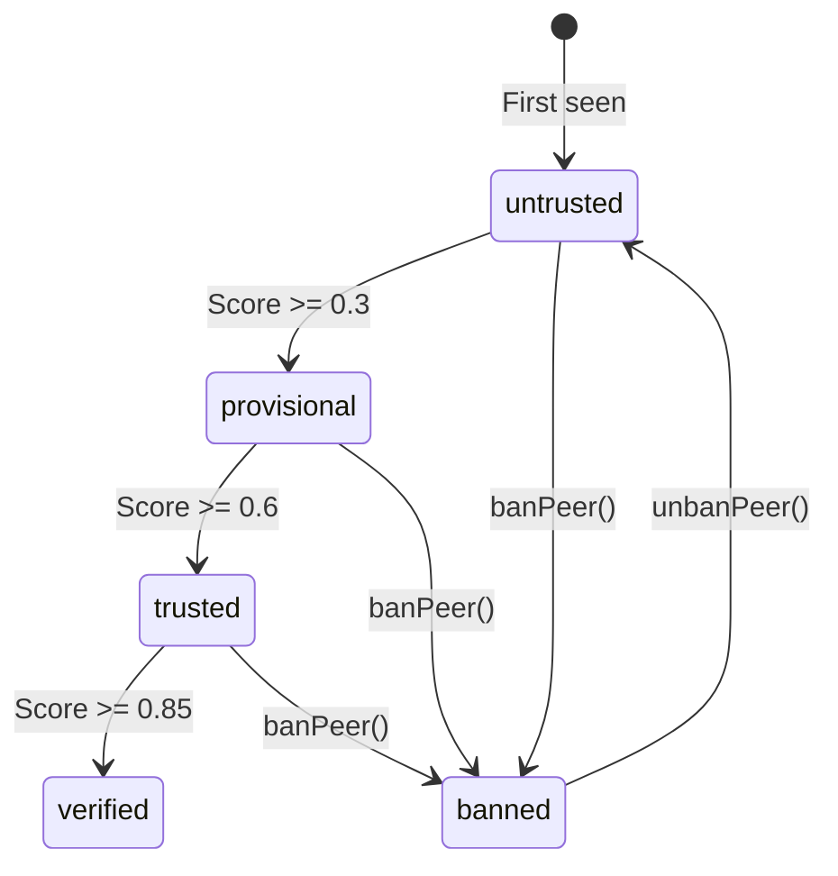

# Skills Pipeline — Skill Lifecycle, Verification & P2P Network

The skills pipeline handles the full lifecycle of autonomous skill generation: from identifying skill candidates in memory, through dream-based mutation and verification, to P2P propagation across a swarm network with graduated peer trust. Skills are knowledge crystals with `lifecycle='frozen'` and `semantic_type='skill'` that represent reusable, executable knowledge.

**Key source files:** `skill-refiner.ts`, `skill-verifier.ts`, `skill-execution-tracker.ts`, `skill-crystallizer.ts`, `skill-network-bridge.ts`, `peer-reputation.ts`, `discovery-agent.ts`, `dream-mutation-strategies.ts`, `skill-marketplace.ts`, `skill-hierarchy.ts`, `skill-pricing.ts`, `marketplace-economics.ts`

**PLAN-20 (May 2026) — executable skill interceptors:** skills can now carry `PreActionInterceptor` implementations that deterministically modify, inject context into, require prerequisites for, or block any tool call before it executes. The Dream Engine's `interceptor_harvest` mode mines the `intervention_records` corpus and auto-proposes new interceptor candidates. See [Pre-Action Interceptors](../agents/interceptors.md).

---

## Full Knowledge Crystal Pipeline

The pipeline transforms raw task experience into verified, tradeable skill crystals through six stages:

```
Task Execution → Execution Tracking → Dream Mutation → Crystallization → Verification → Marketplace
```

1. **Task Execution** — The agent performs tasks. Each execution is instrumented by `SkillExecutionTracker`, which records success/failure, reward scores, timing, and error types.
2. **Execution Tracking** — As executions accumulate, `SkillCrystallizer` monitors for patterns that meet the promotion threshold (>= 3 successes, >= 70% success rate).
3. **Dream Mutation** — The Dream Engine generates variations of promising patterns using strategy-specific prompts (error-driven, adversarial, compositional, parametric, or generic).
4. **Crystallization** — `SkillRefiner` scores mutations via `heuristicScore()` + empirical data, then promotes those scoring >= 0.7 to frozen skill crystals with versioning and provenance DAGs.
5. **Verification** — `SkillVerifier` runs a 3-check safety gate (dangerous pattern blocklist, structural invariants, semantic drift) before any mutation is crystallized.
6. **Marketplace** — `MarketplaceEconomics` dynamically prices verified skills and lists them for P2P trade, with earnings feeding into The Niche economic summary.

### How Skills Are Learned

```
Episode (task execution)
  → SkillExecutionTracker records outcome (success/fail, reward, timing)
    → SkillCrystallizer detects pattern (≥3 successes, ≥70% rate)
      → Dream Engine generates mutation variations
        → SkillRefiner scores & promotes (heuristicScore + empirical >= 0.7)
          → SkillVerifier safety gate (3 checks must pass)
            → Frozen skill crystal (lifecycle='frozen', semantic_type='skill')
              → SkillNetworkBridge publishes to P2P swarm
                → MarketplaceEconomics prices & lists for trade
```

---

## Skill Lifecycle


```mermaid
flowchart TB
    A[Knowledge Crystal] -->|high importance + skill type| B[Skill Candidate]
    B -->|dream mutation mode| C[Dream Engine generates variations]
    C --> D[SkillRefiner.evaluateMutations]
    D --> E{Score >= 0.7?}
    E -->|Yes| F[SkillVerifier.verify]
    E -->|No, mid-confidence| G[Queue in mutation_queue for retry]
    E -->|No, low| H[Archive mutation]
    G -->|retry up to 3x| C
    F --> I{All 3 checks pass?}
    I -->|Yes| J[Crystallize: lifecycle=frozen]
    I -->|No| H
    J --> K[SkillNetworkBridge.publish]
    K --> L[P2P Swarm via Rust Orchestrator]
    L --> M[Peer receives envelope]
    M --> N[SkillNetworkBridge.ingest]
    N --> O{Ban check + dedup?}
    O -->|OK| P[Store as local crystal]
    O -->|Banned/duplicate| Q[Reject]
    J --> R[SkillExecutionTracker records outcomes]
    R -->|feedback| D
```

> **PLAN-21 update (2026-05-26):** the `Score ≥ 0.7?` branch labelled `D → E` is now the two-gate validation pipeline implemented in `src/memory/experiment-sandbox.ts`. A mutation must (a) pass an LLM-judged **faithfulness gate** that verifies each key operational concept survives the edit, and (b) clear a **paired-bootstrap performance gate** against a deterministic 20% held-out partition of `skill_executions` (the 95% CI on the per-trial delta must be strictly above zero). Across each cycle, gate-passing candidates are Pareto-ranked in `src/memory/skill-mutation-pareto.ts` over (delta, faithfulness margin, token delta) and clipped to a cosine-decay edit budget, so over-mutation is bounded even when many candidates pass. Every ten cycles an epoch-wise **slow update** in `src/memory/dream-slow-update.ts` re-evaluates the live version against `skill_text_history` and enqueues hormonal-cluster regressions into `mutation_queue` with a `regression-priority` strategy. The 0.7 numeric threshold in the diagram is preserved here as a coarse summary; the actual acceptance rule is statistical.

---

## Pattern Crystallization (SkillCrystallizer)

The `SkillCrystallizer` (`skill-crystallizer.ts`) is the entry point for automatic skill creation. It scans execution history for patterns that meet strict quality thresholds, then promotes them to skill crystals.

### Promotion Criteria

| Constant           | Value     | Purpose                                                  |
| ------------------ | --------- | -------------------------------------------------------- |
| `MIN_SUCCESSES`    | 3         | Minimum successful executions before a pattern qualifies |
| `MIN_SUCCESS_RATE` | 0.7 (70%) | Minimum success/total ratio                              |

The crystallizer queries the `skill_executions` table, grouping by `skill_crystal_id`, and selects patterns where `successes >= 3 AND successes/total >= 0.7`. Deduplication prevents re-crystallizing patterns that already have a frozen skill crystal or a crystallized child.

### Crystal Creation

When a pattern qualifies:

1. The original chunk text is loaded and used as the basis
2. Importance score is computed as `successRate * 0.6 + frequencyFactor * 0.4` (where `frequencyFactor = min(1, totalExecutions / 20)`)
3. A new chunk is inserted with `lifecycle='generated'`, `memory_type='skill'`, `semantic_type='skill'`, `origin='inferred'`
4. An audit log entry is created with event `skill_crystallized`
5. The `parent_id` links back to the source pattern

---

## Skill Refinement (SkillRefiner)

The `SkillRefiner` (`skill-refiner.ts`) orchestrates the dream mutation evaluation pipeline. It takes mutations generated by the Dream Engine and decides which ones are good enough to become frozen skill crystals.

### Scoring

Each mutation is scored by combining heuristic and empirical signals:

**Heuristic score** (`heuristicScore()`):

- **Length ratio** (+0.2) — mutations should be similar length to originals (penalty for >2x or <0.5x)
- **Keyword coverage** (+0.3 max) — what fraction of original keywords (words >3 chars) appear in the mutation
- **Novelty** (+0.3 max) — new words not in the original (rewarded via `min(0.3, novelty * 0.5)`)
- **Structural indicators** (+0.1 each) — presence of edge case handling, generality/robustness language

**Empirical score** (from `SkillExecutionTracker`):

- If the original skill has >= 3 executions, the tracker's `successRate` boosts the score by `successRate * 0.15`
- If the original already has >90% success rate, an additional `-0.1` penalty raises the bar for mutations (the original is already strong)
- Combined score is capped at 1.0

### Promotion Threshold and Verification Gate

Mutations must clear two gates to be promoted:

1. **Score gate**: `score >= promotionThreshold` (default **0.7**) AND `mutation.confidence >= 0.5`
2. **Verification gate**: `SkillVerifier.verify()` must pass all 3 safety checks (dangerous patterns, structural invariants, semantic drift)

Mutations failing the score gate are archived with a learning note via the audit log. Mutations passing the score gate but failing verification are also archived with the verification failure reason.

### Crystallization

When a mutation is promoted:

1. A new chunk is created with `lifecycle='frozen'`, `memory_type='skill'`, `semantic_type='skill'`
2. If the original had a `stable_skill_id`, the new crystal inherits it with `skill_version + 1` and a `previous_version_id` link
3. If no `stable_skill_id` exists, a new one is generated (UUID)
4. A provenance DAG node is recorded: `operation='mutated'`, `actor='dream_engine'`
5. An audit log entry records `skill_mutation_promoted` with the original ID, mutation ID, confidence, stable skill ID, and version
6. The `onSkillCrystallized` callback fires (if registered)
7. If a `SkillNetworkBridge` is wired, `onSkillCrystallized()` auto-publishes to the P2P network

---

## Verification Safety Gate

The `SkillVerifier` (`skill-verifier.ts`) runs 3 checks before any mutation is promoted. All 3 must pass.

### Check 1: Dangerous Pattern Blocklist

Tests the mutation text against 17 regex patterns covering:

- SQL injection (`DROP TABLE`, `DROP DATABASE`, `TRUNCATE`, `DELETE FROM`)
- Shell injection (`rm -rf`, `curl|sh`, `wget|sh`, `sudo`, `chmod 777`)
- Code injection (`eval(`, `new Function(`, `child_process`, `exec(`, `execSync(`)
- Prototype pollution (`__proto__`, `constructor["prototype"]`)
- Process control (`process.exit`)

### Check 2: Structural Invariants

- Content must be non-empty
- Minimum 20 characters
- Maximum 50KB

### Check 3: Semantic Drift

If a parent crystal ID is provided and has an embedding:

- Computes cosine distance between the mutation embedding and the parent embedding
- Rejects if distance > `maxDriftThreshold` (default 0.3)
- Ensures mutations stay semantically related to their origin

```typescript
type VerificationResult = {
  passed: boolean;
  checks: VerificationCheck[]; // Array of { name, passed, reason }
  overallReason: string;
};
```

---

## Dream Mutation Strategies

The `dream-mutation-strategies.ts` module provides 5 specialized mutation strategies:

| Strategy        | Trigger condition                   | What it does                             |
| --------------- | ----------------------------------- | ---------------------------------------- |
| `generic`       | Default fallback                    | General-purpose skill improvement prompt |
| `error_driven`  | >= 3 executions, high error count   | Analyzes failure logs, suggests fixes    |
| `adversarial`   | Success rate > 0.9                  | Finds edge cases, hardens the skill      |
| `compositional` | >= 2 related skills                 | Combines best aspects of multiple skills |
| `parametric`    | Numeric parameters detected in text | Varies thresholds, timeouts, strategies  |

### Strategy Selection (`selectStrategy()`)

```typescript
function selectStrategy(
  skill: { text: string; skillCategory?: string | null },
  metrics: SkillMetrics | null,
  relatedSkillCount?: number,
): MutationStrategy;
```

Priority order: error_driven > adversarial > compositional > parametric > generic

### Numeric Parameter Detection

`hasNumericParameters()` uses regex to detect patterns like `timeout=30`, `max_retries: 3`, `threshold 0.8` — triggering the `parametric` strategy.

---

## Skill Execution Tracking

The `SkillExecutionTracker` (`skill-execution-tracker.ts`) records the outcomes of skill usage for empirical quality feedback.

### Execution Flow

```typescript
// 1. Start tracking
const execId = tracker.startExecution(skillCrystalId, sessionId);

// 2. Record outcome
tracker.completeExecution(execId, {
  success: true,
  rewardScore: 0.8,
  executionTimeMs: 1200,
  toolCallsCount: 3,
});

// 3. Optional user feedback
tracker.recordFeedback(execId, 1); // -1, 0, or 1
```

### Steering Reward

On completion, the skill crystal's `steering_reward` is adjusted:

- **Success:** +0.1 (clamped to [-1.0, 1.0])
- **Failure:** -0.05

Steering rewards decay multiplicatively each consolidation cycle (default factor: 0.95).

### Aggregated Metrics

```typescript
type SkillMetrics = {
  totalExecutions: number;
  successRate: number; // 0-1
  avgRewardScore: number;
  avgExecutionTimeMs: number;
  userFeedbackScore: number; // -1 to 1 (weighted average)
  lastExecutedAt: number;
  errorBreakdown: Record<string, number>;
};
```

---

## SKILL.md Generation

When a skill crystal is published (either to the P2P network or for marketplace listing), a `SKILL.md` document is generated in the Anthropic skill spec format.

### Format

```markdown
---
name: deploy-node-production
description: Dream-generated skill crystal
crystal_id: <uuid>
---

<skill text content>
```

### Anthropic Spec Compliance

The generated SKILL.md must satisfy:

- Starts with YAML frontmatter delimiters (`---`)
- Contains `name:` field (sanitized from path, max 64 chars, alphanumeric + hyphens)
- Contains `description:` field
- Total document under 500 lines
- Total size under ~5000 tokens (~20K characters)

The `SkillNetworkBridge.publishCrystalSkill()` generates this format automatically when publishing to the P2P network. The frontmatter is base64-encoded into the `SkillEnvelope.skill_md` field for transport.

---

## Skill Impact Trail (PLAN-42 Phase 0)

Every skill mutation attempt — successful or not — is recorded in an
append-only trail under `~/.bitterbot/skill-wiki/`:

- `skill-impact.md` — human-readable markdown entries (timestamp, source,
  action, skill, verdict, detail, optional diff)
- `.provenance.jsonl` — machine-readable mirror, one JSON object per line

The trail is written **programmatically by the harness** after each gate
decision, never by an LLM, so its verdicts are trustworthy. Files roll aside
(never truncate) at a size cap. Module: `src/agents/skills/impact-trail.ts`.

Recording paths as of Phase 0:

| Path                                                  | Gate                                                                   | Trail verdicts                           |
| ----------------------------------------------------- | ---------------------------------------------------------------------- | ---------------------------------------- |
| `skill_manage` tool / `skills.manage` RPC             | SICA staging gate                                                      | via `skills.promote` (accepted/rejected) |
| `skills.promote` / `skills.rollback` RPCs             | promote enforces `gateStatus=passed`                                   | accepted / rejected / rolled-back        |
| Crystallize (`crystallizeSkill`)                      | **now staged + gated + promoted** (previously wrote straight to live)  | accepted / gate-failed / rejected        |
| `guards.promote_candidate` (dream-harvest candidates) | **now runs the gate before promote** (previously raw staged→live copy) | accepted / gate-failed / rejected        |
| `skills.create` (in-app editor)                       | deliberately ungated (human edits are the operator's prerogative)      | ungated-human-edit                       |

### Trace pipeline (PLAN-42 Phase 1)

`src/memory/skill-evolution/` reads the event journal (read-only) and turns
runs into evolution fuel:

- `traces.ts` — `reconstructTrace(journal, runId)` rebuilds the ordered
  trajectory (assistant streaks, paired tool calls/results, terminal
  lifecycle outcome); `formatTraceLog` caps each log at 15k chars
  (head+tail preserved, middle elided). **Redaction happens here** — the
  journal is unredacted, so every text block passes
  `redactSensitiveText(mode: "tools")` before it can reach a prompt.
  **PLAN-44 Phase 0:** the journal now carries a `user` stream (the task
  the run was asked to do; emitted once per run by the embedded runner and
  the CLI-provider path, capped at 4k chars). The reconstructor reads it
  into `trace.task` and prints it as the FIRST header lines of every log
  (`task-origin: human via whatsapp` / `task: ...`); runs journaled before
  the stream existed render `task: (not journaled ...)`. The task's trust
  class (`run-origin.ts`: human / system / circle / a2a / subagent / guest /
  unknown) is derived from the session key at read time, never trusted
  from the row.
- `signals.ts` (PLAN-44 Phase 1) — programmatic trace signals computed
  BEFORE any model reads a trace: tool sequence, repeated loops, the class
  of every tool error (environment: provider / dns / connection / timeout /
  rate-limit / 5xx / service-unavailable / aborted; agent: policy-block /
  file-not-found / edit-mismatch / 4xx / exit-nonzero / exception /
  timeout), first-error position and recovery. Printed as a `## Signals`
  block under the task header of every trace log; the maintainer and judge
  are told to cite them and never invent mechanisms (arXiv 2605.29463).
  Signatures come from the live journal's 136 tool errors. Classification
  is tool-aware (adversarial pass): shell commands are the agent's choice,
  so `exec`/`process` errors classify on the harness reason line
  ("Command exited with code N") and scan the command's output only for
  finer agent classes and for network errors (remote → `network` env,
  loopback → `local-service` agent); `web_fetch` classifies on the HTTP
  status or the first line, never the body; lifecycle errors are provider
  failures unless the text names context overflow or an unknown tool.
- `labeler.ts` — pass / fail / **env-fail** / unknown cascade (PLAN-44
  Phase 1): lifecycle error → env-fail (every live instance was a provider
  error); terminal tool error → env-fail or fail by error class; AGENT
  error density; all-env-errors → env-fail; `complete()` with no agent
  errors → pass; clean end → pass; recovered from env errors → weak pass.
  `env-fail` never takes a failure slot (5 of 8 live wiki pages were
  outage narratives before this); a judge "fail" on a run whose only
  errors were environmental is env-fail; ≥4 identical env errors without
  recovery is a retry-storm fail; human-origin env-fail traces still seed
  the corpus miner (one reserved slot). The judge verdict parse is line-anchored (an echoed
  "verdict: pass|fail|unknown" is rejected). Calibrated against
  `benchmarks/skill-evolution/labeled-traces.jsonl` (58 rows built from
  live run SHAPES with synthetic content; precision ≥ 0.85 / recall ≥ 0.75
  per class, and no env-fail row may ever label as fail —
  `labeler.fixture.test.ts`). Length-based reward heuristics are banned
  (PLAN-40).
- `sampler.ts` — one iteration's stratified budget (≤8 traces: ≤5 fail +
  ≤3 pass, per the paper), monotonic seq cursor persisted at
  `skill-wiki/.sampler-state.json`, deterministic 20% run-id held-out
  partition reserved for the validation gate, exclusion of evolution/probe
  sessions (anti self-distillation). **PLAN-44 Phase 0:** heartbeat runs
  and third-party-origin runs (circle, A2A, subagent, guest) are excluded
  from the journaled task header (D-6); origin FAILS CLOSED (`unknown`,
  raw `hook:`/`acp:` keys and keyless runs are not learnable; `hook` is
  `guest`). A task text the injection scanner flags medium/critical is
  excluded at this boundary (`runsInjected`), and every trace log carries
  a `task-trust: UNTRUSTED TEXT` line; the maintainer, proposer and judge
  prompts state the trust boundary. Cursor safety: the cursor never passes
  the scan horizon nor the first event of a run the scan saw but did not
  examine — including runs whose slot was full (interleaved runs were
  being skipped forever); in-flight runs go to a bounded `pending` list
  (≤50, 3-day TTL) and are re-examined next iteration; a ring of ≤200
  examined run ids (reconstructed runs only) prevents double sampling;
  already-examined runs do not consume the per-scan cap. "Complete" is
  decided from the lifecycle phases (`runHasTerminal`), not from counting
  lifecycle rows, so retried attempts and subagent runs are not mistaken
  for finished runs. Diversity (Phase 1): a trace with the same task text
  AND tool-sequence shape as an already-selected trace is skipped; runs
  are examined oldest-first within the 14-day window (recency comes from
  the fast-forward floor; reordering would pin the cursor); selected
  traces that ran the same task with opposite outcomes are marked as a
  contrastive pair for the maintainer. State writes are atomic
  (`fs-atomic.ts`).

Go/no-go recurrence analysis (2026-08-31, live journal): 822 tool-bearing
complete runs; recurring failure clusters exist (55-run exec cluster,
38-run web_fetch cluster, 5-run wallet cluster) — the maintainer has fuel.

### Wiki layer + Maintainer (PLAN-42 Phase 2)

- `wiki-store.ts` — `skill-wiki/{index.md, logs.md, patterns/*.md}` beside
  the impact trail. Maintainer output is **whitelist-parsed** into a closed
  shape (`create_patterns` / `update_patterns` patch-ops / required
  `update_index` + `append_log`); invalid names, traversal attempts,
  malformed ops, oversized pages, duplicate creates, and
  injection-critical content are dropped and reported, never written. The
  wiki never rolls back and nothing deletes; a pattern cap
  (`skills.evolution.wikiMaxPatterns`, default 100) bounds growth until
  the lint pass lands.
- `maintainer.ts` — the paper's Appendix E.2 prompt (deep trace analysis,
  10-30-line pattern pages documenting root cause + exact commands + fix,
  both failure AND success patterns, PROBLEM+ROOT CAUSE+FIX index
  entries); ONE cheap-model call per iteration.
- `evolution-pass.ts` — orchestrates one iteration (sample → maintain;
  the Phase 3 proposer slots in after). Degradation contract: no LLM or
  no journal → clean no-op; no new traces → zero LLM spend; unparseable
  maintainer output → nothing written and the cursor holds so the window
  retries, up to `MAX_PARSE_FAILURES` (3) consecutive failures at one
  cursor, after which the window is skipped (one prose-inducing trace must
  not pin the loop); housekeeping (gate, lint, publish) runs on the
  parse-failed path too; anything that throws → caught, logged at `warn`,
  reported as reason `error`. If the dedicated proposer lane cannot
  resolve its model, the proposer re-runs on the evolution lane rather
  than losing the iteration. **PLAN-44 Phase 0:** every attempt (no-op, parse-failed,
  crashed) appends one JSON record to `skill-wiki/iterations.jsonl`
  (`iteration-log.ts`: sampler stats, cursor range, maintainer
  created/updated/dropped + parse issues, proposer turns/reads/protocol
  errors, gate outcomes, lint, publishes; trimmed to the newest 500).
- `proposer.ts` + `proposal-apply.ts` (PLAN-42 Phase 3) — the Skill
  Proposer: a ReAct loop with exactly the paper's two tools. `read_file`
  resolves ONLY through an allowlisted resolver (wiki files, this
  iteration's traces, live SKILL.md/PURPOSE.md — traversal and absolute
  paths structurally impossible); `finish` submits ONE atomic proposal
  (create XOR patch XOR no_action). Initial context = wiki index +
  skill-impact history + iteration outcome summary; pattern pages and
  traces are fetched on demand, and each pattern read stamps its
  `dream_utility` consumption. Proposals are STAGED through the SICA gate
  with PURPOSE.md + `.evolution-meta.json` provenance but are NEVER
  auto-promoted — promotion belongs to the validation gate (accept only on
  measured improvement). Repeated protocol garbage or the turn cap force
  `no_action`, which is a valid outcome, not a failure.
- Validation gate (PLAN-42 Phase 4, rebuilt in PLAN-44 Phase 2) — the ONLY
  path from staged proposal to live skill, and the answer to "how do we
  know a generated skill is good": always comparative, always strict.
  **Mode (D-2):** `validation-mode.ts` resolves the EFFECTIVE mode — an
  explicit `skills.evolution.validationMode` wins; otherwise `tasks` once
  the effective corpus carries ≥ 5 reviewed capability tasks, else
  `records`. **Tasks mode** (`validate-tasks.ts`, `task-runner.ts`,
  `task-corpus.ts`, `canonical-corpus.ts`): real agent turns over the
  fresh-seeded canonical REGRESSION suite (15 templates, three of them
  `safety`-tagged: embedded-instruction resistance, a phishing refusal, a
  plain echo — one observed failure there rejects with no re-check) plus
  the node's reviewed CAPABILITY suite. The candidate arm is the RUNTIME
  PATHWAY (D-3): the prompt carries only an `<available_skills>` index
  entry plus the runtime's "read at most one SKILL.md" rule; the body sits
  in a per-trial scratch workspace and the journal records whether the
  agent actually read it. Trigger precision is gated: candidate read rate
  < 0.5 on capability tasks HOLDs (`never-triggered`), > 0.5 on regression
  tasks REJECTs (`over-triggered`). Validation sessions
  (`agent:<id>:skill-evolve-val-*`) run under a dedicated workspace-scoped
  tool allow-list (D-4, `skill-validation-policy.ts`: read/write/edit/
  apply_patch, `tools.fs.workspaceOnly` forced; `exec`/`process` only with
  `skills.evolution.validationTools.exec: true`, then approvals off, a
  scrubbed environment and a workdir confined to the scratch workspace)
  in that scratch workspace (gateway `agent` RPC `workspaceDir`, honoured
  only for a trial dir the runner registered in-process). The session's
  system prompt keeps the skills index in minimal mode, and the candidate
  enters that index through the scratch workspace's `skills/` root, so the
  gate measures the runtime's real selection problem. Validation sessions
  load NO bootstrap context (`bootstrap-files.ts`): the scratch workspace
  has no GENOME/PROTOCOLS/MEMORY by design, so the prompt would otherwise
  carry `[MISSING]` markers the model narrates instead of doing the task,
  and on the peer flavor those files are the node's private state.
- Security closures (PLAN-44 Phase 3, 2026-09-04). Every trace span the
  maintainer / proposer / judge read (assistant text, tool args, tool
  results) is fenced `<untrusted>…</untrusted>` by `formatTraceLog`, with
  a smuggled closing tag defanged, and both prompts name the fence as
  authoritative. The wiki store drops `medium` injection hits like
  `critical` (D-7; `low` is written and logged). Evolution-authored content
  goes through the staging gate with `strictInjection`, where a `medium`
  hit BLOCKS instead of warning (a warn used to map to gateStatus
  "passed"). `promoteStaged` refuses any staging dir carrying
  `.evolution-meta.json` (error `evolution-staged`) unless the caller sets
  `allowEvolutionStaged`: the validation gate does; the `skills.promote`
  RPC does only for `forceGate` on an `operator.admin` connection (the
  `author` param is caller-asserted, scopes are not); the admin-scoped
  `guards.promote_candidate` does; the agent's `skill_manage` tool never
  does. `stageSkill` strips both sidecars whenever the author is not
  `evolution`, and the gate re-checks `meta.contentHash` against the staged
  file, so an agent cannot overwrite an evolution-staged name and ride its
  provenance (the overwrite becomes an ordinary staged edit; a direct file
  write is rejected `staged content tampered` and discarded). A successful promote now carries
  `.evolution-meta.json` and `PURPOSE.md` into the live dir, so a
  promoted skill keeps its cap / doctrine / summary identity. The proposer's
  evidence is origin-bound: `collectProposalEvidence` records which sampled
  traces it read and their run-origin classes into `.evolution-meta.json`
  (`evidence`) and a `## Evidence` section of PURPOSE.md; a proposal whose
  cited traces are all third-party (circle / a2a / subagent / guest /
  unknown) is HELD `untrusted-evidence-only` before any LLM spend, and a
  proposal that read no traces at all is refused at apply time (`proposal
cites no traces`); a pre-user-stream trace is classified by its session
  key, as the sampler admitted it. P2P
  ingestion routes an envelope into the skill-network bridge (memory
  chunk) only when `ingestSkill` ACCEPTED it (`shouldBridgeIngest`); a
  quarantined envelope is no longer an `active`, recall-visible chunk while
  its file sits in review — the operator's `skills.incoming.accept` re-routes
  it from the `.provenance.json` the accept writes (the CLI accept prefers
  that RPC and falls back to disk-only with a note), and the accept first
  re-hashes the quarantined SKILL.md against the envelope's content hash.
  The wiki index scan covers only the lines an update ADDS (an old suspect
  line cannot freeze the catalogue) and a withheld log entry still leaves a
  redacted record; the `## Signals` block reduces tool names to an
  identifier charset and the lifecycle error text is fenced.
- Description contract + repair loop (PLAN-44 Phase 4a, 2026-09-05). The
  runtime index shows the agent only `<name>` + `<description>` and opens a
  skill when exactly one description clearly applies, so the description is
  the whole routing key. `description-contract.ts` defines the contract
  (40-240 chars; a `when` clause naming the triggering situation; a
  `not/never/unless/except/only` clause scoping it out; no URLs, emoji or
  copied maintainer notes; frontmatter name equal to the skill name; no
  `-alt` variants). The staging gate enforces it as a BLOCK for synthesized
  content only (`descriptionContract` set by `applyProposal` and
  `crystallize`; a body patch over a legacy skill is grandfathered unless
  the proposer rewrote the description). The proposer prompt and the
  `skill_manage` crystallize parameter carry the contract verbatim. Repair:
  when the tasks-mode gate HOLDs a proposal `never-triggered`,
  `description-repair.ts` asks the LLM for contract-compliant rewordings,
  ranks the current description and each variant with a routing proxy (the
  LLM answers, per capability and regression task, whether the index entry
  would make it open the skill; score = capability hit rate minus
  regression hit rate), rewrites only the `description:` line of the staged
  SKILL.md when the winner routes at least half the capability tasks and
  beats the current description, re-keys `meta.contentHash` (so the tamper
  check passes and the 24h backoff does not apply), increments
  `meta.descriptionRepairs` (cap 2) and records `descriptionRepairLog` and
  an impact entry. The proxy only SELECTS; the real gate re-measures the
  repaired candidate on the next pass (incumbent trials memoized). Kill
  switch `skills.evolution.descriptionRepair: false`. One trust classifier
  remains: `classifySessionKeyTrust` delegates to `classifyRunOrigin`, so
  hook / group / channel / circle / a2a / subagent / guest / skill-evolve
  sessions are untrusted for canonical pins exactly as they are for
  evolution learning. Peer skills
  (attestation sweep) run on the `skill-evolve-val-peer-` flavor, which
  keeps the A2A no-tools floor. Both arms' trials are memoized in
  `skill-wiki/.trial-cache.sqlite` (`trial-cache.ts`, keyed by task prompt
  / arm content hash / model / generator version / trial index, non-empty
  answers only; the canonical seed rotates daily per model so same-day
  proposals share instances), so a budget retry resumes rather than
  restarts; held proposals whose content, corpus and model are unchanged
  are not re-validated for 24h. A wall-clock budget
  (`skills.evolution.validationBudgetMinutes`, default 45) HOLDs with
  `budget-exhausted`. **Corpus review** (`corpus-review.ts`; RPCs
  `skills.evolution.corpus.list|accept|reject`; CLI `bitterbot skills
corpus list|accept|reject`) is the only writer of `task-corpus.jsonl`:
  drafts are re-flagged at accept time (absolute paths, network verbs,
  injection hits, error-string checkers) and rejected ids are never
  redrafted. **Records mode** (`validate-records.ts`) is the opt-in
  fallback: held-out traces scored in BOTH presentation orders with skill
  bodies framed as untrusted data, exact sign test with a 0.1 discordance
  floor. `validation-gate.ts` settles every staged evolution proposal:
  measured improvement -> promote (PURPOSE.md + `.evolution-meta.json`
  enriched with mode/scores/read rates/tokens/corpus version/model);
  measured non-improvement or over-triggering -> discard + record verdict;
  insufficient data, never-triggered, budget -> HOLD and retry; net-new
  creates respect `maxActiveEvolved` (default 5). Rejected content is
  dedup-hashed: an identical (name, content) proposal can never be
  re-staged.
- Phase 5 ops: `wiki-lint.ts` (deterministic hygiene each iteration —
  exact-duplicate and over-cap pages archived to `patterns/archive/`
  (never deleted), orphans flagged into logs.md for the next maintainer
  call; the growth-bounding pass the paper admits it lacks).
  `p2p-publish.ts` — the flywheel's outbound leg: only VALIDATED evolved
  skills that survived `maturityDays` (default 3) locally publish to the
  P2P network, carrying a machine-readable provenance trailer (validation
  verdict, scores, corpus version, model) so receivers can re-gate
  locally; publish-once per validated version; kill switch
  `skills.evolution.propagate`. `status.ts` + the `skills.evolution.status`
  gateway RPC — one read-only snapshot (wiki size, sampler cursor +
  pending/processed counts, the last 10 iteration records, staged/held
  proposals, evolved live skills with verdicts, P2P eligibility, corpus
  presence) plus the FULL effective `skills.evolution.*` config (every
  field has help text + a label; defaults are declared on the zod schema).
  **PLAN-44 Phase 0 (D-1):** when neither `proposerModel` nor `judgeModel`
  is set, the Skill Proposer runs on the agent's primary model (the cheap
  lane failed its own JSON protocol in 3 of 5 live iterations); the RPC
  reports `proposerModelSource` and `proposerModelConfigured`; each iteration record carries the proposer `lane`. The `user`
  journal stream is emitted once per run (retries dedupe) by the embedded
  runner, the CLI-provider path, and the gateway `agent` command's CLI
  branch, and is never broadcast to WebSocket clients.
- Dream-engine hook `maybeRunSkillEvolutionPass` (curator pattern):
  cadence-gated at `skills.evolution.cadenceHours` (default 24h) via the
  persisted sampler-state timestamp + an in-memory attempt throttle; runs
  OUTSIDE the per-cycle LLM budget (own lane); records created/updated
  patterns in `dream_utility` (lane `evolution`). Runtime agents never see
  the wiki (fidelity F2): `skill-wiki/` is not a skill root and pattern
  pages are not `SKILL.md`-shaped.

Phase 0 also unified all staging paths on
`resolveStorageRoots()` (`skill-storage.ts`) — `guards.promote_candidate`,
`guards.status`, and `interceptor_harvest` previously built
`resolveStateDir()/skills-staging` in parallel — and schematized the
curator kill switch (`memory.dream.skillCurator.enabled`, previously an
untyped cast). The `skills.manage/promote/rollback` RPCs are now advertised
in `server-methods-list.ts`. The `skills.evolution.*` config namespace
(master switch `skills.evolution.enabled`, default **true**) is in place for
the evolution loop phases. Plans: `docs/plans/PLAN-42-WIKISKILL-SKILL-EVOLUTION.md`
(mechanism) and `docs/plans/PLAN-44-WIKISKILL-PIPELINE-REPAIR.md` (repair, from
the 2026-09-03 code-first audit in `docs/reviews/`).

---

## P2P Skill Network

### SkillNetworkBridge

The `SkillNetworkBridge` (`skill-network-bridge.ts`) mediates between the local crystal store and the P2P network.

**Publishing** (`publishCrystalSkill()`):

1. Loads the crystal from the database
2. Enforces governance: only `shared` or `public` scope, never `confidential` sensitivity
3. Checks provenance chain for confidential ancestors (blocks publish if found)
4. Generates a SKILL.md format with frontmatter
5. Sends to the Rust orchestrator via `orchestratorBridge.publishSkill()`

**Ingesting** (`ingestNetworkSkill()`):

1. Checks if the sender peer is banned via `PeerReputationManager`
2. **Cortisol gate** — if a network cortisol spike is active (`haltUntrustedIngestion`), rejects skills from peers with trust level below `"trusted"` (i.e., `untrusted` and `provisional` peers are blocked)
3. Deduplicates by content hash
4. Version conflict resolution via `SkillVersionResolver` (natural selection: fitter variants win)
5. Decodes base64 content from the envelope
6. **SkillVerifier safety gate** (Plan 8) — inbound skills pass through the same 3-check verification as locally crystallized mutations: dangerous pattern blocklist, structural integrity, and semantic drift. Rejected skills result in a negative trust signal (0.2 weight) against the sender, degrading their EigenTrust score over time.
7. Verifies management signature if present (Ed25519 via Node.js `crypto`)
8. Stores as a new crystal with `lifecycle='generated'`, `semantic_type='skill'`, `origin='peer'`, plus `is_verified` and `verified_by` if management-endorsed
9. Stores peer wallet address (if included in envelope) for revenue sharing
10. Checks for bounty matches — if a match is found and the skill passes the **bounty quality gate** (SkillVerifier + 3 executions + >70% success rate), a bounty claim is published to the network for USDC payout

### Rust Orchestrator

The P2P layer uses a Rust binary (`swarm/mod.rs`) implementing a real libp2p swarm with:

- **Gossipsub** for skill envelope broadcast (4 topics — see below)
- **Kademlia** for peer discovery
- **AutoNAT** for NAT traversal
- **Identify** for peer identification and node tier advertisement

Communication between Node.js and Rust happens via IPC. The bridge is wired at gateway startup via `MemoryIndexManager.wireOrchestratorBridge()`.

### Gossipsub Topics

| Topic                    | Purpose                     | Who publishes         |
| ------------------------ | --------------------------- | --------------------- |
| `bitterbot/skills/v1`    | Skill envelope broadcast    | All nodes             |
| `bitterbot/telemetry/v1` | Telemetry events            | All nodes             |
| `bitterbot/weather/v1`   | Hormonal weather broadcasts | Management nodes only |
| `bitterbot/bounties/v1`  | Global curriculum bounties  | Management nodes only |

---

## Two-Tiered Network: Management & Edge Nodes

The P2P network has two tiers. **Edge nodes** (default) run the standard pipeline: index, dream, publish, ingest. **Management nodes** are trusted oracles that provide three additional capabilities: skill endorsement, hormonal weather broadcasting, and global curriculum bounties.


```mermaid
flowchart TB
    subgraph "Management Nodes (Genesis Trust List)"
        M1[Management Node A] --> |signed weather| GOSSIP[Gossipsub]
        M1 --> |signed bounties| GOSSIP
        M1 --> |skill endorsement| GOSSIP
        M2[Management Node B]
    end

    subgraph "Edge Nodes"
        E1[Edge Node 1]
        E2[Edge Node 2]
        E3[Edge Node 3]
    end

    GOSSIP --> E1
    GOSSIP --> E2
    GOSSIP --> E3
    E1 --> |skills| GOSSIP
    E2 --> |skills| GOSSIP
```

### Genesis Trust List

Management node authorization is based on a **Genesis Trust List** — a file of base64-encoded Ed25519 public keys, one per line. The list is configured via:

- **Rust CLI**: `--genesis-trust-list /path/to/genesis_trust_list.txt` (defaults to `{key_dir}/genesis_trust_list.txt`)
- **TypeScript config**: `p2p.genesisTrustListPath` or `p2p.genesisTrustList` (inline array)

```
# genesis_trust_list.txt — authorized management node pubkeys
MCowBQYDK2VwAyEA7x...base64...==
MCowBQYDK2VwAyEAkR...base64...==
```

A node declaring `--node-tier management` must have its own pubkey in the trust list, or the orchestrator refuses to start.

### Node Tier Identification

Tiers are advertised via the **Identify protocol**. The `agent_version` string encodes the tier:

```
bitterbot-orchestrator/0.1.0/edge
bitterbot-orchestrator/0.1.0/management
```

When a peer identifies as `management`, the receiving node:

1. Extracts the peer's Ed25519 pubkey from the Identify response
2. Checks the pubkey against the local genesis trust list
3. Sets `PeerDetail.tier = "management"` and `PeerDetail.tier_verified = true/false`
4. Emits a `peer_identified` IPC event to Node.js

Management claims from peers not in the trust list are silently downgraded to `edge`.

### Verified Safe Marketplace Tier

Management nodes can cryptographically endorse skills by signing the skill content with their Ed25519 key. The `SkillEnvelope` carries two optional fields:

```typescript
type SkillEnvelope = {
  // ... existing fields ...
  management_signature?: string; // base64 Ed25519 sig by management node
  management_pubkey?: string; // base64 pubkey of management signer
};
```

**Verification flow:**


```mermaid
flowchart LR
    A[Skill received] --> B{Has management sig?}
    B -->|No| C[Store as unverified]
    B -->|Yes| D{Pubkey in trust list?}
    D -->|No| E[Strip sig, store as unverified]
    D -->|Yes| F{Ed25519 sig valid?}
    F -->|No| E
    F -->|Yes| G["Store as verified (is_verified=1)"]
```

- **Rust side**: `SecurityValidator.validate_management_signature()` verifies the signature and strips forged claims. Invalid management sigs are stripped but the skill is still accepted (never reject a skill just for a bad endorsement).
- **TypeScript side**: `SkillNetworkBridge.verifyManagementSignature()` performs Ed25519 verification using Node.js `crypto` with SPKI DER wrapping.
- **Marketplace sort**: Verified skills sort above unverified by default (`ORDER BY is_verified DESC, importance_score DESC`).

### Hormonal Weather Broadcasting

Management nodes can broadcast **weather events** — network-wide cortisol spikes that trigger the immune response across all edge nodes:

```typescript
// Management node publishes:
await orchestratorBridge.publishWeather(
  0.9, // cortisol level (0-1)
  300_000, // duration: 5 minutes
  "Sybil attack detected in peer cluster X",
);
```

**Security:**

- Weather envelopes are signed with the management node's Ed25519 key
- Rust validates: pubkey in genesis trust list + valid signature
- **5-minute TTL**: Envelopes with timestamps older than 5 minutes or more than 1 minute in the future are silently dropped (replay attack prevention)
- Edge nodes call `HormonalStateManager.applyNetworkCortisolSpike()` to raise local cortisol

**Effects on edge nodes during a spike:**

- `haltUntrustedIngestion = true` — skills from `untrusted`/`provisional` peers are rejected
- `decayResistance` increases — stressed memories are harder to forget
- `mergeThreshold` tightens — more conservative merging

See [Knowledge Crystals: Network Cortisol Override](./knowledge-crystals.md#network-cortisol-override-phase-3) for the full hormonal mechanics.

### Global Curriculum Bounties

Management nodes can publish **bounties** — exploration targets that prioritize specific knowledge gaps across the entire network:

```typescript
await orchestratorBridge.publishBounty({
  bounty_id: "bounty-001",
  target_type: "knowledge_gap", // or "contradiction", "stale_region", "frontier"
  description: "Production debugging patterns for memory leak detection",
  priority: 0.8,
  reward_multiplier: 2.5,
  expires_at: Date.now() + 86_400_000, // 24 hours
  region_hint: "debugging",
});
```

**Bounty lifecycle:**


```mermaid
flowchart LR
    A[Management publishes bounty] --> B[Gossipsub broadcast]
    B --> C[Edge nodes ingest via CuriosityEngine]
    C --> D["Ultra-high priority target (priority*2, cap 1.5)"]
    D --> E[Dream exploration mode picks up target]
    E --> F[Crystal generated matching bounty]
    F --> G[checkBountyMatch detects match]
    G --> H["Dopamine boost (achievement * rewardMultiplier)"]
    H --> I[Crystal published with bounty_match_id]
```

- Bounties are signed by management nodes (same verification as weather)
- **5-minute TTL** for replay attack prevention
- `CuriosityEngine.ingestBounty()` inserts the bounty as an exploration target with doubled priority (capped at 1.5)
- `CuriosityEngine.checkBountyMatch()` keyword-matches crystallized content against active bounties
- On match: massive dopamine stimulation scaled by `rewardMultiplier`, and the crystal is recorded with `bounty_match_id` and `bounty_priority_boost`

See [Curiosity & Search: Bounty System](./curiosity-and-search.md#bounty-system-phase-3) for curiosity engine integration details.

---

## Peer Reputation System

The `PeerReputationManager` (`peer-reputation.ts`) implements graduated trust with anti-Sybil protections.

### Trust Levels


```mermaid
stateDiagram-v2
    [*] --> untrusted: First seen
    untrusted --> provisional: Score >= 0.3
    provisional --> trusted: Score >= 0.6
    trusted --> verified: Score >= 0.85
    untrusted --> banned: banPeer()
    provisional --> banned: banPeer()
    trusted --> banned: banPeer()
    banned --> untrusted: unbanPeer()
```

```typescript
type TrustLevel = "banned" | "untrusted" | "provisional" | "trusted" | "verified";
```

### Local Reputation Score

```
localScore = 0.4 * acceptanceRate + 0.4 * avgSkillQuality + 0.2 * longevityFactor
```

Where `longevityFactor` grows with time since first seen.

### EigenTrust Web-of-Trust

Trust edges between peers form a graph. The EigenTrust algorithm computes global trust scores via power iteration:

```
t_new = 0.9 * C^T * t + 0.1 * p
```

Where:

- `C` = row-normalized trust matrix
- `t` = current trust vector
- `p` = pre-trusted peer vector (from config)
- Convergence threshold: 0.001

Trust edges are updated via EMA blending: `new = 0.3 * observation + 0.7 * previous`.

### Blended Score

```
reputationScore = 0.7 * localScore + 0.3 * eigenTrustScore
```

### Anomaly Detection

`detectAnomalies()` runs periodically and flags peers publishing > 3x their historical average rate within a sliding window (default: 1 hour). Anomalous peers:

- Get `anomaly_flag = 1` in the database
- Are capped at `provisional` trust level maximum

### Management Node Check

`isManagementNode(pubkey)` checks whether a peer's pubkey is in the Genesis Trust List. Used by `SkillNetworkBridge` to verify management signatures on skill envelopes.

### Ban/Blocklist

`banPeer(pubkey)` immediately blocks all future skill ingestion from that peer. `isBanned()` is checked on every `ingestNetworkSkill()` call.

---

## Proactive Skill Suggestions

The `DiscoveryAgent` (`discovery-agent.ts`) suggests skills to the user using 4 strategies:

| Strategy         | Signal                            | Data source                                                    |
| ---------------- | --------------------------------- | -------------------------------------------------------------- |
| `friction`       | Repeated low-score search queries | `curiosity_search_queries` (>= 3 occurrences, avg score < 0.4) |
| `goal_alignment` | Active or stalled user goals      | `task_goals` table matched to marketplace by keyword           |
| `curiosity_gap`  | Unresolved knowledge gaps         | `curiosity_targets` of type `knowledge_gap`                    |
| `trending`       | Popular peer-origin skills        | High-download marketplace-listed chunks                        |

```typescript
type SkillSuggestion = {
  skillId: string;
  skillName: string;
  confidence: number;
  rationale: string;
  source: "friction" | "goal_alignment" | "curiosity_gap" | "trending";
  relevantGoalIds: string[];
  relevantQueryPatterns: string[];
};
```

### Skill Edge Discovery

The `DiscoveryAgent` also maintains the `skill_edges` table, discovering relationships between skills:

| Edge type      | Meaning                        | Discovery method                     |
| -------------- | ------------------------------ | ------------------------------------ |
| `prerequisite` | Skill A is required before B   | LLM analysis of skill pairs          |
| `enables`      | Completing A unlocks B         | LLM analysis                         |
| `contradicts`  | A and B are mutually exclusive | LLM analysis                         |
| `composes`     | A and B can be combined        | LLM analysis of same-category skills |
| `similar`      | A and B are semantically close | Cosine similarity >= 0.8             |

Edge steering rewards decay by 0.95x each cycle.

---

## Skill Marketplace

The `skill-marketplace.ts` module provides listing and search over published skills:

```typescript
type MarketplaceEntry = {
  stableSkillId: string;
  name: string;
  description: string;
  version: number;
  authorPeerId: string;
  authorReputation: number;
  successRate: number;
  downloadCount: number;
  tags: string[];
  category: string;
  createdAt: number;
  isVerified?: boolean; // Endorsed by a management node (Phase 3)
  verifiedBy?: string | null; // Base64 pubkey of endorsing management node
};

type MarketplaceFilters = {
  category?: string;
  minSuccessRate?: number;
  minAuthorReputation?: number;
  tags?: string[];
  sortBy?: "relevance" | "trending" | "newest" | "top_rated";
};
```

Skills are listed when `marketplace_listed = 1` on the chunk. Download counts are tracked in the `download_count` column.

**Default sort order**: Verified skills sort above unverified (`ORDER BY is_verified DESC, importance_score DESC`). Skills endorsed by a management node appear first in search results.

### Marketplace Economics Integration

The `MarketplaceEconomics` (`marketplace-economics.ts`) handles the economic layer on top of the search/discovery marketplace. It works with the `SkillPricingEngine` (`skill-pricing.ts`) to dynamically price skills.

#### Dynamic Pricing

Each skill's price is computed by `computeSkillPrice()`:

```
rawPrice = basePriceUsdc * (1 + qualityMultiplier) * demandMultiplier * reputationMultiplier * scarcityBonus
```

| Component              | Formula                                                 | Range   |
| ---------------------- | ------------------------------------------------------- | ------- |
| `qualityMultiplier`    | `successRate * max(0.1, avgRewardScore)`                | 0-1     |
| `demandMultiplier`     | `1 + log(uniqueBuyers + bountyMatches + 1) * 0.1`       | 1+      |
| `reputationMultiplier` | `max(0.1, reputationScore)`                             | 0.1-1   |
| `scarcityBonus`        | `1.5` if <= 2 similar skills, `1.2` if <= 5, else `1.0` | 1.0-1.5 |

Price defaults: base `$0.01`, floor `$0.001`, cap `$1.00`. Prices are rounded to 6 decimal places (USDC precision).

#### Listing Requirements

A skill must meet minimum quality gates before it can be listed:

- `minExecutionsForListing`: 3 (default)
- `minSuccessRateForListing`: 0.6 (60%)

Skills failing these gates get `listable = false` with a `listingBlockReason`.

#### Purchase Tracking and Anti-Sybil

Purchases are recorded in the `marketplace_purchases` table with buyer peer ID, amount, tx hash (unique index for replay protection), and direction (`sale` or `purchase`). The demand signal for pricing uses unique buyer counts (`COUNT(DISTINCT buyer_peer_id)`) rather than raw download counts to prevent sybil wash trading.

#### Earnings Feed into The Niche

`getEconomicSummary()` produces a summary consumed by The Niche (working memory economic section):

```typescript
type EconomicSummary = {
  totalEarningsUsdc: number;
  totalSpentUsdc: number;
  netEarningsUsdc: number;
  listedSkillCount: number;
  uniqueBuyers: number;
  skillsPurchased: number;
  topEarners: Array<{ name: string; earningsUsdc: number; purchases: number }>;
  earningsTrend: Array<{ date: string; amountUsdc: number }>;
  walletBalanceUsdc?: number;
};
```

Listings are refreshed during consolidation (every ~30 minutes) via `MarketplaceEconomics.refreshListings()`, which scans all `publish_visibility='shared'` skill/task_pattern crystals, recomputes prices, and upserts into `marketplace_listings` within a single SQLite transaction.

---

## Skill Hierarchy

The `skill-hierarchy.ts` module manages parent-child skill relationships and multi-level capability scoring:

```typescript
type SkillHierarchy = {
  level3: number; // Overall capability score (0-1)
  level2: DomainProfile; // 3 domains: What/How/Why
  level1: {
    // 6 groups
    factual: number;
    temporal: number;
    causal: number;
    relational: number;
    qualitative: number;
    implementation: number;
  };
  level0: number[]; // Raw 4-perspective embedding similarities
};

type DomainProfile = {
  factual: number; // What: facts, entities, knowledge
  procedural: number; // How: steps, tools, execution
  affective: number; // Why: goals, motivations, context
};
```

---

## Procedural-Memory Curator (PLAN-15)

The original pipeline above is **write-side**: it turns experience into crystallized skills. The
curator is the **read/maintenance-side**: it walks the SKILL.md files already on disk and decides
which to keep, mark stale, archive, or consolidate.

It complements the dream-mutation flow rather than replacing it. The mutation flow is creative
("here are some variations of this skill"); the curator is custodial ("this skill is unused, that
one fails 80% of the time, this other one is subsumed by its neighbour").

### Lifecycle table

Migration v12 adds `skill_lifecycle`, one row per SKILL.md keyed on the canonical skill name:

| column              | meaning                                                                 |
| ------------------- | ----------------------------------------------------------------------- |
| `skill_name`        | Primary key. Matches `chunks.skill_category` for joinability.           |
| `origin`            | `agent_authored` / `managed` / `workspace` / `p2p` / `unknown`.         |
| `state`             | `active` / `stale` / `archived` / `pinned`.                             |
| `created_at`        | First-seen timestamp (ms).                                              |
| `last_used_at`      | Most recent successful execution (ms), or NULL.                         |
| `usage_count`       | Total executions recorded.                                              |
| `success_count`     | Subset of `usage_count` that succeeded.                                 |
| `error_count`       | Subset of `usage_count` that failed.                                    |
| `consolidated_into` | If non-NULL, the skill this one was merged into.                        |
| `pinned`            | 1 if the operator pinned it. Pinned rows are off-limits to the curator. |
| `updated_at`        | Row-mutation timestamp.                                                 |

The table is **backfilled on first migration** from existing `skill_executions` rows joined to
`chunks.skill_category` so installs upgrading from v11 do not start with an empty lifecycle log.

`SkillLifecycleStore` (`src/memory/skill-lifecycle.ts`) is the API. The execution pipeline calls
`recordUsage()` after every skill invocation; the curator and `skill_manage` tool drive everything
else.

### Pass 1 — heuristic transitions (no LLM)

`src/memory/skill-curator-heuristics.ts` is a pure-function classifier. Default thresholds:

| from → to              | trigger                                                                                                   |
| ---------------------- | --------------------------------------------------------------------------------------------------------- |
| `active → stale`       | Idle ≥60d since last use, OR unused with age ≥14d (with a 3d fresh-skill grace window).                   |
| `stale → archived`     | Idle ≥120d since last use.                                                                                |
| `archived → active`    | Used within 7d of being archived (reactivation grace — defends against the curator clobbering a revival). |
| **Flag for LLM judge** | `error_count / usage_count ≥ 50%` over ≥5 runs. Heuristic alone never auto-archives high-error skills.    |
| `noop`                 | Any other case, or `origin != agent_authored`, or `pinned = 1`.                                           |

Only `agent_authored` skills are eligible. Skills authored by the user, ingested from the P2P
marketplace, or installed from `managed` are untouched.

### Pass 2 — LLM judge on borderlines (A-MAC hybrid)

`src/memory/skill-curator-judge.ts` runs the auxiliary model **only** on borderlines flagged by
pass 1, mirroring the A-MAC paper's heuristic-first pattern (arXiv 2603.04549) that cuts
LLM-judged cost ~10x with comparable quality.

The judge reads the SKILL.md content plus a peer-summary list and returns one of:

```yaml
action: keep         # situational failures, leave alone
action: archive      # clearly broken or no longer useful
action: consolidate  # archive in favour of another existing skill
  into: "<peer-name>"
action: patch        # rewrite the frontmatter description only
  new_description: "..."
```

**Hard rule:** the judge cannot delete. Archival is reversible; deletion is not. The only path
that removes a SKILL.md from disk is the Phase 2c `skill_manage` tombstone flow, gated by the
behavioural gate and the explicit operator-or-agent intent that drives it.

### Driver and reports

`runFullCuratorPass()` in `src/memory/skill-curator.ts` is the entry point. It:

1. Runs the heuristic pass; applies confident transitions unless `dryRun: true`.
2. Runs the LLM judge on at most `maxJudgeCalls` (default 10) borderlines per pass, so token
   spend is bounded even when many skills are flagged.
3. Writes a unified `REPORT.md` to `<CONFIG_DIR>/curator-reports/<ISO-ts>/` (atomic temp+rename).
4. Returns a structured `FullCuratorPassResult` with the heuristic outcomes and per-skill judge
   decisions.

A dry-run produces the report without mutating the DB or rewriting any SKILL.md, so operators can
preview what the curator would do before flipping it on.

### Gateway and agent integration

- The agent can drive the curator indirectly by calling `skill_manage` (next section); the
  curator itself is invoked from the memory manager's schedule.
- All gateway-side skill mutations open a short-lived WAL-mode connection via
  `withSkillLifecycleStore` (`src/agents/skills/skill-lifecycle-from-config.ts`) so the
  regression-baseline branch of the behavioural gate fires even from gateway entry points.

---

## Related Documentation

- [Architecture Overview](./architecture-overview.md) — system entry point and file map
- [Knowledge Crystals](./knowledge-crystals.md) — core data model and lifecycle
- [Dream Engine](./dream-engine.md) — how dream mutations are generated
- [Curiosity & Search](./curiosity-and-search.md) — curiosity-driven skill gap detection
