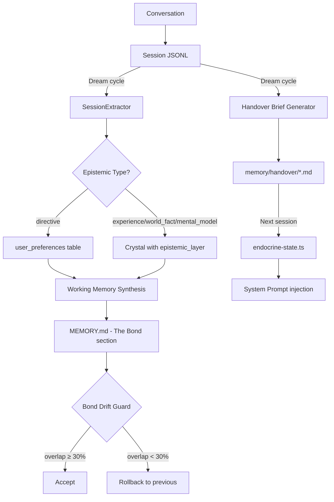

# User Knowledge — Session Extraction & Bond Evolution

Bitterbot builds a layered understanding of its user through conversation analysis, explicit corrections, and cross-session continuity. This system extracts facts, preferences, and behavioral patterns from conversations, maintains a Theory of Mind ("The Bond"), and ensures continuity between sessions through handover briefs.

**Key source files:** `session-extractor.ts`, `session-handover.ts`, `user-model.ts`, `working-memory-prompt.ts`, `manager.ts`, `endocrine-state.ts`, `system-prompt.ts`

---

## 5-Layer Architecture

```
Layer 1: Session Extraction
  → Raw conversation → structured facts (per dream cycle)

Layer 2: Epistemic Typing
  → Facts classified by knowledge type (experience, directive, world_fact, mental_model)

Layer 3: User Model
  → Facts aggregated into user_preferences table by category

Layer 4: Bond Drift Guard
  → Theory of Mind validated against historical baseline

Layer 5: Cross-Session Handover
  → Compact briefs carry context between sessions
```

### Layer 1: Session Extraction

During each dream cycle, the `SessionExtractor` processes **changed session transcripts** (sessions modified since the last extraction). For each session, a single LLM call extracts structured facts:

```typescript
interface ExtractedFact {
  text: string; // "User prefers dark mode"
  epistemicType: EpistemicType; // "directive"
  confidence: number; // 0.9
  category: string; // "ui_preference"
}
```

**Cost control:** Extraction runs per-session, not per-message. Only sessions with new messages since the last dream cycle are processed. Typical cost: 1 LLM call per changed session.

### Layer 2: Epistemic Typing

Each extracted fact is classified into one of four epistemic types:

| Type           | Meaning                        | Example                             | Storage                                  |
| -------------- | ------------------------------ | ----------------------------------- | ---------------------------------------- |
| `experience`   | Autobiographical event         | "User deployed to prod on March 15" | Crystal with `epistemic_layer` column    |
| `directive`    | Explicit preference/correction | "User prefers tabs over spaces"     | `user_preferences` table (high priority) |
| `world_fact`   | External knowledge             | "Their company uses Kubernetes"     | Crystal with `epistemic_layer` column    |
| `mental_model` | Inferred behavioral pattern    | "User works late on Wednesdays"     | Crystal with `epistemic_layer` column    |

**Directives override inferred knowledge.** If the user explicitly says "I prefer X," this takes priority over any pattern the system has inferred. The `working_memory_note` tool supports a `type="correction"` parameter for user-initiated overrides.

### Layer 3: User Model

The `UserModelManager` aggregates directive-type facts into a `user_preferences` table organized by category:

| Category                | Examples                                      |
| ----------------------- | --------------------------------------------- |
| `communication_style`   | "Prefers casual tone," "Likes emoji"          |
| `technical_preferences` | "Uses TypeScript," "Prefers vim"              |
| `work_patterns`         | "Most productive mornings," "Deploys Fridays" |
| `personal_context`      | "Has a dog named Max," "Lives in Toronto"     |
| `ui_preference`         | "Dark mode," "Compact layout"                 |

The `upsertFromDirective()` method handles updates. Confidence calibration uses Bayesian-style updates:

- **Corroboration:** `confidence = 1 - (1 - confidence) × decay_factor`. Same-session corroboration uses `decay_factor = 0.7`; cross-session uses `0.6` (stronger signal from independent confirmation). This creates logarithmic growth — first mentions matter most, subsequent ones have diminishing effect.
- **Contradiction:** `confidence = confidence × 0.6`. When a new fact contradicts an existing one (detected via negation patterns and value comparison), confidence erodes quickly and the value is updated to the newer statement. Confidence never drops below 0.1.

User preferences are fed into the dream engine's MEMORY.md synthesis as an `## Input: User Preferences` section, ensuring the Bond section reflects actual stated preferences.

### Layer 4: Bond Drift Guard

The Theory of Mind ("The Bond" section in MEMORY.md) evolves through dream cycles. To prevent catastrophic drift — where the Bond diverges from reality due to LLM hallucination during synthesis — a **Jaccard term overlap** guard validates each update:

```
overlap = |terms_old ∩ terms_new| / |terms_old ∪ terms_new|
```

| Overlap | Action                                   |
| ------- | ---------------------------------------- |
| ≥ 50%   | Accept new Bond (normal evolution)       |
| 30-50%  | Accept with warning log                  |
| < 30%   | **Collapse to previous Bond** (rollback) |

This prevents a single bad LLM call from erasing the accumulated understanding of the user.

### Layer 5: Cross-Session Handover

When a session ends (or during dream cycles), a **handover brief** is generated and stored:

```markdown
## Last Session Summary

- Discussed GCCRF implementation, found 3 bugs
- User was stressed about launch deadline (cortisol elevated)
- Decided to defer P2P mesh delegation to post-launch
- Emotional state: focused, slightly anxious, collaborative

## Entities Touched

- dream-engine.ts (file) — edited
- computeGCCRFReward() (function) — debugged
- CURIOSITY_THRESHOLD (config) — discussed
```

The brief is:

1. **Written** to `memory/handover/*.md` and indexed as searchable chunks
2. **Gated** by the Session Continuity Gate — cosine similarity between the brief's purpose and the user's opening message determines whether to inject it. Below 0.25 similarity = fresh start, brief skipped. This prevents stale context pollution (e.g., injecting database migration context when the user wants help writing an email).
3. **Loaded** by `endocrine-state.ts` at next session start (if the gate passes)
4. **Annotated** with staleness if older than 48 hours
5. **Injected** into the system prompt as "Last session: [compact summary]"

The **entity snapshot** (files, functions, config keys last touched) enables cross-session anaphora resolution. When the user says "change that parameter" in the next session, the agent has the referent available. Entity names are surfaced via proactive recall when deictic markers ("that", "the same", "it") are detected in the user's message.

---

## Data Flow



---

## Working Memory Note Tool

The agent can explicitly record knowledge via the `working_memory_note` tool:

```
working_memory_note(
  text: "User prefers dark mode in all editors",
  type: "directive",           // epistemic type
  importance: 0.8
)
```

Notes are written to `memory/scratch.md` (the write-ahead log) and consumed by the next dream cycle. The `type` parameter determines how the note is processed:

- `directive` → `user_preferences` table (survives indefinitely)
- `experience` → Crystal with high importance (natural decay)
- `correction` → Overrides existing knowledge in the same category

---

## Profile Queries

The agent can query its accumulated user knowledge via the `fullUserProfile()` method on the memory manager, which returns:

```typescript
{
  preferences: UserPreference[],    // From user_preferences table
  recentFacts: Crystal[],           // Epistemic-typed crystals
  bondSummary: string,              // Current Bond section from MEMORY.md
  lastHandover: HandoverBrief,      // Most recent session handover
}
```

The system prompt includes guidance for the agent to reference this profile naturally in conversation.

---

## Dormant Code That Was Wired

The session extraction and handover systems existed as **scaffolded but unwired code** prior to Plan 4:

| File                     | Was                                   | Now                                               |
| ------------------------ | ------------------------------------- | ------------------------------------------------- |
| `session-extractor.ts`   | Complete implementation, never called | Called during dream cycles for changed sessions   |
| `session-handover.ts`    | `formatCompactSummary()` existed      | Called, briefs stored and loaded at session start |
| `epistemic_layer` column | Column existed in schema              | Populated by extraction pipeline                  |
| `user_preferences` table | Table existed                         | Fed into working memory synthesis                 |

No new files were created — the infrastructure was activated and wired together.

---

## Related Documentation

- [Working Memory](./working-memory.md) — MEMORY.md as recursive state vector
- [Emotional System](./emotional-system.md) — hormonal state in handover briefs
- [Biological Identity](./biological-identity.md) — Bond as part of the Phenotype
- [Dream Engine](./dream-engine.md) — session extraction runs during dream cycles
