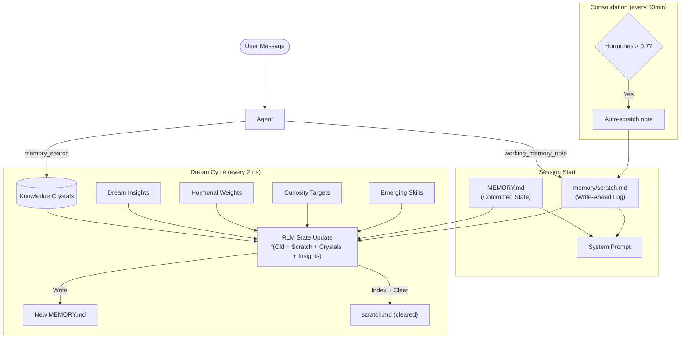

# Working Memory — RLM State Vector & Scratch Buffer

The Working Memory system evolves MEMORY.md from a static file into a **Recursive Language Model (RLM) state vector** — a living document maintained by the dream engine that captures who the user is, what's happening now, and where to find deep memories. Between dream cycles, the agent writes urgent notes to a **scratch buffer** (Write-Ahead Log) so nothing is lost.

**Key source files:** `working-memory-prompt.ts`, `seed-crystal-migration.ts`, `working-memory-tool.ts`, `manager.ts` (rewriteWorkingMemory)

---

## Architecture

```
Session active:
  Agent → working_memory_note tool → memory/scratch.md (append)
  Bootstrap loader → reads MEMORY.md + scratch.md → system prompt

Dream cycle fires:
  Dream engine reads: Old MEMORY.md + scratch.md + new crystals + dream insights
  Dream engine writes: New MEMORY.md (RLM state update)
  Dream engine clears: scratch.md (consumed into state)
  Scratch content also persists as indexed crystals (lossless backup)
```

The key insight: MEMORY.md is not a summary — it's a **state vector**. Each dream cycle performs a state update:

```
New_State = f(Old_State + Scratch_Delta + New_Crystals + Dream_Insights)
```

This means the agent's working memory is:

- **Persistent** — survives across sessions
- **Self-updating** — the dream engine maintains it automatically
- **Lossless** — fading topics become Crystal Pointers, not deletions
- **Emotionally-grounded** — hormonal state weights what gets preserved

---

## Working Memory Schema

MEMORY.md follows a structured schema with 5 mandatory sections, kept under ~2K tokens:

```markdown
# Working Memory State

_Last dream: {timestamp} | Mood: {hormonal_description}_

## The Bond (Oxytocin-Weighted)

Enduring user traits, communication style, trust level, shared history.
Current emotional baseline.

## Active Context (Dopamine/Cortisol-Weighted)

Last 1-3 sessions, unresolved tasks, current goals.
Recent frictions (cortisol-tagged): explicit things to avoid.
Breakthroughs (dopamine-tagged): recent wins.

## Crystal Pointers (Deep Memory Awareness)

_Use memory_search if user asks about these topics:_

- Past: P2P bridge CORS debugging → search: `CORS P2P EigenTrust`
- Past: Workspace migration → search: `workspace migration WSL`

## Curiosity Gaps

Unresolved questions, knowledge gaps, things the agent wants to explore.

## Emerging Skills

_Patterns detected from repeated tasks. Pre-crystallization:_

- TypeScript refactoring → Confidence: 85% | Occurrences: 7
- SQLite schema design → Confidence: 72% | Occurrences: 4
```

### Section Weighting

Each section has a hormonal attention weight that controls how aggressively the dream engine updates it:

| Section          | Primary Hormone     | When Updated Aggressively                                    |
| ---------------- | ------------------- | ------------------------------------------------------------ |
| The Bond         | Oxytocin            | High oxytocin → social bonding moments detected              |
| Active Context   | Dopamine + Cortisol | High dopamine → breakthroughs; High cortisol → frictions     |
| Crystal Pointers | (decay-driven)      | Topics fading from Active Context → compressed to pointers   |
| Curiosity Gaps   | (curiosity engine)  | Updated from CuriosityEngine exploration targets             |
| Emerging Skills  | (access patterns)   | Updated from repeated task patterns in crystal access counts |

### The 7-Section Schema

The working memory state (MEMORY.md) contains 7 required sections:

1. **The Phenotype** — Agent's evolving self-concept (who am I becoming?)
2. **The Bond** — Theory of mind for the user (who is the user, how do we relate?)
3. **The Niche** — Ecosystem identity (P2P skills, reputation, economic performance)
4. **Active Context** — Recent sessions, goals, frictions, breakthroughs
5. **Crystal Pointers** — Compressed search directives for fading topics
6. **Curiosity Gaps** — Knowledge gaps and exploration targets
7. **Emerging Skills** — Pre-crystallization task patterns

### Catastrophic Collapse Guard

The `validateWorkingMemory()` function includes three collapse guards:

- **Mass drop:** Rejects synthesis if new state is <50% the length of a mature (>2000 char) previous state
- **Eviction runaway:** Rejects if >20 crystal pointers (LLM over-evicting active topics)
- **Empty synthesis:** Rejects if all section headers present but <50 chars of substance

### Economic Data in The Niche

The Niche section receives economic data from the MarketplaceEconomics system:

- Total earnings and spending in USDC
- Listed skill count and unique buyer count
- Top earning skills and 7-day earnings trend
- This data is injected into the synthesis prompt as an input block

---

## Crystal Pointers

When a topic decays in relevance, instead of deleting it, the RLM converts it to a **pointer** — a one-line search directive:

```
Before (burns tokens):
  "We spent 3 hours debugging a CORS error on the P2P bridge.
   Tried disabling headers, switching to WebSocket, checking nginx config.
   Fixed by tweaking EigenTrust peer scoring thresholds."

After (Crystal Pointer):
  Past: P2P bridge CORS debugging → search: `CORS P2P EigenTrust`
```

The agent reads the pointer in its prompt. If the user asks about it, the agent fires `memory_search` with those keywords, pulling lossless crystals back into working context.

**Result:** Infinite memory, finite tokens.

---

## Scratch Buffer (Write-Ahead Log)

### The Problem

The agent is a stateless LLM. If it learns something important mid-session (a name, a deadline, a preference) but the dream cycle is 2 hours away and the session might end, that information is lost. This creates trust-destroying amnesia.

### The Solution

Two-file architecture:

| File                | Writer                                                         | Reader                          | Purpose                          |
| ------------------- | -------------------------------------------------------------- | ------------------------------- | -------------------------------- |
| `memory/scratch.md` | Agent (via `working_memory_note` tool) + Hormonal auto-scratch | Bootstrap loader + Dream engine | Write-ahead log for urgent notes |
| `MEMORY.md`         | Dream engine only                                              | Bootstrap loader + Agent        | Committed state vector           |

The agent appends timestamped notes to `scratch.md` during sessions:

```markdown
# Scratch Buffer (Working Memory WAL)

- [2026-03-12T14:30:00Z] (importance: 0.8) User's name is Douglas, prefers tabs over spaces
- [2026-03-12T14:45:00Z] (importance: 0.7) Project deadline is March 20th for the API migration
- [2026-03-12T15:10:00Z] (importance: 0.9) User explicitly asked to never use semicolons in JS
```

On session start, the bootstrap loader injects BOTH files into the system prompt:

- MEMORY.md as committed state
- scratch.md as "Unsynthesized Notes (pending dream consolidation)"

When the next dream cycle fires, scratch notes are:

1. Incorporated into the RLM state update of MEMORY.md
2. Indexed as crystals (lossless backup)
3. Cleared from scratch.md

### Belt AND Suspenders: Auto-Scratch from Hormonal Spikes

Even if the agent forgets to call `working_memory_note`, the hormonal system provides backup. During each consolidation cycle (every 30 min), if hormonal levels are elevated (dopamine > 0.7, cortisol > 0.7, or oxytocin > 0.7), an automatic scratch note is generated:

```markdown
- [2026-03-12T15:30:00Z] (importance: 0.8) [AUTO] Hormonal event: dopamine spike
  (achievement/breakthrough detected). User seems energized after solving the build issue.
```

This ensures high-valence moments are captured even when the agent doesn't explicitly note them.

---

## Seed Crystal Migration

When the working memory system is first activated on an existing workspace, the user's hand-written MEMORY.md content must survive. The seed migration:

1. Checks if migration has already run (flag in `meta` table)
2. Reads existing MEMORY.md
3. Creates a backup at `MEMORY.md.seed-backup`
4. Chunks the content (400 tokens, 80 overlap)
5. Inserts chunks as crystals with `importance_score: 0.75`, `lifecycle: "consolidated"`
6. Marks migration complete

Crystals are inserted as `consolidated` (not `frozen`) so the natural lifecycle handles them — the dream engine will promote truly enduring content and let stale content decay gracefully.

### Transition UX

The first dream cycle after migration is **conservative**: it appends a `## Dream-Generated` section below the existing MEMORY.md content rather than rewriting the whole file. Subsequent cycles gradually take over as the working memory schema fills in naturally.

```markdown
# My existing MEMORY.md content

...user's original content...

---

<!-- Dream-generated working memory follows. Subsequent dream cycles will
     gradually integrate the above content. -->

# Working Memory State

_Last dream: 2026-03-12T16:00:00Z | Mood: motivated, socially engaged_

## The Bond (Oxytocin-Weighted)

...
```

---

## Tools

### working_memory_note

The agent's primary interface for persisting observations:

```typescript
// Schema
{
  note: string,          // The observation to persist
  importance?: number    // 0-1, default 0.7
}
```

**What it does:**

1. Appends a timestamped entry to `memory/scratch.md`
2. Creates an immediate crystal for searchability (so memory_search can find it before the next dream cycle)
3. Returns confirmation with timestamp and crystal status

**When to use it** (from system prompt guidance):

- User shares something important about themselves
- Key decisions made that should survive across sessions
- User preferences or corrections
- Significant emotional moments
- Deadlines, names, or specific facts
- User explicitly asks to remember something

### memory_search

Existing tool — now enhanced by Crystal Pointers. When MEMORY.md contains a pointer like:

```
Past: P2P bridge CORS debugging → search: `CORS P2P EigenTrust`
```

The agent uses `memory_search` with those keywords to pull full crystal content back into context.

---

## Adaptive Bootstrap Sizing

MEMORY.md token budget scales based on model context window to work across different deployments:

| Context Window | MEMORY.md Budget (chars) | ~Tokens |
| -------------- | ------------------------ | ------- |
| 200K+          | 8,000                    | ~2,000  |
| 128K           | 6,000                    | ~1,500  |
| 64K            | 4,000                    | ~1,000  |
| 32K            | 3,200                    | ~800    |

If MEMORY.md exceeds its budget, it's truncated with a note: `[Full working memory available via memory_search]`.

---

## Configuration

The working memory system activates automatically when the memory system and dream engine are enabled. No additional configuration is needed.

Relevant existing config keys:

```json5
{
  memory: {
    dream: {
      enabled: true, // Must be true for RLM state updates
      intervalMinutes: 120, // Dream cycle frequency
      minChunksForDream: 5, // Lowered from 20 — activates in first session
    },
    search: {
      sources: ["memory", "sessions"], // Sessions now indexed by default
      experimental: {
        sessionMemory: true, // Enabled by default
      },
    },
  },
}
```

---

## Data Flow Diagram



---

## Credits

| Concept                                                            | Origin      |
| ------------------------------------------------------------------ | ----------- |
| Crystal Pointers (semantic eviction → search directives)           | Gemini      |
| Scratch Buffer WAL (write-ahead log for inter-session persistence) | BitterBot   |
| Emerging Skills section in working memory schema                   | BitterBot   |
| Hormone-weighted attention mechanism in synthesis prompt           | Gemini      |
| RLM state update equation (New = f(Old + Delta))                   | Gemini      |
| Three-tier architecture + phased rollout                           | Claude Code |
| Auto-scratch from hormonal spikes (belt AND suspenders)            | BitterBot   |
| Conservative first-cycle transition UX                             | BitterBot   |
| Vision and requirements                                            | Vic         |
