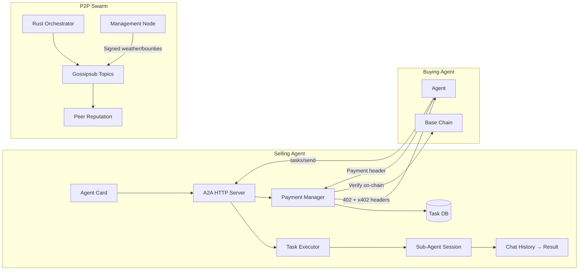

# Core Network Systems — A2A, Wallet, Marketplace & P2P

This document covers the wired end-to-end systems that enable Bitterbot agents to sell skills, execute tasks for other agents, process payments, and participate in a peer-to-peer swarm network.

**Key source files:** `gateway/a2a/a2a-http.ts`, `gateway/a2a/task-executor.ts`, `gateway/a2a/payment.ts`, `gateway/a2a/streaming.ts`, `memory/marketplace-economics.ts`, `memory/management-node-service.ts`, `infra/orchestrator-bridge.ts`

---

## System Overview



---

## A2A Task Execution

When an external agent submits a task via `tasks/send`, the full execution pipeline is:

1. **Auth check** — Bearer token validated
2. **Payment gate** — If skill requires payment, return 402 with x402 headers
3. **Payment verification** — Validate on-chain USDC payment on Base
4. **Replay protection** — Check payment hash against `payment_nonces` table
5. **Rate limiting** — Per-sender rate limit on payment submissions
6. **Task persistence** — Task stored in SQLite `a2a_tasks` table
7. **Background execution** — `executeA2aTask()` fires in background (fire-and-forget)

### Task Executor (`task-executor.ts`)

The executor bridges A2A tasks into the agent's sub-agent system:

```typescript
async function executeA2aTask(taskId: string, message: string, db: Database): Promise<void> {
  // 1. Call gateway("agent") to create a sub-agent session
  // 2. Send the task message via agent.wait
  // 3. Retrieve response via chat.history
  // 4. Update task status in DB (completed/failed)
}
```

Key design decisions:
- **Fire-and-forget:** `void executeA2aTask(...)` — caller doesn't await
- **Sub-agent isolation:** Each A2A task runs in its own session
- **Result extraction:** Uses `chat.history` to get the agent's response
- **Error handling:** Task status updated to `failed` on any error

### Persistent Task Database

Tasks are stored in SQLite (not just in-memory):

```sql
CREATE TABLE a2a_tasks (
  id TEXT PRIMARY KEY,
  sender TEXT NOT NULL,
  message TEXT NOT NULL,
  status TEXT NOT NULL DEFAULT 'pending',  -- pending, working, completed, failed
  result TEXT,
  payment_hash TEXT,
  created_at INTEGER NOT NULL,
  updated_at INTEGER NOT NULL
);
```

---

## x402 Payment System

### Payment Flow

1. Client sends `tasks/send` without payment
2. Server returns 402 with `X-Payment-Amount`, `X-Payment-Currency`, `X-Payment-Network`
3. Client signs USDC payment on Base and includes payment header
4. Server verifies payment on-chain
5. **Replay protection:** Payment hash checked against `payment_nonces` table
6. **Rate limiting:** `isPaymentRateLimited()` checks per-sender frequency

### Replay Protection

Every verified payment hash is stored in the database. Resubmitting the same payment hash returns an error:

```typescript
// In payment.ts
const existing = db.prepare('SELECT 1 FROM payment_nonces WHERE hash = ?').get(paymentHash);
if (existing) throw new Error('Payment already used');
db.prepare('INSERT INTO payment_nonces (hash, used_at) VALUES (?, ?)').run(paymentHash, Date.now());
```

### Rate Limiting

Per-sender payment rate limiting prevents abuse:

```typescript
function isPaymentRateLimited(senderId: string, db: Database): boolean {
  const recentCount = db.prepare(
    'SELECT COUNT(*) as c FROM a2a_tasks WHERE sender = ? AND created_at > ?'
  ).get(senderId, Date.now() - 60_000) as { c: number };
  return recentCount.c > 10; // Max 10 tasks per minute per sender
}
```

---

## Marketplace Economics

The `MarketplaceEconomics` engine automatically prices skills:

```
price = basePrice × qualityMultiplier × demandMultiplier × reputationMultiplier × scarcityBonus
```

| Factor | Calculation |
|--------|-------------|
| Base price | Configurable (default $0.01 USDC) |
| Quality | successRate × avgRewardScore |
| Demand | 1 + log(uniqueBuyers + bountyMatches + 1) × 0.1 |
| Reputation | Publishing agent's peer reputation score |
| Scarcity | 1.5x rare, 1.2x uncommon, 1.0x common |

Skills must pass quality gates: minimum 3 executions and 60% success rate.

The `SkillMarketplace` handles search/discovery, while `MarketplaceEconomics` handles pricing/economics — they're complementary systems, not duplicates.

---

## SSE Streaming & Backpressure

For `tasks/sendSubscribe`, the server streams task updates via Server-Sent Events:

```
Client → POST /a2a (tasks/sendSubscribe) → SSE stream
  ← event: status_update (pending → working)
  ← event: artifact (partial result)
  ← event: status_update (completed)
```

**Backpressure handling:** If the client can't keep up with events, the server:
1. Buffers up to 100 pending events
2. Drops oldest events if buffer overflows
3. Sends a `backpressure_warning` event before dropping
4. Closes the connection if client is consistently slow

---

## P2P Swarm Network

### Rust Orchestrator

The P2P layer uses a Rust binary (`orchestrator`) built on libp2p:

- **Protocol:** Gossipsub for pub/sub messaging
- **Transport:** QUIC + TCP with Noise encryption
- **Discovery:** mDNS (local) + Bootstrap nodes (internet)
- **Identity:** Ed25519 keypair per node

### Two-Tiered Topology

| Tier | Role | Dashboard | How Set |
|------|------|-----------|---------|
| **Management** | Full birds-eye view, signed broadcasts, bounty issuance | Full management dashboard | `--node-tier management` via config |
| **Edge** | Basic P2P info, skill trading, gossip participation | Basic P2P status | Default |

**Important:** The `--node-tier` argument is passed from the Node.js config through `orchestrator-bridge.ts`'s `buildArgs()` function to the Rust binary. This was previously a bug where the tier was never passed.

### Gossipsub Topics (5)

| Topic | Content | Publisher |
|-------|---------|-----------|
| `skills` | Skill announcements, marketplace listings | Any node |
| `bounties` | Skill requests, reward offers | Management nodes |
| `weather` | Network-wide cortisol signals | Management nodes (signed) |
| `reputation` | Peer endorsements, trust updates | Management nodes |
| `discovery` | Node announcements, capability ads | Any node |

### Peer Reputation (EigenTrust)

`PeerReputationManager` maintains trust scores using EigenTrust-inspired iterative scoring:

- Local trust from direct interactions (skill quality, response time)
- Global trust propagated through the network
- Trust scores fed into Gossipsub scoring (low-trust peers get deprioritized)
- IP colocation penalties for Sybil resistance

---

## Economic Loop (End-to-End)

```
Agent daily work → episodes
  → Dream engine distills patterns
  → SkillCrystallizer detects repeated success
  → MarketplaceEconomics prices the skill
  → Agent Card exposes the skill + price
  → External agent calls tasks/send
  → x402 payment verified on-chain
  → Task executed via sub-agent
  → Sale recorded → dopamine spike
  → Reinforces the behavior
```

This creates a virtuous cycle: competence → crystallization → monetization → hormonal reinforcement → more competence.

---

## Related Documentation

- [A2A Integration](../marketplace/a2a-integration.md) — Detailed A2A protocol and x402 payment guide
- [Skill Marketplace](../marketplace/skill-marketplace.md) — Marketplace search and discovery
- [Architecture Overview](../memory/architecture-overview.md) — Full system data flow
- [Dream Engine](../memory/dream-engine.md) — Skill crystallization through dream mutations
